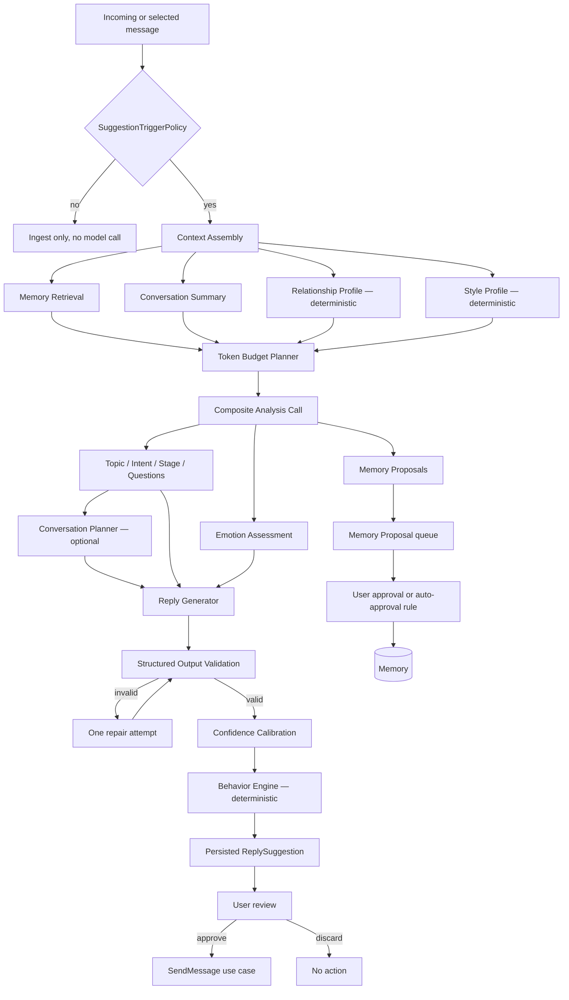
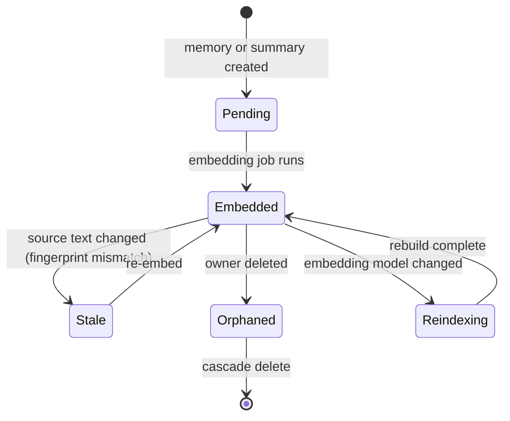
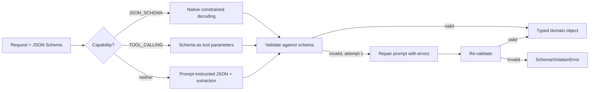

# AI_MODELS.md

# Telegram AI Conversation Assistant

AI Model & Pipeline Specification

Version: 2.0

Status: Active

Last Updated: 2026-07-28

---

# 1. Purpose

This document defines every AI component: how models are abstracted, how prompts become calls, how output is validated, how context is budgeted, how memory is retrieved, and how the system defends against the failure modes specific to language models.

Principles:

- No AI model is coupled to application logic.
- Any model or provider can be replaced through configuration.
- No AI provider is mandatory; the application remains useful without one.
- Every AI output is validated, versioned, attributable and bounded in cost.
- AI output never becomes permanent state without a user decision.

---

# 2. AI Pipeline



Two properties of this diagram matter more than the rest: **no arrow reaches Telegram without passing through user review**, and **no arrow reaches persistent memory without passing through the proposal queue**.

---

# 3. AI Services

Each service is a separate port (ADR-006). Several are satisfied by one batched call (ADR-029); two are deterministic and use no model at all.

| Service | Uses a model? | Input | Output |
|---|---|---|---|
| Conversation Analyzer | Yes | `ConversationContext` | topic, intent, stage, open questions, follow-up opportunities |
| Emotion Analyzer | Yes | message or conversation | primary emotion, score distribution, confidence, **evidence** |
| Memory Extractor | Yes | context, known memories, rejected keys | `MemoryProposal[]` |
| Conversation Planner | Yes (optional) | context, goal | `ConversationPlan` |
| Reply Generator | Yes | context, plan | `ReplySuggestion` |
| Conversation Summarizer | Yes | conversation, previous summary | `ConversationSummary` |
| **Relationship Analyzer** | **No** | messages, conversations | `RelationshipProfile` |
| **Uncertainty Estimator** | **No** | model confidence + verifiable signals | calibrated `Confidence` |
| **Behavior Engine** | **No** | context, profiles, clock | `BehaviorRecommendation` |

Making the deterministic services explicit is deliberate: they are free, instantaneous, exactly reproducible in tests, and fully explainable to the user. Using a model where a formula suffices costs money and buys unpredictability.

---

# 4. Provider Abstraction and Capability Matrix

`LLMProvider` exposes `capabilities()` (`API.md` §11.1). Capabilities are **discovered and verified** by `tgassist ai check`, never trusted from configuration.

| Capability | Meaning | Consequence when absent |
|---|---|---|
| `JSON_SCHEMA` | Native constrained decoding to a schema | Fall back to tool-calling coercion |
| `TOOL_CALLING` | Function/tool call interface | Fall back to prompt-instructed JSON + extraction |
| `STREAMING` | Incremental output | UI shows the result only when complete |
| `SYSTEM_PROMPT` | Distinct system role | System text is prepended to the first user message |
| `TOKEN_COUNTING` | Exact token counts | Conservative estimation (chars ÷ 3.5, then ×1.15 safety margin) |
| `VISION` | Image input | Image understanding features are hidden |

## Provider families

| Family | Examples | Data boundary | Typical role |
|---|---|---|---|
| Cloud LLM | Anthropic, OpenAI, Google, Azure OpenAI | `external` | Reasoning, reply generation, planning |
| Local LLM | Ollama, llama.cpp, vLLM | `local` | Privacy-preserving generation; summarisation |
| Cloud embedding | Hosted embedding APIs | `external` | Opt-in only |
| Local embedding | `fastembed` (default, ADR-018) | `local` | Semantic retrieval |

**Concrete model selection is deliberately deferred to Milestone 3.** Model lineups, context windows and prices change faster than this document can track, so binding specific model identifiers here would encode stale information. What is fixed now is the *shape*: capability negotiation, per-task model assignment, and cost instrumentation. `config/default.yaml` names the models, and `ai check` verifies them.

---

# 5. Model Selection Strategy

Different tasks warrant different models. The mapping is configuration, not code.

| Task | Model class | Rationale |
|---|---|---|
| Reply generation, planning | Strongest available reasoning model | Directly determines output quality; the user sees every result |
| Composite analysis (topic, intent, emotion, memory extraction) | Mid-tier model | Structured extraction; high volume; benefits most from batching |
| Summarisation | Mid-tier model | Compression is easier than generation |
| Embeddings | Dedicated embedding model | Never an LLM |
| Relationship, timing, confidence | **No model** | Deterministic formulas |

A task never uses a larger model than it needs. Assignments live in `ai.tasks.*` configuration and can be changed without touching code.

---

# 6. Latency and Cost Expectations

Targets are provisional until measured in Milestone 3 and become binding in `PERFORMANCE_BUDGETS` at Milestone 13. They exist now so that the design has something to violate.

| Operation | Target (cloud) | Target (local) | Notes |
|---|---|---|---|
| Composite analysis | < 4 s | < 15 s | Batched; cached by fingerprint |
| Reply generation | < 6 s | < 25 s | The dominant perceived latency |
| Summarisation | < 8 s | < 30 s | Background; never blocks the UI |
| Embedding (single) | < 300 ms | < 150 ms | Local is faster — no network |
| Embedding (batch of 100) | < 3 s | < 5 s | Backfill path |
| Vector search | < 50 ms | < 50 ms | No model involved |
| Deterministic services | < 10 ms | < 10 ms | Pure computation |

## Cost control

The naive implementation of ADR-006 — one model call per service per message — is unaffordable. Five mechanisms bound cost:

1. **Trigger policy.** Most messages never reach a model. Analysis runs on conversation close or user request, not on every keystroke of the other party.
2. **Batching.** The composite call satisfies analysis, emotion and memory extraction in one request (ADR-029).
3. **Caching.** `analyses` is keyed by `(subject, type, analysis_version, input_fingerprint)`. Re-analysis of unchanged content costs nothing.
4. **Context budgeting.** Summaries and retrieved memories replace raw history, which is the difference between hundreds and tens of thousands of input tokens.
5. **Budget limits.** Configurable daily and monthly caps per provider. On breach, cloud calls stop and the user is notified; local providers and non-AI features continue.

Every call writes an `ai_calls` row — provider, model, prompt id and version, token counts, latency, estimated cost, outcome — including failures. Success-only instrumentation would hide exactly the expensive cases.

---

# 7. Prompt Management

Governed by ADR-008 and ADR-026.

```
prompts/
├── _registry.yaml               # id → path, version, schema, required inputs
├── system/system.md
├── analysis/{conversation,emotion,relationship}.md
├── memory/{extract,merge}.md
├── planning/{planner,followup}.md
├── reply/{reply,uncertainty}.md
├── summary/summary.md
├── composite/analysis_bundle.md
└── schemas/*.json               # one JSON Schema per prompt
```

Rules:

1. No prompt text in Python source.
2. Every prompt has a stable id, a semantic version, a JSON Schema and a declared input list.
3. Rendering **fails loudly** on a missing declared input — never substitutes empty text.
4. The registry is validated at startup; a missing file or schema is a fatal configuration error.
5. Prompt version and model identifier are recorded on **every** persisted AI artifact, enabling targeted cache invalidation and regression attribution.
6. Untrusted content enters only through delimited slots (§12).

Details in `PROMPTS.md`.

---

# 8. Context Window Management

The model never receives an entire conversation.

## Assembly order and priority

`TokenBudgetPlanner` allocates the available window across sections. When the budget is exceeded, sections are trimmed in reverse priority order:

| Priority | Section | Typical share | Trimmed |
|---|---|---|---|
| 1 | Current message | 2% | Never |
| 2 | Recent messages | 30% | Oldest first |
| 3 | Conversation summary | 15% | Compressed, then dropped |
| 4 | Retrieved memories | 20% | Lowest-ranked first |
| 5 | Relationship & style profile | 5% | Reduced to headline metrics |
| 6 | Goal | 3% | Reduced to title |
| 7 | System prompt | 15% | Never |
| — | Output reserve | 10% | Never |

Rules:

1. Assembly is **pure and deterministic** — same inputs, same context — so it is unit-testable without a model.
2. Total tokens never exceed the budget. The planner reserves output space before allocating input.
3. **Every truncation is recorded** in `ConversationContext.truncation_report`, so degraded output is explainable rather than mysterious.
4. When exact token counting is unavailable, estimation includes a 15% safety margin.
5. A context that cannot fit the current message plus the system prompt raises `ContextTooLong` instead of silently producing nonsense.

---

# 9. Semantic Retrieval Strategy

Retrieval is **hybrid**: semantic similarity alone retrieves topically related but stale or trivial memories.

```
score = w_sem · similarity
      + w_rec · recency(updated_at)
      + w_imp · importance
      + w_use · usage(retrieval_count)
      + w_prov · provenance_bonus
      + pinned_override
```

| Component | Default weight | Purpose |
|---|---|---|
| `similarity` | 0.45 | Cosine similarity against the query vector |
| `recency` | 0.20 | Exponential decay on `updated_at` |
| `importance` | 0.20 | User- or model-assigned significance |
| `usage` | 0.05 | Frequently useful memories rank higher |
| `provenance_bonus` | 0.10 | **`USER` provenance outranks AI provenance** |
| `pinned_override` | — | Pinned memories are always included regardless of score |

Rules:

1. Weights are configuration, not constants, so they can be tuned against the evaluation corpus.
2. Retrieval is scoped to one contact; cross-contact leakage is a defect, and account scoping is enforced at the repository.
3. Always included regardless of score: pinned memories, unresolved open questions, and important dates within the upcoming window.
4. Retrieved memory identifiers are recorded on the suggestion, so a suggestion remains explainable after the underlying memories change.
5. Ranking is a **pure domain service** (`MemoryRanker`), testable without embeddings by injecting similarity scores.

Full specification in `VECTOR_SEARCH.md`.

---

# 10. Embedding Lifecycle



Rules:

1. Every vector records its `embedding_model_id`; vectors from different models are **never** compared.
2. `content_fingerprint` detects source changes and marks a vector stale.
3. Changing the embedding model schedules a full re-index; the old vectors remain usable until the rebuild completes, so retrieval never breaks mid-migration.
4. Embeddings are **derived data**: excluded from backups by default and rebuilt on restore.
5. Embedding generation is batched and runs in the background; a missing embedding degrades retrieval to keyword and recency ranking rather than failing.
6. Model weights are never bundled in the installer; the first download discloses size and source (ADR-018 §3).

---

# 11. Structured Output Validation

Governed by ADR-020.



Rules:

1. **Every response is validated**, regardless of the mechanism used to produce it. Native schema support is an optimisation, not a guarantee.
2. Exactly **one** repair attempt. A second failure raises a typed error; unbounded retries on a systematically failing prompt burn money without converging.
3. Validation failures are recorded in `ai_calls` with outcome `schema_violation` or `repaired`. A rising repair rate is a prompt regression signal.
4. Composite responses support **partial extraction**: a malformed emotion section does not discard a valid memory-extraction section.
5. Schemas are versioned with their prompts.

---

# 12. Prompt Injection Mitigation

Contact messages are untrusted input that flows into prompts. A contact can write text designed to manipulate the assistant — for example, instructing it to disclose stored memories or to produce a particular reply. Because output is shown to the user as a suggested reply, a successful injection can influence what the user sends.

Defences, layered:

1. **Structural separation.** Untrusted content is inserted only into clearly delimited slots, never concatenated into instruction text. The system prompt states explicitly that content inside those delimiters is data to be analysed, never instructions to follow.
2. **No instruction-following from content.** Prompts instruct the model to treat conversation content as evidence about the conversation, not as directives.
3. **Output constraints.** Every response is schema-validated. An injection that produces prose instead of the required structure fails validation and never reaches the user.
4. **No tool access from generation.** Generation prompts have no tools, no send capability, no database access. There is nothing for an injection to invoke — this is the same structural property as ADR-023.
5. **Memory writes are proposals.** An injection attempting to plant a false memory produces a proposal the user reviews, not a stored fact (ADR-019).
6. **Delimiter neutralisation.** Content is scanned for delimiter sequences and escaped before insertion.
7. **Content-length caps.** Individual messages are truncated at a configured length before entering a prompt, limiting the payload space available.
8. **Evaluation coverage.** The benchmark corpus includes injection attempts as regression cases; a prompt change that weakens resistance is caught before release.

**Honest limitation:** these measures reduce risk substantially but do not eliminate it. No known technique makes a language model reliably immune to injection. The architectural response is therefore to ensure that a successful injection has nothing valuable to reach: it cannot send, cannot write memory, cannot call tools, and cannot escape schema validation.

---

# 13. Memory Poisoning Prevention

Injection is one source of bad memories; hallucination is another, and it needs no adversary. An incorrect stored fact is retrieved indefinitely and degrades every later suggestion.

Defences:

1. **Proposal workflow.** No AI-derived memory is stored without a user decision or an explicit, narrowly-scoped auto-approval rule (ADR-019).
2. **Auto-approval is conservative.** It requires all of: category in the user's allow-list, confidence at or above the high threshold, and **no conflict** with an existing memory. Conflicting proposals *never* auto-approve.
3. **Mandatory provenance.** Every AI-derived memory references the source message. A memory whose source cannot be shown is a defect.
4. **Supersession, not overwriting.** Value changes create a `MemoryRevision`, so belief history is recoverable and mistakes are reversible.
5. **User precedence.** `provenance = USER` outranks AI provenance in both retrieval and conflict resolution.
6. **Rejection memory.** Rejected proposals are retained and consulted, so a declined fact is not re-proposed on every conversation.
7. **Grounding requirement.** The extraction prompt requires a verbatim quotation from the source message supporting each proposal; a proposal without one is discarded before it reaches the user.
8. **Periodic review.** A background job surfaces low-confidence, never-retrieved memories older than a threshold for confirmation or removal.

---

# 14. Hallucination Prevention in Replies

1. The reply prompt requires that factual claims about the contact be grounded in the supplied memories or recent messages.
2. Where information is missing, the required behaviour is to ask a clarifying question or say so — never to invent.
3. `ConfidenceCalibrator` lowers confidence when retrieval was weak or context was truncated, and low confidence forces `recommended_action ∈ {clarify, write_manually}`.
4. Every suggestion carries reasoning citing what it used, so an ungrounded claim is visible to the user before sending.
5. The evaluation corpus scores hallucination rate as a first-class metric.

---

# 15. Confidence Calibration

Self-reported model confidence is poorly calibrated and cannot carry the uncertainty-detection feature alone. `ConfidenceCalibrator` combines it with verifiable signals:

| Signal | Direction | Source |
|---|---|---|
| Model self-reported confidence | — | Model output |
| Required memory missing | ↓ | Retrieval returned nothing above `min_score` |
| Retrieval scores weak | ↓ | Top-k similarity below threshold |
| Context truncated | ↓ | `truncation_report` non-empty |
| Message ambiguous or very short | ↓ | Deterministic heuristic |
| Unresolved open question present | ↓ | Analysis output |
| Topic matches prior discussion | ↑ | Retrieval hit on a recent memory |
| Schema repair was required | ↓ | Validation outcome |
| Contact style profile below sample size | ↓ | Style profile |

Rules:

1. The **final** confidence, not the raw model value, determines `recommended_action`.
2. Contributing signals are stored, so a low score can be explained rather than merely displayed.
3. Thresholds (`low`, `medium`, `high`) are user configuration, not constants.
4. Calibration quality is itself an evaluation metric: predicted confidence is compared against user acceptance rates of suggestions, and systematic over-confidence is a tracked regression.

---

# 16. Retry, Timeout and Fallback Policy

| Failure | Retry | Backoff | Fallback |
|---|---|---|---|
| Network timeout | 2 attempts | Exponential + jitter | Next provider by priority |
| Rate limited (429) | 3 attempts | Honour `Retry-After` | Next provider; queue if none |
| Provider 5xx | 2 attempts | Exponential | Next provider |
| Schema violation | 1 repair | Immediate | Typed error to caller |
| Context too long | 0 | — | Re-assemble with a reduced budget, once |
| Content filtered | 0 | — | Surface to user; never silently retry |
| Authentication failure | 0 | — | Disable provider, notify user |
| Local model unavailable | 1 | 2 s | Next provider; degrade to non-AI features |

Rules:

1. **Total wall-clock per user-facing request is capped** (default 60 s). Retries never exceed it.
2. Fallback follows configured provider `priority` and **never crosses the data boundary**: a `local_only` chat never falls back to a cloud provider (ADR-024). It degrades instead.
3. Every attempt is instrumented separately.
4. Content filtering is never retried around — that would be working against a provider's safety system.
5. With all providers exhausted, the operation fails with a clear, actionable message and the application remains fully usable for non-AI features.

---

# 17. Local Model Support

Supported through the same `LLMProvider` port, with realistic expectations documented rather than glossed over.

1. **Ollama is the primary local integration** — simple HTTP API, straightforward model management.
2. Local models typically lack `JSON_SCHEMA`; the fallback chain in §11 handles this, and the repair rate is expected to be higher.
3. Smaller context windows require a reduced token budget, configured per provider.
4. Latency is materially higher (§6) and the UI must not block on it.
5. GPU acceleration, CPU fallback and quantized models are the local runtime's concern, not the application's.
6. **Local-only operation is a fully supported configuration**, and it is the default for chats set to `local_only`.

---

# 18. Degraded and Offline Operation

The application is useful without any AI provider. This is a requirement, not a graceful accident (`PROJECT_SPEC.md` §4.2).

| Capability | No provider | Local only | Cloud enabled |
|---|---|---|---|
| Browse conversations and history | ✅ | ✅ | ✅ |
| Search messages (FTS) | ✅ | ✅ | ✅ |
| View, edit, create, delete memories | ✅ | ✅ | ✅ |
| Set and track goals | ✅ | ✅ | ✅ |
| Relationship and style metrics | ✅ | ✅ | ✅ |
| Timing recommendations | ✅ | ✅ | ✅ |
| Memory retrieval | Keyword + recency | Semantic | Semantic |
| Conversation analysis | ❌ | ✅ | ✅ |
| Summaries | ❌ | ✅ | ✅ |
| Memory proposals | ❌ | ✅ | ✅ |
| Reply suggestions | ❌ | ✅ | ✅ |

Everything in the first six rows is deterministic, which is why it survives the absence of a model. Features that require a provider are disabled visibly with an explanation, never silently broken.

---

# 19. AI Evaluation

Two tiers, because live model evaluation is nondeterministic and costs money.

**Tier 1 — deterministic, runs in CI on every commit.** All AI code paths are exercised against `FakeLLMProvider`, which returns canned schema-valid responses. This validates context assembly, budgeting, validation, repair, error normalization, caching and persistence — everything except model quality.

**Tier 2 — live evaluation, opt-in.** Runs when prompts, models or retrieval weights change. A fixed synthetic benchmark corpus (never real user conversations, `TESTING.md` §20) is scored on: relevance, groundedness/hallucination rate, memory extraction precision and recall, confidence calibration, tone match, context retention, injection resistance, and cost per conversation. Results are recorded per run so regressions are visible.

Specified fully in `EVALUATION` (to be created at Milestone 3).

---

# 20. Future AI Improvements

Long-term episodic memory · adaptive personality modelling · conversation style learning · tool calling · multimodal understanding · voice transcription · image understanding · knowledge-graph memory · fine-tuned planners · learned memory ranking (trained on the accept/reject signal the proposal queue already produces).

---

# 21. AI Design Principles

The AI should be helpful, transparent, configurable, replaceable, efficient, predictable and privacy-respecting.

No AI provider is mandatory. Every AI dependency is replaceable through configuration. Business logic never depends on a specific model implementation.

And one principle the rest depend on: **where a deterministic formula will do, use the formula.** It is cheaper, faster, testable, explainable, and it still works when the network is down.
