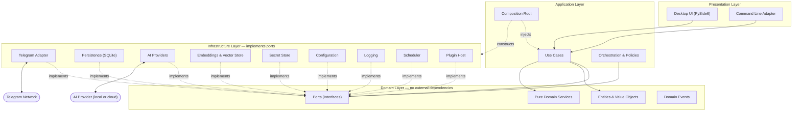
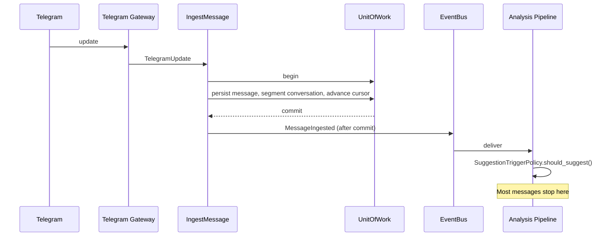

# ARCHITECTURE.md

# Telegram AI Conversation Assistant

Architecture Version: 2.0

Status: Active

Last Updated: 2026-07-28

---

# 0. Changes in Version 2.0

| Change | Reason |
|---|---|
| **Dependency rule corrected** (§9) | v1.0 documented the rule inverted, which would have placed infrastructure imports inside the domain layer (ADR-011) |
| High-level diagram corrected (§2) | v1.0 showed replies flowing automatically to Telegram, contradicting ADR-010 |
| Folder structure corrected (§10) | v1.0 nested `tests/` and `docs/` inside `src/` |
| Concurrency model defined (§6) | Previously unspecified; determines every port signature (ADR-013) |
| Event semantics defined (§8) | Previously unspecified; plugins depend on them |
| Trigger policy added (§5) | The pipeline previously implied AI processing of every message |
| Layer table added (§3) | Distinguishes layers from components, which v1.0 conflated |

---

# 1. Architecture Philosophy

The project follows:

- Clean Architecture
- Domain-Driven Design
- SOLID principles
- Dependency injection
- Repository pattern
- Event-driven communication
- Plugin-oriented design

**Business logic never depends on Telegram, AI providers, databases, or the user interface.** Everything outside the core business logic is replaceable.

The domain layer is the centre. Dependencies point inward. Nothing in the domain knows that Telegram, SQLite or any model provider exists.

---

# 2. High-Level Architecture



**Reading the diagram.** Solid arrows are compile-time dependencies. Dotted arrows are implementation and injection. Note that no arrow points from the domain outward, and that the Telegram adapter is reached only through ports — never directly from a use case.

---

# 3. Layers versus Components

These are different axes and v1.0 conflated them.

**Layers** are the dependency structure. There are exactly four, plus a composition root.

| Layer | Contains | May depend on |
|---|---|---|
| Presentation | Qt UI, CLI, view models | Application, Domain |
| Application | Use cases, policies, event handlers, composition root | Domain (+ infrastructure, in the composition root only) |
| Domain | Entities, value objects, ports, pure services, events, errors | Nothing |
| Infrastructure | Adapters for every port | Domain |

**Components** are functional units that live *within* layers. The Memory Engine, for example, has a domain part (`MemoryRanker`, `MemoryConflictDetector`), an application part (`ExtractMemoryProposals`, `ReviewMemoryProposal`) and an infrastructure part (`MemoryRepository`, `VectorStore` implementations).

Components are peers coordinated by the application layer. **The Memory Engine does not "sit below" the Conversation Engine**; both are orchestrated by use cases.

---

# 4. Core Components

## 4.1 Telegram Gateway

**Layer:** infrastructure, behind a domain port.

Responsibilities: connect, authenticate, receive updates, read history, send messages, download media, manage reconnection and rate limits.

Constraints: no business logic; no database access; streams history rather than materialising it; exposes **no typing-indicator method** (ADR-023).

Output: `TelegramUpdate` values and domain-mapped structures.

## 4.2 Conversation Engine

**Layers:** domain (`ConversationSegmenter`, `ContextAssembler`) + application (`AnalyzeConversation`) + infrastructure (`ConversationAnalyzer` adapter).

Responsibilities: segment chats into conversations deterministically; detect topic, intent, stage and open questions; assemble token-budgeted context.

Output: `Conversation`, `ConversationContext`, `ConversationAnalysis`.

## 4.3 Memory Engine

Responsibilities: extract memory **proposals**; detect conflicts; merge duplicates; rank and retrieve; manage embeddings; apply decay to ranking.

Constraint: **the memory engine never writes a `Memory` directly from AI output.** It writes `MemoryProposal` records; only `ReviewMemoryProposal` promotes them (ADR-019).

Output: `MemoryProposal`, ranked `Memory` sets.

## 4.4 Goal Manager

Responsibilities: store and activate per-contact goals; enforce one active goal per contact; supply the active goal to planning.

Constraint: goals are always user-authored. AI may suggest a change; it never makes one.

## 4.5 Relationship Engine

Responsibilities: compute interaction frequency, reciprocity, response times, conversation depth, topic breadth, initiation balance and engagement trend.

Constraint: **deterministic, no LLM** (ADR-029 §3). Every metric is a published formula (`DOMAIN_MODEL.md` §10) with a minimum sample size, below which it reports `insufficient_data` rather than a number.

## 4.6 Emotion Analyzer

Responsibilities: detect emotional state with confidence and cited evidence.

Constraint: an assessment without evidence is invalid. Emotion informs suggestions; it never triggers an action.

## 4.7 Planner Engine

Input: `ConversationContext`, `RelationshipProfile`, active `Goal`, retrieved memories.
Output: `ConversationPlan` — objective, direction, topics to introduce, topics to avoid, reasoning, confidence.

Constraint: advisory; becomes stale on any new message; optional in the pipeline behind a feature flag so its value can be measured against direct generation.

## 4.8 Reply Generator

Output: `ReplySuggestion` — primary text, alternatives, reasoning, confidence, recommended action.

Constraints: **no dependency on `TelegramGateway`.** It cannot send. Confidence below the low threshold forces `recommended_action ∈ {clarify, write_manually}`.

## 4.9 Human Behavior Engine

Output: `BehaviorRecommendation` — suggested delay, send time, length, split hint, rationale.

Constraints: deterministic rules; **no gateway dependency**; never recommends sending during quiet hours unless urgent; produces recommendations only, never actions (ADR-023).

## 4.10 Uncertainty Estimator

Combines the model's self-reported confidence with verifiable signals — missing required memory, unresolved open question, ambiguous or very short message, weak retrieval scores, truncated context — into a calibrated `Confidence` whose inputs are recorded, so a low score is explainable.

## 4.11 Plugin Host

Discovers, loads and isolates plugins; enforces API version compatibility; wraps every hook invocation so a failing plugin is disabled rather than fatal (ADR-025).

---

# 5. Data Flow

## 5.1 Inbound



Persisting a message, assigning it to a conversation and advancing the sync cursor happen in **one transaction**. Events are published only after commit, so no handler observes a fact that is later rolled back.

## 5.2 Suggestion generation — user-initiated or policy-triggered

```
ConversationContext assembly
   ↓  (memories retrieved, summary loaded, budget applied)
Analysis (cached where possible)
   ↓
Planner (optional)
   ↓
Reply Generator
   ↓
Uncertainty calibration
   ↓
Behavior recommendation
   ↓
Persisted ReplySuggestion
   ↓
Presented to the user
   ↓
User reviews, edits, approves — or discards
   ↓
SendMessage use case          ← the only path that reaches Telegram
```

The step "user reviews and approves" is not a courtesy. It is the only edge in the graph that connects generated text to the network.

## 5.3 Trigger policy

The pipeline does **not** run for every incoming message. `SuggestionTriggerPolicy` evaluates: is the chat sync- and AI-enabled; is a reply plausibly expected; did the user request a suggestion; is the cost budget within limits; is the contact soft-deleted or blocked. Absent an explicit user request, most messages are ingested and analysed cheaply, and no model call is made.

---

# 6. Concurrency Model

Defined by ADR-013.

1. **Asyncio-first.** Every I/O-performing port method is `async`.
2. **Telegram, AI providers, embeddings and background jobs** run natively on the event loop.
3. **SQLite runs on a single dedicated worker thread.** Async repository methods delegate to it. This makes the single-writer invariant structural and eliminates lock contention by construction.
4. **The Qt event loop is bridged via `qasync`.** No I/O ever runs on the UI thread; the UI communicates with use cases through view models.
5. **Pure domain services are synchronous** and free of side effects, including clock reads — time is injected (`Clock`).
6. Long-running operations are batched and cancellable, so interruption never leaves inconsistent state.

---

# 7. Storage Architecture

Single SQLite database (ADR-007), accessed exclusively through repositories (ADR-004) using SQLAlchemy Core (ADR-015). Schema in `DATABASE.md`.

| Data | Location | Rationale |
|---|---|---|
| Application data | SQLite database file | One consistency domain, one backup, one encryption decision |
| Embeddings | `embeddings` table (BLOB) | Same file: one backup, one encryption boundary (`VECTOR_SEARCH.md`) |
| Secrets | OS credential store | Never in files or the database (ADR-021) |
| Telegram session | TDLib encrypted store | Highest-value asset; always encrypted (ADR-022) |
| Application logs | Rotating JSONL files | No write contention with the database (ADR-027) |
| Audit events | `audit_log` table | Durable, queryable, append-only |
| Attachments | Filesystem, referenced by path | Blobs do not belong in the database |
| Archives | Separate SQLite files per year | Keeps the working set small (`DATABASE.md` §9) |
| Configuration | YAML + environment | Deployment-scoped, reviewable (ADR-028) |
| User settings | `settings` table | User-scoped, backed up with user data |

---

# 8. Event System

Internal communication uses domain events. Semantics are specified because plugins depend on them (`API.md` §5.3):

1. Asynchronous, in-process delivery.
2. Ordered per publisher, per handler.
3. **Handler exceptions are isolated** — logged, counted, never propagated.
4. Repeatedly failing handlers are unsubscribed automatically and a notification is raised.
5. At-most-once, non-durable. Events do not survive restart; anything requiring durability is a database write.
6. Handlers must be idempotent.
7. Events are immutable and are published only **after** the originating transaction commits.

The event catalogue is in `DOMAIN_MODEL.md` §7.

---

# 9. Dependency Rules

> **This section was inverted in version 1.0 and is corrected here per ADR-011.**

## Allowed

```
presentation   → application → domain
infrastructure → domain                       (implements ports)
composition root → all layers                 (construction only)
```

## Forbidden

```
domain         → application | infrastructure | presentation
domain         → any third-party library
application    → infrastructure concrete classes
presentation   → infrastructure
infrastructure → application | presentation
any module     → circular import
```

## Rationale

Dependencies point **inward**, toward the domain. Infrastructure depends on the domain because it implements interfaces the domain declares. The domain depends on nothing, which is precisely what makes it testable without Telegram, a database or a model.

## Enforcement

The rule is checked in CI by `import-linter` contracts, not by convention. Additional architectural tests assert:

- No module under `domain/` imports any third-party package.
- `ReplyGenerator`, `ConversationPlanner` and `BehaviorRuleEngine` have no reference to `TelegramGateway` (ADR-023).
- `AuditRepository` exposes no update or delete method.
- Only `application/container.py` imports from `infrastructure/`.

A violation fails the build.

---

# 10. Folder Structure

`tests/`, `docs/`, `prompts/`, `config/` and `migrations/` are **outside** `src/`. Third-party plugins are outside `src/`; the plugin *host* is inside it.

```
TelegramChatHelper/
├── pyproject.toml         .importlinter        .pre-commit-config.yaml
├── README.md              LICENSE              CHANGELOG.md
├── config/                prompts/             migrations/
├── resources/             scripts/             docs/
├── plugins/                                    # third-party plugins
├── tests/
│   ├── unit/ integration/ e2e/ evals/ architecture/ fakes/ data/
└── src/tgassist/
    ├── domain/
    │   ├── model/         # entities, value objects
    │   ├── ports/         # ALL interfaces
    │   ├── services/      # pure domain services
    │   ├── events.py      errors.py
    ├── application/
    │   ├── container.py   # composition root
    │   ├── use_cases/     policies/  event_handlers/  dto.py
    ├── infrastructure/
    │   ├── telegram/      persistence/  ai/  embeddings/
    │   ├── config/        logging/      security/
    │   ├── events/        tasks/        plugins/
    └── presentation/
        ├── cli/           desktop/
```

---

# 11. AI Layer

AI is abstracted behind ports. **No business logic ever calls a model directly.**

- `LLMProvider` — text generation with capability negotiation (ADR-020)
- `EmbeddingProvider` — vector computation
- `VectorStore` — vector storage and search, deliberately separate from embedding computation
- `PromptRepository` — versioned, registry-backed prompt loading (ADR-026)
- `StructuredOutputValidator` — schema validation applied to every response

Service ports (`ConversationAnalyzer`, `MemoryExtractor`, `ReplyGenerator`, …) stay separate per ADR-006, while a composite implementation may satisfy several with one batched call per ADR-029. That optimisation is invisible above the port boundary.

Details in `AI_MODELS.md`.

---

# 12. Plugin System

Plugins may register: AI providers, UI panels, commands, background jobs and event handlers.

Constraints: discovery via entry points and hooks via `pluggy`; **plugins are trusted code with no sandbox**, stated plainly to users; permissions are declared and displayed but advisory in v1.0; API version compatibility is checked before loading; every hook call is isolated so a failure disables the plugin rather than the application; plugins never access the database directly, only `PluginContext`.

Details in `PLUGIN_SYSTEM.md`.

---

# 13. Error Handling

Errors are categorized into a domain hierarchy. Adapters normalize provider-specific exceptions at the boundary; no SDK exception escapes into the application.

Families: `DomainError`, `PersistenceError`, `TelegramError`, `AIProviderError`, `ConfigurationError`, `PluginError`, `SecurityError`.

Each error declares whether it is retryable, its retry policy, and how it surfaces to the user. Details in `ERROR_HANDLING.md`.

---

# 14. Security

- Secrets in the OS credential store, never in files or the database (ADR-021)
- Telegram session data always encrypted (ADR-022)
- Database file created with owner-only permissions, verified at startup
- Parameterized queries only
- Central log redaction; message content excluded unless diagnostic mode is explicitly enabled
- Untrusted conversation content is structurally delimited before entering any prompt
- External AI providers receive data only from chats explicitly set to `cloud_allowed`
- Append-only audit log for security- and privacy-relevant actions

Details in `SECURITY.md` and `PRIVACY.md`.

---

# 15. Testing Strategy

| Level | Scope | Dependencies |
|---|---|---|
| Architectural | Layer contracts, forbidden imports, structural constraints | None |
| Unit | Domain services, entities, value objects | None |
| Use case | Application logic against fakes | None |
| Contract | Every port implementation, real and fake, against one suite | Varies |
| Integration | Adapters against real dependencies | Marked `integration` |
| Provider conformance | Same schemas across all LLM adapters | Network, opt-in |
| End-to-end | Full workflows driven through the CLI | Local only |
| Evaluation | AI output quality against a benchmark corpus | Opt-in, cost-gated |

Coverage targets: domain and application >90%, repositories >85%, infrastructure >70%.

Details in `TESTING.md`.

---

# 16. Future Scalability

The architecture supports, without redesign:

- **Multiple Telegram accounts** — `account_id` is present on every entity from the first migration
- **Additional messaging platforms** — implement one new gateway adapter; the domain names no platform
- **PostgreSQL** — repositories, search and vectors are all behind ports (ADR-016)
- **Web dashboard** — a third presentation adapter alongside UI and CLI
- **Voice and image understanding** — new analysis types over existing attachment metadata
- **Knowledge-graph memory** — the memory category/key/value shape generalises

Because the domain is platform-independent, new platforms require a new gateway and nothing else.

---

# 17. Architectural Rules

1. Dependencies point inward. The domain depends on nothing.
2. No AI logic in the presentation layer.
3. No database code in business logic.
4. No Telegram code in the domain.
5. Every external dependency sits behind a port.
6. Every module has a single responsibility.
7. Every feature is independently testable.
8. Only the composition root constructs infrastructure.
9. Nothing except the `SendMessage` use case can send a message.
10. AI output never becomes permanent state without a user decision or an explicit auto-approval rule.
11. Large features are developed incrementally.
12. Documentation stays synchronized with implementation.
