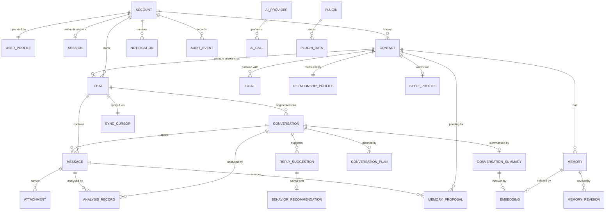

# DOMAIN_MODEL.md

# Telegram AI Conversation Assistant

Domain Model Specification

Version: 1.0

Status: Active

Last Updated: 2026-07-28

---

# 1. Purpose

This document defines the business domain: its entities, value objects, invariants, relationships and lifecycles.

It is the **authoritative source for the domain model**. `DATABASE.md` derives its schema from this document, and `API.md` derives its repository and service contracts from it. When this document and the schema disagree, this document is correct and the schema is a defect.

The domain layer contains **no third-party imports** (ADR-011). Everything here is expressible in plain Python: dataclasses, enums, and pure functions.

---

# 2. Ubiquitous Language

These terms have exactly one meaning across the codebase, the documentation and the user interface.

| Term | Definition |
|---|---|
| **Account** | A Telegram account the application is authorised to act on behalf of. The root ownership boundary for all data. |
| **User Profile** | The human operator of the application: their preferences, writing style, languages and availability. Distinct from Account, which is a credential binding. |
| **Session** | An authenticated connection state for an Account, including the local encrypted session store. |
| **Contact** | A Telegram user other than the operator, about whom the application may store memories and relationship data. |
| **Chat** | A Telegram conversation container: private, group, channel or saved messages. Mirrors Telegram's structure. |
| **Conversation** | A bounded *session of interaction* within a Chat — a contiguous run of messages separated from neighbours by an inactivity gap. The unit that summaries, plans and analyses attach to. |
| **Message** | A single message within a Chat, inbound or outbound. |
| **Memory** | A durable, user-visible fact about a Contact, approved for long-term retention. |
| **Memory Proposal** | An AI-extracted candidate fact awaiting user decision. Not yet a Memory (ADR-019). |
| **Goal** | A user-defined objective for the relationship with a Contact, guiding but never overriding suggestions. |
| **Relationship Profile** | Computed, deterministic metrics describing interaction patterns with a Contact. |
| **Style Profile** | Observed communication characteristics of a Contact or of the operator: typical length, formality, emoji use, language mix. |
| **Conversation Context** | The assembled, token-budgeted input to an AI task for one Conversation at one moment. Transient. |
| **Conversation Plan** | A proposed strategy for continuing a Conversation, given a Goal. |
| **Reply Suggestion** | A generated candidate reply with confidence, reasoning and alternatives. Never sent automatically (ADR-023). |
| **Behavior Recommendation** | Advice about *when* and *how* to reply. Advice only; never an action. |
| **Emotion Assessment** | A detected emotional state with confidence and supporting evidence. |
| **Analysis Record** | A cached AI-derived judgement about a Message or Conversation, versioned by prompt and model. |
| **Sync Cursor** | Per-Chat bookmark recording how far history synchronisation has progressed. |
| **Notification** | A user-facing alert raised by the application. |
| **Audit Event** | A durable record of a security- or privacy-relevant action. |
| **AI Provider** | A configured source of language-model or embedding capability. |
| **Plugin** | An optional extension registered through the plugin host. |
| **Configuration** | Deployment-scoped, file- and environment-sourced settings. Immutable at runtime (ADR-028). |
| **Setting** | User-scoped preference stored in the database and mutable at runtime (ADR-028). |

**Chat versus Conversation** is the distinction most easily lost. A Chat is permanent and mirrors Telegram. A Conversation is a derived, bounded episode within it. One Chat has many Conversations. Summaries belong to Conversations; message history belongs to Chats.

---

# 3. Entity Overview



---

# 4. Value Objects

Value objects are immutable, compared by value, and carry their own validation. They have no identity.

| Value Object | Definition | Invariants |
|---|---|---|
| `AccountId`, `ContactId`, `ChatId`, `MessageId`, `ConversationId`, `MemoryId`, `GoalId` | Typed 64-bit identifiers | Positive; not interchangeable across types. Implemented as `NewType` aliases: the distinction is enforced statically by `mypy --strict` across the domain and application layers, which avoids wrapping and unwrapping at every call site. Range validation lives in the entities that hold them, where an invalid value has a meaning worth reporting. |
| `TelegramUserId`, `TelegramChatId`, `TelegramMessageId` | External identifiers assigned by Telegram | Never used as local primary keys |
| `Confidence` | A model or system confidence value | `0.0 ≤ value ≤ 1.0`; exposes `band()` → `LOW`/`MEDIUM`/`HIGH` using configured thresholds |
| `Score` | A normalised metric (trust, engagement, depth) | `0.0 ≤ value ≤ 1.0`; carries `sample_size` and `computed_at`; a score with `sample_size` below the minimum is `Score.insufficient()` and never displayed as a number |
| `Importance` | Memory importance weight | `0.0 ≤ value ≤ 1.0` |
| `TokenBudget` | Allocation across context sections | Section allocations sum to no more than `total` |
| `TimeWindow` | A start/end instant pair | `start ≤ end`; both UTC |
| `LanguageCode` | BCP-47 language tag | Validated against a known tag set |
| `Timezone` | IANA timezone identifier | Must resolve; defaults to the Account timezone |
| `PromptVersion` | Prompt identifier plus semantic version | Immutable; recorded on every AI artifact |
| `ModelIdentifier` | Provider name plus model name | Immutable; recorded on every AI artifact |
| `Money` | Estimated cost | Non-negative; carries currency; always marked as an estimate |
| `Provenance` | Origin of a fact: `USER`, `AI_APPROVED`, `AI_AUTO`, `IMPORTED` | Determines precedence in conflict resolution |

**Time rule.** Every instant in the domain is UTC. Local-time conversion happens only in the presentation layer, using the Contact's or Account's timezone. No domain object stores a naive datetime.

---

# 5. Core Entities

## 5.1 Account

**Responsibility.** Represents an authorised Telegram account and forms the ownership root for all stored data. Present from the first release even though multi-account is a future feature, because retrofitting an ownership root is a breaking migration (`PROJECT_SPEC.md` §4.11).

**Attributes (implemented).** `id`, `telegram_user_id`, `display_name`, `timezone`, `is_active`, `created_at`, `updated_at`.

**Attributes (deferred to Milestone 2).** `phone_number_hash` and `last_authenticated_at`. Both are written only by authentication, and the first also requires choosing a salt strategy — per-account random and global secret have different security properties, and that choice belongs with the code that first receives a phone number. Both are one additive migration away.

**Invariants.**
- Exactly one Account is `is_active` at a time in v1.0, enforced by a **partial unique index** on `is_active` rather than by convention.
- `telegram_user_id` is unique: two local accounts for one Telegram user would make "which account is this message for" unanswerable.
- `display_name` is non-blank and at most 128 characters; surrounding whitespace is trimmed, because a name differing only by whitespace is the same name.
- `timezone` is a resolvable **IANA identifier**, never a fixed offset. An offset cannot express daylight saving, so it is wrong for half of every subsequent year — and reply-timing advice is computed against local hours.
- `created_at` and `updated_at` are timezone-aware UTC, and `updated_at` is never earlier than `created_at`.
- Deleting an Account deletes every record owned by it, with no orphans. Implemented as the purge operation in Milestone 11; the repository deliberately exposes no partial deletion, which would appear to work while leaving orphans.

**Lifecycle.** `created → active ⇄ inactive → deleted`

Account owns only the lifecycle it genuinely has: whether the user has selected it. **Authentication state belongs to Session** (§5.3), which models it as an explicit state machine. Version 1.0 of this document gave Account a lifecycle including `authenticating` and `logged_out`, which duplicated Session's states while providing only a boolean to express them; two entities would have owned "is this account authenticated" and would eventually have disagreed. See ADR-037.

**Validation.** Every invariant above is checked in the entity's constructor, so an invalid Account cannot exist in memory — not merely cannot be saved. The schema restates them as check constraints, so a row written by any other route cannot violate them either.

**Immutability.** State changes return a new instance. `activated`, `deactivated` and `renamed` return `self` unchanged when the change is a no-op, so a redundant call does not move `updated_at` and make nothing look like something.

**Relationships.** Owns Chats, Contacts, Notifications, Audit Events; has one User Profile and at most one live Session.

---

## 5.2 User Profile

*Implemented in Milestone 1.2. Corrected by ADR-038.*

**Responsibility.** Describes how the operator wants replies written: register, length, emoji, language, and when they would rather not be disturbed. It is the counterpart to a Contact's Style Profile and supplies the "user preferences" section required by every prompt.

**Identity.** `account_id` is the identity. It is simultaneously the primary key and a foreign key to `accounts(id)`; there is no surrogate key, because an account has exactly one profile and a profile cannot exist without an account (ADR-038).

**Attributes.** `account_id`, `primary_language`, `tone_preference` (`casual` | `neutral` | `formal` | `mirror_contact`), `preferred_message_length` (`short` | `medium` | `long`), `emoji_usage` (`none` | `sparing` | `frequent`), `quiet_hours`, `created_at`, `updated_at`.

**Invariants.**
- Exactly one User Profile per Account, enforced by the primary key.
- `primary_language` is a structurally well-formed BCP-47 tag, normalised to lowercase language with uppercase region (`en-GB`).
- `quiet_hours` is a `TimeRange` of minutes past midnight, may wrap midnight, and must not cover the entire day. Equal bounds are rejected: they are ambiguous between an empty range and the whole day.
- `updated_at >= created_at`; both are timezone-aware UTC.
- Every invariant is restated as a `CHECK` constraint, so a row written by any route obeys them.

**Lifecycle.** The profile is created with defaults on first access rather than alongside the Account, so adding an account does not require deciding preferences before the application is usable. It is deleted by cascade with its Account; there is no independent delete.

**Deferred attributes.** `display_name` and `timezone` are **not** duplicated here — Account owns both. `available_hours`, `auto_approve_memory_categories`, `confidence_thresholds` and `additional_languages` are deferred until the aggregate that defines each vocabulary exists, so their values can be validated rather than merely stored (ADR-038).

**Notes.** `tone_preference = mirror_contact` instructs the Reply Generator to adopt the Contact's Style Profile rather than a fixed register.

---

## 5.3 Session

*Implemented in Milestone 2.4. Corrected by ADR-049.*

**Responsibility.** Where an Account stands with Telegram: whether it has credentials, whether it has a connection, and where its encrypted local store lives. It exists in the domain because the authorization flow is a multi-step state machine the presentation layer must drive.

**Identity.** `account_id` is the identity, simultaneously primary key and foreign key to `accounts(id)`. An Account has exactly one Session, so a surrogate key would be a second name for one row — the reasoning ADR-038 applied to User Profile.

**Attributes.** `account_id`, `authorization_state`, `connection_state`, `session_path`, `encryption_key_ref` (a name in the `SecretStore`, never a key value), `client_version`, `connected_at`, `last_activity_at`, `created_at`, `updated_at`.

**Two state axes, not one.** Version 1.0 of this document gave Session a single enum running from `disconnected` through `awaiting_code` to `ready` and `reconnecting`. TDLib reports **two** states and they vary independently, so one field cannot express *authorized but currently reconnecting* — the ordinary condition after any network interruption. Under the old model a reconnect had to overwrite `ready`, discarding the fact that the account was authorized, and the code then had to *infer* that authorization survived. See ADR-049.

```
authorization: unauthorized → waiting_phone → waiting_code
                            → waiting_password (2FA) → ready
                            → logged_out

connection:    offline ⇄ connecting ⇄ updating ⇄ ready
               waiting_for_network
```

Each mirrors what TDLib reports, so the adapter translates rather than infers. Neither axis overwrites the other.

**Derived state.**
- `is_authorized` — authorization is `ready`.
- `is_connected` — connection is `updating` or `ready`. The socket is up from `updating` onwards; that state means *connected and catching up*.
- `can_send` — authorized **and** connection is `ready`. Stricter than `is_connected` on purpose: a session still replaying its backlog may not know the conversation has moved on, and suggesting a reply into a stale view of a chat is the mistake this application exists to avoid. This replaces "only the `ready` state permits sending", which could not say which sense of ready it meant.
- `needs_credentials` — the flow is waiting for something from a person.

**Invariants.**
- `encryption_key_ref` never holds key material. A key value in that column is a security defect, not a shortcut.
- A session that is not connected cannot record `connected_at`; a stale stamp would answer "how long connected" with a duration that never happened.
- `updated_at >= created_at`; every timestamp is timezone-aware UTC.
- Every invariant is restated as a `CHECK` constraint, so a row written by any route obeys them.

**Lifecycle.** Prepared on demand — a session record is written when a login is first prepared, not when the Account is created — and removed by cascade with its Account. Logging out is a *transition*, not a deletion: it moves both axes and leaves a record saying so, because "this account was signed out" is a fact a deleted row cannot express. Destroying the local store and the key is the caller's work; an entity cannot delete a directory.

---

## 5.4 Contact

*Implemented in Milestone 1.3. Corrected by ADR-041 and ADR-042.*

**Responsibility.** A person the operator communicates with, and the anchor for memory, goals and relationship data.

**Identity.** A locally generated `id`, **not** the Telegram user identifier. The same person can be known to two Accounts, so `telegram_user_id` is not unique in this table; a natural key would have to be the pair, and every child table would then carry both columns in its foreign key. See ADR-041.

**Attributes.** `id`, `account_id`, `telegram_user_id`, `username`, `display_name`, `archived_at`, `deleted_at`, `created_at`, `updated_at`.

**Invariants.**
- `(account_id, telegram_user_id)` is unique, enforced by an index that **includes soft-deleted rows**: a deleted Contact still holds that person's history, so a second row for them would split it.
- `username`, when present, is a structurally valid Telegram handle: 5–32 characters, letter first, letters, digits and underscores, no trailing underscore. A leading `@` is stripped.
- `display_name` is non-empty and at most 128 characters.
- `archived_at` and `deleted_at` are mutually exclusive; at most one is ever set.
- `updated_at >= created_at`; every timestamp is timezone-aware UTC.
- Soft deletion hides a Contact and suspends all AI processing for it, but preserves history until hard deletion is requested.
- Hard deletion removes the Contact and every Memory, Proposal, Goal, Relationship Profile, Style Profile and Suggestion referencing it (`PRIVACY.md` §7, contact purge). Milestone 11 owns it; there is no hard delete today.

**Lifecycle.**

```
active ⇄ archived
  ↓  ↘     ↓
    deleted → (restored) → active
```

Three states, expressed as two nullable timestamps of which at most one is set; both null means active. Timestamps rather than booleans because retention asks "deleted before when" (ADR-042). One `restored` transition serves both archived and deleted.

`discovered` and `dormant` from version 1.0 are **not implemented**: the first is indistinguishable from `active` until synchronisation exists to discover anybody, and the second is derived from `last_seen_at` and a configured window, neither of which exists. Both are recorded in ADR-042 rather than dropped.

**Deferred attributes.** `first_name` / `last_name` (duplicated by `display_name`; needed for salutation generation in Milestone 8), `phone_number_hash` (the salt strategy belongs with the code that first receives a phone number), `language` (nothing reads it; `UserProfile.primary_language` is what reply generation consults), `country` / `timezone` (Telegram supplies neither), `is_blocked` (distinct from archived, but nothing processes anybody until Milestone 8), `notes` (overlaps the Memory aggregate), `first_seen_at` / `last_seen_at` (written by synchronisation from message timestamps). Each is one additive migration away.

**Enforced since Milestone 2.7.** "A Contact cannot be its own Account's operator identity" was stated in version 1.0 and unenforced until synchronisation needed it. It is now checked by the domain service `require_not_operator` on every write path that can create a contact -- `CreateContact` and both synchronisation use cases.

The identifier it compares against is `Account.telegram_user_id`, which has existed since Milestone 1.2; the rule was unenforced because nobody had written the check, not because the value was missing. It is not a schema constraint: SQLite's `CHECK` cannot reference another table, and a trigger would be a second home for the same rule (ADR-052).

Enforcement is on write only. A database written before Milestone 2.7 may hold such a row; nothing scans for one, because refusing to list contacts would be a worse outcome than the row existing.

---

## 5.5 Chat

*Implemented in Milestone 1.4. Corrected by ADR-043 and ADR-044.*

**Responsibility.** The **edge of the communication graph**: the container joining an Account to a Contact. Account and Contact are the graph's nodes; Chat is what connects them, and it is where message history, synchronisation state and per-chat AI policy attach.

**Identity.** A locally generated `id`, for the same reasons a Contact's is (ADR-041). `(account_id, telegram_chat_id)` is unique.

**Attributes.** `id`, `account_id`, `telegram_chat_id`, `chat_type` (`private` | `group` | `supergroup` | `channel` | `saved`), `contact_id` (private chats only), `title` (every other kind), `sync_enabled`, `ai_processing_mode` (`disabled` | `local_only` | `cloud_allowed`), `created_at`, `updated_at`.

**Invariants.**
- `(account_id, telegram_chat_id)` is unique. Two accounts may record the same Telegram chat; one account may not record it twice.
- `contact_id` is non-null **if and only if** `chat_type = private`, and `title` is non-null if and only if it is not. Both directions are enforced, in the entity and in the schema: a private chat with nobody in it, and a group chat claiming a single counterpart, are equally unrepresentable.
- A private chat has no title of its own. Its name is the Contact's display name, stored once, on the Contact.
- A Contact has at most one private chat, enforced by a partial unique index.
- `contact_id` must name a Contact **of the same Account**, enforced by a composite foreign key on `(account_id, contact_id)` (ADR-043).
- `telegram_chat_id` is non-zero. It **may be negative**: Telegram numbers groups and channels below zero, so the "must be positive" rule that suits a user identifier is wrong here.
- `ai_processing_mode` defaults to `local_only` (ADR-024); no content leaves the device for a Chat set to `disabled` or `local_only`.
- A Chat with `sync_enabled = false` ingests no history and receives no live updates.
- `updated_at >= created_at`; every timestamp is timezone-aware UTC.

**Lifecycle.** A Chat has none of its own. It exists because a conversation exists in Telegram, so a user does not create or remove one — what they control is `sync_enabled` and `ai_processing_mode`. Removal is by cascade: from the Account, or from the Contact purge in `PRIVACY.md` §7 (ADR-044).

**Deferred attributes.** `last_message_at` (written by ingestion; until messages exist it would be null on every row), `is_muted` (nothing notifies), `is_archived` (a third way to hide something, after archiving the Contact and disabling sync), `retention_days` (no global policy to inherit until Milestone 10), `deleted_at` (see the lifecycle above). Each is one additive migration away.

**Notes.** MVP scope is private chats (`PROJECT_SPEC.md` §12). All five kinds are modelled so that enabling group support is additive — and because the private-chat invariants are only meaningful if a non-private chat is representable.

`saved` earned its place in Milestone 2.7. Telegram's Saved Messages arrives as a private chat whose counterpart is the operator, which cannot be stored as a private chat because that would require a Contact the operator is forbidden to be (ADR-052). Every real account has one, so this is the ordinary case rather than an edge one.

Synchronisation records every kind of chat but sets `sync_enabled` only for the kinds in `telegram.sync_chat_types` (default: private). A group is therefore visible and switchable rather than absent, and nothing revisits that setting once the chat exists (ADR-053).

---

## 5.6 Message

**Responsibility.** A single message. The immutable factual record from which everything else is derived.

*Implemented in Milestone 1.5. Corrected by ADR-045 and ADR-046.*

**Attributes.** `id`, `account_id`, `chat_id`, `telegram_message_id` (**optional**), `sender_kind` (`operator` | `contact` | `system`), `message_type` (`text` | `photo` | `voice` | `video` | `document` | `sticker` | `location` | `poll` | `service` | `other`), `text` (optional), `sent_at` (source time, UTC), `ingested_at` (local insert time, UTC).

**Identity.** A locally generated `id`. `telegram_message_id` is **optional**, because ingestion accepts messages from any source and only Telegram issues identifiers (ADR-045).

**Invariants.**
- `(account_id, chat_id, telegram_message_id)` is unique **where the identifier is present** — the idempotency guarantee that makes re-synchronisation safe, enforced by a *partial* index so that many source-less messages remain permitted.
- `(account_id, chat_id)` is a composite foreign key to `chats`, so a message cannot be filed in another account's chat (ADR-043).
- `sent_at` and `ingested_at` are distinct concepts and both required. Timing analysis uses `sent_at`; sync diagnostics use `ingested_at`. Conflating them is a defect. Neither is required to precede the other: clock skew between a sender and this device is ordinary.
- A `text` message has non-empty text. Every other kind may carry a caption or nothing.
- Messages are **append-only**: there is no update path and no delete path, expressed by the repository having no such methods and the table having no `updated_at` (ADR-046). A test asserts the absence.

**Derived, not stored.** `is_outgoing` is exactly `sender_kind == operator`. Version 1.0 stored it "because it is queried constantly"; that is an argument for an index on a derived value, not for a second copy of a fact that can then disagree with the first.

**Deferred attributes.** `conversation_id` (Conversation does not exist — ADR-044), `sender_telegram_user_id` (identifies which participant in a group; `sender_kind` suffices for a private chat), `reply_to_message_id` (threading; a self-referential key with its own deletion semantics, read by context assembly in Milestone 8), `forwarded_from`, `edited_at`, `is_deleted_remotely` (all written by synchronisation), `deleted_at` (nothing deletes a message yet — see below).

**Deletion policy.** Not implemented, and deliberately not decided. Retention is Milestone 10, purge is Milestone 11, and remote-deletion mirroring is Milestone 3; each will choose soft or hard deletion with its own code in front of it. Adding `deleted_at` now would settle the question early and put a filter nothing writes into every history query (ADR-046). The eventual behaviour remains as specified: a remote deletion sets `is_deleted_remotely` and blanks `text` if *mirror remote deletions* is enabled (default: on), retaining the row so replies referencing it stay coherent (`PROJECT_SPEC.md` §4.1).

---

## 5.7 Conversation

*Implemented in Milestone 3.0. Corrected by ADR-056.*

**Responsibility.** A bounded episode of interaction within a Chat. The unit of summarisation, planning and analysis. Its existence keeps prompt context proportional to a coherent exchange rather than to an entire chat history.

**Derived, not reported.** Every other entity here records something a person or Telegram decided. A Conversation records something this application *computed* from stored messages, which is why it has no external identifier, why it can be recomputed at any time, and why deleting a stale one loses nothing.

**Attributes.** `id`, `account_id`, `chat_id`, `started_at`, `ended_at`, `message_count`, `created_at`, `updated_at`.

**Membership is the time range.** A Message belongs to the Conversation whose `[started_at, ended_at]` contains its `sent_at`. Messages carry **no** `conversation_id` and there is no join table: `Message` is append-only and its repository has no update path at all (ADR-046), so assigning a conversation to a stored message would be exactly the mutation that discipline forbids — and since conversations do not overlap, the range already *is* the membership (ADR-056).

**Invariants.**
- A Conversation belongs to exactly one Chat and never spans Chats, enforced by a composite foreign key rather than by a check (ADR-043).
- Conversations do not overlap in time within a Chat. Enforced by a unique `(account_id, chat_id, started_at)`: each is a contiguous run, so two beginning at the same instant is the only way they could overlap.
- `ended_at` is never null and never before `started_at`. A Conversation is derived from messages that already exist, so it always has a last one.
- `message_count` is at least one. An empty Conversation is a row that should have been deleted.
- **Identity survives re-segmentation.** A recomputed segment claims the stored Conversation owning the plurality of its messages; a stored one may be claimed by at most one segment, the earliest, with ties to the lowest identifier (ADR-056). Without that rule a rebuild would replace every Conversation with an identical-looking new one.

**Segmentation rule (deterministic, no AI).** A new Conversation begins when the gap since the previous message exceeds `conversation.gap_minutes` (default 360), or when the current one reaches `conversation.max_messages` (default 200). It is a pure function of `sent_at` and a count, read in the total order `(sent_at, telegram_message_id, id)` — every component immutable once stored — so re-segmenting a Chat yields identical boundaries however the messages arrived.

**Deferred attributes.** `is_open` — **derived, not stored** (ADR-056). Whether a Conversation may still grow depends on how long ago it ended, which depends on *now*; a stored flag would be true when written and wrong an hour later, with no job to correct it. `Conversation.is_open_at(now, gap)` asks it against a supplied instant, and version 1.0's "at most one open per Chat" is replaced by the stronger non-overlap constraint above. `initiated_by` — recomputable from the first message's sender; nothing reads it until relationship metrics (Milestone 6). `dominant_language` — needs language detection (Milestone 6).

---

## 5.8 Attachment

**Responsibility.** Metadata for non-text message content. The application stores metadata always and file bytes only when the user has enabled media download.

**Attributes.** `id`, `message_id`, `attachment_type`, `filename`, `mime_type`, `size_bytes`, `storage_path`, `is_downloaded`, `remote_file_id`, `duration_seconds`, `width`, `height`, `caption`, `created_at`.

**Invariants.**
- `storage_path` is non-null only when `is_downloaded` is true.
- Downloads respect the configured per-file and total size caps.
- Deleting a Message deletes its Attachments and any downloaded bytes.

---

## 5.9 Memory

**Responsibility.** A durable, user-visible fact about a Contact. The system's most valuable and most safety-critical state (ADR-019).

**Attributes** (as implemented, ADR-059 and ADR-060). `id`, `account_id`, `contact_id`, `category`, `key`, `value`, `confidence`, `importance`, `source`, `proposal_id`, `conversation_id`, `ai_call_id`, `created_at`, `deleted_at`, `retrieval_count`, `last_retrieved_at`.

**Where the key comes from.** It is a **deterministic normalisation of the value, derived by this application**: case folded, punctuation dropped, whitespace collapsed, truncated. The model never supplies it — a key is an identity, and identity is the one thing this project refuses to let a model own (ADR-058 §2, ADR-059 §2).

That makes storing the same fact twice structurally impossible. It does **not** detect a contradiction: "Lives in Lisbon" and "Lives in Porto" normalise to different keys, so both are stored, and choosing between them is *conflict detection* (§6) rather than deduplication. The limitation is deliberate and is argued in ADR-059.

**Invariants.**
- `(account_id, contact_id, category, key)` is unique among non-deleted Memories. Two partial indexes rather than one, because SQL treats NULLs as distinct and a contactless fact would otherwise escape the constraint.
- **`proposal_id` is unique among Memories**, so "accepting a proposal creates exactly one Memory" is a constraint rather than a rule a caller has to keep.
- **A Memory is immutable and has no edit method.** Correcting one means forgetting it and accepting a new proposal. An edit in place would keep the provenance while changing the fact, and the provenance is the only thing that makes a stored claim checkable.
- **Provenance is complete or absent, never partial.** A Memory created from a proposal always names the proposal, the conversation and the AI call. It may lose all three at once, when the chat they belong to is deleted — the foreign keys are `SET NULL` rather than `CASCADE`, because a memory is user-approved knowledge and does not stop being known because the exchange it came from was removed.
- **`source = USER` outranks AI sources** in retrieval scoring and conflict resolution. Nothing implements that yet; only `ai_approved` is ever written today, because accepting a proposal is the only route into this table.
- `confidence` is kept as the model reported it. A person accepting a fact says it is worth keeping, not that the model was certain.
- **`importance` is a person's judgement and `confidence` is a machine's**, and retrieval ranks by importance *first* for exactly that reason (ADR-060 §2). It is set when the proposal is accepted — the moment somebody is looking at the fact and can judge — and is not changed afterwards.
- **`retrieval_count` and `last_retrieved_at` are bookkeeping about the fact, not part of it**, which is what lets them change while the Memory stays immutable. They move together: a count with no timestamp could not say when, and a timestamp with no count would make "has this ever been used" depend on which field was asked.
- **`last_retrieved_at` is deliberately not a ranking input.** Ranking by it would make a retrieved memory rank higher and so be retrieved again — a feedback loop rather than a relevance signal. It exists so the *absence* of retrieval stays visible.
- Deletion is soft (`deleted_at`), and it **frees the key**, so the same fact can be accepted again — the only route to a correction. Hard deletion belongs to retention (Milestone 10).

**Deferred attributes.** `is_pinned`, `valid_from` / `valid_until` and `updated_at` — the first two serve *ranking policies* nothing implements (pinning is a rule about bypassing the budget; validity is a rule about expiry), and the last has nothing to write it. `source_message_id` is not stored: extraction reads a whole conversation, so `conversation_id` is the honest granularity. `MemoryRevision` is absent because revisions record edits and there are none.

**Categories (initial closed set).** `identity`, `location`, `occupation`, `interest`, `preference`, `relationship`, `important_date`, `plan`, `shared_experience`, `open_question`, `constraint`, `other`.

**Lifecycle, as implemented.** `proposed → accepted → active → deleted`. A Memory exists only from the moment a person accepts the proposal it came from, and the only transition it has is being forgotten. `superseded` and `archived` need supersession and archival, neither of which exists.

**Decay.** `effective_importance = importance × recency_factor(last_retrieved_at, updated_at)`. Decay affects ranking only; it never deletes. Deletion is always a user action or a retention-policy action (`PRIVACY.md` §6). **Not implemented, and now deliberately so**: the inputs exist, but multiplying importance by a recency factor would fold two comparable facts into one incomparable number, which is exactly the weighted score ADR-060 §2 rejects. Decay should be reconsidered when there is retrieval data to justify a shape for it.

---

## 5.10 Memory Proposal

**Responsibility.** An AI-extracted candidate fact awaiting a decision. The mechanism that keeps hallucinated or injected content out of permanent memory (ADR-019).

**Attributes** (as implemented, ADR-058). `id`, `account_id`, `conversation_id`, `ai_call_id`, `category`, `value`, `confidence`, `evidence`, `prompt` (`prompt_id` + `version`), `status` (`pending` | `accepted` | `rejected`), `created_at`.

**What the model supplies, and what it does not.** The model returns exactly four things: `category`, `value`, `confidence` and `evidence`. Everything else — identifier, timestamp, which conversation, which AI call, which prompt version, and the status it starts in — is assigned by the application. A model able to name an identifier could overwrite a proposal somebody had already read; one able to set a status could approve itself. The output schema sets `additionalProperties: false`, so an attempt to supply either fails validation rather than being ignored.

**Invariants.**
- **Every proposal is created `pending` and is decided exactly once.** `MemoryProposal.decided()` is the only transition it has, and it refuses every source state but `pending`; the repository's one update names `pending` in its `WHERE` clause, so two decisions racing cannot both win. **Nothing returns a proposal to pending**, so a decision cannot be undone or reopened (ADR-059 §3).
- **`status` and `decided_at` move together.** A decided proposal records when; a pending one does not. Both directions are enforced, so "has this been decided" has one answer however it is asked.
- **Accepting creates exactly one Memory, in the same transaction as the decision. Rejecting creates none**, and the proposal is kept so the extractor does not offer the same fact again.
- **`evidence` is required and never null.** A proposal without a quotation is a claim with no source. The application additionally checks that the quotation *appears in the conversation the model was shown* — whitespace-insensitive, case-insensitive, and nothing more forgiving than that. A model cannot quote what nobody said (ADR-058 §8).
- `confidence` is between 0 and 1, enforced by the schema, the value object and a check constraint. A value outside the range is not a low confidence but a model that did not answer the question asked.
- `(account_id, conversation_id, category, value)` is unique. Re-running extraction over a conversation must cost nothing and change nothing.
- Rejected Proposals are retained so the same fact is not re-proposed; the duplicate check consults them.
- `conversation_id` and `ai_call_id` are each half of a **composite** foreign key including `account_id`, so a proposal cannot cite another account's conversation or audit trail (ADR-043). Both cascade.

**Deferred attributes.** `key` (a proposal does not need one — the *Memory* it becomes derives its key from the value at acceptance, ADR-059 §2), `contact_id` (resolved from the conversation's chat when the memory is created, so the extractor need not depend on the chat graph), `conflicts_with_memory_id` (nothing detects conflicts yet), `rejection_reason` (a rejection is a decision, not an explanation), `decided_by` (every decision is a person's, so the column would record a constant), `model_identifier` (reachable through `ai_call_id`, which carries the model, the cost and the moment), and the `superseded` / `expired` statuses (both are transitions, and a proposal has exactly one). Proposals therefore **do not expire**; §5.10's ninety-day rule arrives with the milestone that implements retention.

**Auto-approval rule.** A Proposal auto-approves only when *all* hold: its category is in `UserProfile.auto_approve_memory_categories`; `confidence ≥ threshold.high`; `conflicts_with_memory_id` is null; and the Chat's `ai_processing_mode` is not `disabled`. Otherwise it waits for the user. **Not implemented, and deliberately not implemented in the slice that introduced proposals**: every proposal today waits for a person, and auto-approval is a decision worth making with a queue in front of you rather than in advance (ADR-058).

---

## 5.11 Memory Revision

**Responsibility.** The audit trail of a Memory's value over time. Enables "what did we believe, when, and why", and makes supersession reversible.

**Attributes.** `id`, `memory_id`, `previous_value`, `new_value`, `reason` (`user_edit` | `superseded_by_proposal` | `merge` | `correction`), `changed_by` (`user` | `system`), `source_proposal_id`, `created_at`.

**Invariants.** Revisions are append-only and never modified or deleted while the parent Memory exists.

---

## 5.12 Goal

**Responsibility.** A user-defined objective for a relationship, guiding planning and reply generation without overriding user judgement.

**Attributes.** `id`, `account_id`, `contact_id`, `goal_type`, `title`, `description`, `priority`, `status` (`active` | `paused` | `achieved` | `abandoned`), `target_date`, `success_criteria`, `created_at`, `updated_at`, `deleted_at`.

**Invariants.**
- **At most one `active` Goal per Contact.** This resolves the cardinality ambiguity across the v1.0 documents: the schema permits many Goals per Contact (history, paused alternatives), the domain permits exactly one active at a time, and the planner consumes only the active one.
- `priority` orders non-active Goals for promotion; it does not create concurrency.
- A Goal is always authored by the user. AI never creates or modifies Goals; it may only suggest that the user consider a change.

**Goal types.** `friendship`, `professional_networking`, `language_practice`, `maintain`, `reconnect`, `general`, `custom`.

---

## 5.13 Relationship Profile

**Responsibility.** Deterministic, explainable metrics describing the interaction pattern with a Contact. Computed from observable message data (ADR-029 §3) — no LLM involvement.

**Attributes.** `id`, `account_id`, `contact_id`, `interaction_frequency`, `reciprocity_ratio`, `median_response_time_operator`, `median_response_time_contact`, `conversation_depth`, `engagement_trend` (`rising` | `stable` | `declining` | `insufficient_data`), `topic_breadth`, `initiation_balance`, `total_messages`, `total_conversations`, `first_interaction_at`, `last_interaction_at`, `sample_size`, `computed_at`.

**Invariants.**
- Exactly one Relationship Profile per Contact.
- Every metric is a pure function of Messages and Conversations, recomputable from scratch and identical on recomputation.
- A metric whose `sample_size` is below the configured minimum is reported as `insufficient_data`, never as a number.
- Metric definitions are published in §10 of this document and are stable across releases; changing one requires a version bump and a recomputation job.

**Deliberate exclusion.** There is no stored `trust_score` or `friendship_level`. The v1.0 documents specified both without definitions, which made them unfalsifiable and untestable. The measurable components are retained above; any qualitative label shown in the UI is derived at presentation time from these metrics and is always accompanied by the evidence that produced it (`PROJECT_SPEC.md` §3.5).

---

## 5.14 Style Profile

**Responsibility.** Observed communication characteristics, used so suggestions match how a Contact actually writes and how the operator actually writes.

**Attributes.** `id`, `account_id`, `owner_kind` (`contact` | `operator`), `contact_id`, `median_message_length`, `formality` (`informal` | `neutral` | `formal`), `emoji_rate`, `question_rate`, `languages`, `typical_active_hours`, `punctuation_style`, `sample_size`, `computed_at`.

**Invariants.**
- `contact_id` is non-null exactly when `owner_kind = contact`.
- Computed from observable data; the LLM may only label `formality`.
- Below the minimum sample size, the profile is not used to shape suggestions.

---

## 5.15 Conversation Summary

**Responsibility.** A compact representation of a Conversation, letting later context assembly skip raw history (`PROMPTS.md` §19).

**Attributes.** `id`, `account_id`, `conversation_id`, `chat_id`, `summary_text`, `key_topics`, `important_facts`, `open_questions`, `follow_up_opportunities`, `first_message_id`, `last_message_id`, `prompt_version`, `model_identifier`, `analysis_version`, `token_count`, `created_at`, `superseded_at`.

**Invariants.**
- At most one non-superseded Summary per Conversation.
- Regenerating a Summary supersedes rather than replaces the previous one.
- A Summary always records the prompt and model that produced it, enabling targeted invalidation (ADR-026 §5).
- A Summary never contains material absent from its source Conversation; violations are an evaluation failure (`AI_MODELS.md` §14).

---

## 5.16 Conversation Context

**Responsibility.** The assembled, budgeted input for one AI task at one moment. **Transient — never persisted.** It exists as a domain object so context assembly is unit-testable without a model.

**Attributes.** `conversation_id`, `contact_id`, `goal`, `relationship_profile`, `style_profiles`, `retrieved_memories`, `summary`, `recent_messages`, `current_message`, `open_questions`, `token_budget`, `assembled_at`, `truncation_report`.

**Invariants.**
- Total tokens never exceed `token_budget.total`.
- Section priority when trimming follows `PROMPTS.md` §19: current message → recent messages → summary → memories → relationship → goal → system.
- `truncation_report` records exactly what was dropped, so degraded output is explainable rather than mysterious.
- All Contact-derived content in a Context is marked as untrusted for prompt-assembly purposes (`SECURITY.md` §12).

---

## 5.17 Conversation Plan

**Responsibility.** A proposed strategy for continuing a Conversation given the active Goal.

**Attributes.** `id`, `account_id`, `conversation_id`, `objective`, `suggested_direction`, `topics_to_introduce`, `topics_to_avoid`, `reasoning`, `confidence`, `prompt_version`, `model_identifier`, `created_at`, `is_stale`.

**Invariants.**
- A Plan is advisory. Neither the Reply Generator nor the user is bound by it.
- A Plan becomes `is_stale` when a new message arrives in its Conversation.
- Plans are retained for explainability and evaluation, not reused once stale.

---

## 5.18 Reply Suggestion

**Responsibility.** A generated candidate reply with its reasoning, confidence and alternatives. Persisted because `PROJECT_SPEC.md` §3.6 requires the application to explain why a suggestion was made, and `TESTING.md` §9 requires regression comparison.

**Attributes.** `id`, `account_id`, `conversation_id`, `in_reply_to_message_id`, `primary_text`, `alternatives`, `reasoning`, `confidence`, `uncertainty_flags`, `recommended_action` (`send` | `review` | `clarify` | `write_manually` | `wait`), `context_snapshot_ref`, `plan_id`, `prompt_version`, `model_identifier`, `provider_name`, `status` (`offered` | `accepted` | `edited_and_sent` | `dismissed` | `expired`), `sent_message_id`, `created_at`, `decided_at`.

**Invariants.**
- **A Reply Suggestion never sends itself** (ADR-023). Only the `SendMessage` use case sends, and only from an `accepted` or `edited_and_sent` Suggestion or user-authored text.
- `confidence` below `threshold.low` forces `recommended_action ∈ {clarify, write_manually}`.
- `context_snapshot_ref` identifies the memories, summary and messages used, so a suggestion remains explainable after the underlying data changes.
- Outcome (`status`) is recorded for every Suggestion; this is the primary quality signal for evaluation.

---

## 5.18a Suggestion (implemented, Milestone 10b)

**Responsibility.** A thing the assistant has proposed, stored so that it can be
reviewed, and awaiting exactly one decision. The narrow, built form of §5.18:
where Reply Suggestion is the designed aggregate with alternatives, uncertainty
flags and a recommended action, `Suggestion` is what exists today — enough to
make every generated draft observable and decidable, and nothing more (ADR-062).

**Attributes.** `id`, `account_id`, `chat_id`, `conversation_id` (nullable),
`ai_call_id`, `proposal_type` (`reply_draft`), `title`, `description`,
`payload`, `status` (`pending` | `accepted` | `dismissed`), `created_at`,
`decided_at`.

**Three fields for three audiences.** `title` for a listing, `description` for
the **person deciding** — for a reply draft, the draft itself — and `payload`
for a **machine that does not exist yet**, as a JSON object. The split is what
keeps review uniform as the kinds of suggestion multiply: a reviewer decides
about a title and a description whatever `proposal_type` says, so a new kind
needs new payload handling and no new review.

**Invariants.**
- **Accepting executes nothing** (ADR-062). It records agreement and publishes a
  fact. The use cases are given nothing that could act — no gateway, no
  scheduler, no executor — so this is structural rather than a rule.
- **Exactly one transition**, `pending` to a terminal state, enforced twice: the
  entity refuses a second decision and explains itself, and the repository's
  conditional `WHERE status = 'pending'` write survives concurrency. No undo, no
  reopen, no edit.
- `decided_at` is present exactly when the status is terminal, and never earlier
  than `created_at`.
- **Nothing is deleted, including dismissals.** A record of only what was agreed
  with cannot show what the generator is getting wrong.
- Every suggestion cites the `AiCall` that produced it, and through it the model,
  the prompt version and the cost.
- `payload` must parse as a JSON object; nothing further is checked, because
  nothing reads it yet.

---

## 5.19 Behavior Recommendation

**Responsibility.** Advice about reply timing and shape. Deterministic (ADR-029 §3).

**Attributes.** `id`, `account_id`, `conversation_id`, `suggested_delay_seconds`, `suggested_send_at`, `rationale`, `suggested_length`, `should_split`, `split_hint`, `confidence`, `rule_version`, `created_at`.

**Invariants.**
- Advisory only. It has **no dependency on the Telegram gateway** — a structural guarantee, not a policy (ADR-023 §4).
- Never recommends sending inside the operator's configured quiet hours unless the message is marked urgent.
- Outputs are bounded by configured minimum and maximum delays.
- `rule_version` records which rule set produced the advice.

---

## 5.20 Emotion Assessment

**Responsibility.** Detected emotional state for a Message or Conversation, with evidence.

**Attributes.** `id`, `subject_kind` (`message` | `conversation`), `subject_id`, `primary_emotion`, `emotion_scores`, `confidence`, `evidence`, `prompt_version`, `model_identifier`, `created_at`.

**Emotions.** `happy`, `excited`, `curious`, `neutral`, `sad`, `angry`, `anxious`, `stressed`, `surprised`, `confused`.

**Invariants.**
- `emotion_scores` covers the full closed set and sums to approximately 1.0.
- `evidence` cites the text that drove the assessment; an assessment without evidence is invalid.
- Emotion never triggers an automatic action; it informs suggestions only.

---

## 5.21 Analysis Record

**Responsibility.** A cached AI judgement about a Message or Conversation, preventing repeated processing and enabling targeted invalidation.

**Attributes.** `id`, `subject_kind`, `subject_id`, `analysis_type` (`emotion` | `intent` | `topic` | `question_detection` | `stage` | `composite`), `result`, `confidence`, `analysis_version`, `prompt_version`, `model_identifier`, `input_fingerprint`, `created_at`.

**Invariants.**
- `(subject_kind, subject_id, analysis_type, analysis_version)` is unique.
- `input_fingerprint` is a hash of the exact analysed content; a change invalidates the entry.
- A prompt or model version change invalidates only affected entries, never the whole cache (ADR-029 §5).

---

## 5.22 Sync Cursor

*Implemented in Milestone 2.8. Corrected by ADR-050 and ADR-054.*

**Responsibility.** Per-Chat synchronisation bookmark making history backfill resumable and idempotent.

**Identity.** The **chat identifier**, not a surrogate beside it. There is exactly one cursor per chat, so a surrogate would be a second name for one row — the reasoning ADR-038 applied to `UserProfile` and `Session`. Version 1.0 listed an `id`; ADR-054 removes it.

**Attributes.** `account_id`, `chat_id`, `oldest_synced_message_id`, `newest_synced_message_id`, `backfill_complete`, `backfill_horizon`, `last_sync_at`, `updated_at`.

**Invariants.**
- Exactly one Cursor per Chat, which is the primary key rather than a checked rule.
- `oldest_synced_message_id` and `newest_synced_message_id` are both set or both null, and the first is never greater than the second. A floor with no ceiling describes a range whose extent nobody can state.
- Backfill resumes from `oldest_synced_message_id` and never re-requests completed ranges. It is a **message identifier**, because Telegram pages history by one and identifiers are unique and totally ordered within a chat, which timestamps are not (ADR-054).
- The Cursor is written **in the same transaction as the messages it accounts for**. Interrupting a sync at any point therefore leaves messages and bookmark agreeing, with no reconciliation pass (ADR-050).
- `backfill_complete` means complete **for `backfill_horizon`**. The two are read together, so a run configured to reach further back resumes rather than reporting success.
- `account_id` names the same account as the Chat, enforced by a composite foreign key rather than by a check (ADR-043).

**Deferred attributes.** `consecutive_failures` — drives exponential backoff and, past a threshold, disables sync for a Chat and raises a Notification. None of that exists, so it would be written and never consulted; it records nothing historical, so adding it later loses nothing. `last_error` — **dropped**, not deferred: an error string on a row is a log entry in the wrong place (ADR-050). `backfill_target_date` is renamed `backfill_horizon`.

---

## 5.23 Notification

**Responsibility.** A user-facing alert raised by the application.

**Attributes.** `id`, `account_id`, `notification_type`, `severity` (`info` | `warning` | `error` | `action_required`), `title`, `body`, `related_entity_kind`, `related_entity_id`, `is_read`, `is_dismissed`, `action_url`, `created_at`, `read_at`.

**Types.** `memory_proposals_pending`, `suggestion_ready`, `sync_failed`, `auth_required`, `provider_unavailable`, `quota_warning`, `retention_pending`, `plugin_error`, `backup_failed`, `migration_required`.

**Invariants.**
- `action_required` notifications persist until acted upon; they cannot be auto-dismissed.
- Notifications never contain message content beyond a short, configurable preview, and none at all when previews are disabled.

---

## 5.24 AI Model

*Implemented as a **value object**, not a stored record (ADR-057 §2). The routing table this section originally described — `capabilities`, `is_default_for`, `priority` — is deferred to the milestone that has two providers to route between. A routing table with one row has never been exercised.*

**Responsibility.** Which model answered, and what using it implied.

**Attributes.** `vendor` (`anthropic` | `fake`), `identifier`, `data_boundary` (`local` | `external`), `input_cost_per_million`, `output_cost_per_million`, `currency`.

**Invariants.**
- `data_boundary` is derived from the **vendor**, never read from configuration. A cloud model is external however a settings file describes it, and a boundary a user could edit would put the privacy guarantee in a file (ADR-024).
- `cost_of(usage)` returns `None` when the model is unpriced or the tokens were unreported. Zero would be a claim that a call was free.
- A model with `data_boundary = external` may only process content from Chats whose `ai_processing_mode = cloud_allowed`, and never content that names no Chat at all (ADR-024, ADR-057 §3).
- `api_key_ref` lives in configuration, not on the model, and is a `SecretStore` name, never a key value (ADR-021).
- Configuring no provider is valid; the default is a local scripted model and the application degrades to non-AI features (`PROJECT_SPEC.md` §4.2).

---

## 5.25 AI Call

**Responsibility.** An instrumentation record for one model invocation. Makes cost and latency measurable from the first milestone (ADR-029 §6).

**Attributes.** `id`, `account_id`, `chat_id`, `model` (§5.24), `prompt` (`prompt_id` + `version`), `task_kind`, `usage` (`input_tokens`, `output_tokens`), `cost`, `outcome` (`success` | `timeout` | `rate_limited` | `provider_error` | `malformed` | `cancelled` | `refused`), `finish_reason` (`stop` | `length` | `content_filter` | `other`, null unless successful), `latency_ms`, `response_digest`, `response_text`, `created_at`.

**Invariants.**
- **Append-only.** Nothing transitions an AiCall, and `AiCallRepository` has no `update` and no `delete`. The absence of both is what says so (ADR-057 §5).
- **Never stores the prompt**, under any setting. It is reconstructible from `prompt` and the message rows, and storing it would duplicate message content into a table with a different retention class (`SECURITY.md` §9).
- `response_digest` is a truncated SHA-256 of the response, which is what deterministic replay compares. `response_text` is normally null and is written only when `ai.store_responses` is on — a diagnostic the production profile refuses, arranged exactly as `logging.diagnostic_mode` is (ADR-057 §6).
- `cost` is computed by the entity from the model's rates, never supplied, so no caller can record a number the rates do not support. It is `Decimal`, stored as text.
- A successful call records `finish_reason`; a failed one does not. A refused call spends no tokens.
- `chat_id` is present because the privacy gate is per chat, so a record without it could not be audited against the permission that allowed it. It is part of a composite foreign key that cascades: a record derived from a deleted chat is residue of that chat (ADR-043, ADR-057 §10).
- Written for every call including failures **and refusals**; success-only instrumentation hides the expensive cases, and an audit without refusals cannot show that a call was blocked.
- Subject to log retention, not conversation retention.
- `retry_count` is deferred: nothing retries yet, and a column nobody writes is a column nobody keeps correct (ADR-057).

---

## 5.25a Conversation Context and Prompt Context

**Responsibility.** What a model is told, and the account of how it was chosen.
Value objects produced by `ContextAssembler`, not aggregates: they have no
identity, no lifecycle and no table (ADR-061 §8).

**`ConversationContext`.** `turns` (who, text, tokens — oldest first),
`available` (how many messages there were before trimming), `truncated` (how
many were shortened to the per-message limit).

**`PromptContext`.** `memories` (in retrieval order), `conversation`, `trimmed`
(what the budget removed and why), `budget`, `tokens`, and `memory_keys` — the
keys supplied to the model, against which its reported attribution is checked.

**Invariants.**
- The order is fixed: system prompt, memories, conversation, task and output
  format. It is not configurable: an ordering a user could change would make
  every installation's prompt a different experiment.
- Trimming removes the oldest messages first, then the lowest-ranked memories.
  The most recent message is never removed — without it there is nothing to
  respond to.
- **Nothing is ever shortened to fit the budget.** A truncated fact is a fact
  that was never stated. (The per-message character limit is separate, applied
  before assembly, and marked in the text so the model can tell.)
- Memories are neutralised but not delimited; the conversation is delimited by
  the prompt, which owns the markers.
- **Neither is persisted.** They are how a prompt was built, not a record of
  it; the writes in the pipeline are the `AiCall` and, since Milestone 10b, the
  `Suggestion` the generated draft is stored as (§5.18a).

---

## 5.26 Plugin

**Responsibility.** Registration record for an installed extension (ADR-025).

**Attributes.** `id`, `plugin_name`, `version`, `api_version_range`, `entry_point`, `is_enabled`, `declared_permissions`, `install_source`, `installed_at`, `last_error`, `error_count`, `updated_at`.

**Invariants.**
- A Plugin whose `api_version_range` excludes the current API version is refused and never loaded.
- `declared_permissions` is advisory in v1.0: displayed and logged, not enforced (ADR-025 §4).
- Repeated failures disable the Plugin and raise a Notification; a failing Plugin never halts the application.

---

## 5.27 Audit Event

**Responsibility.** A durable record of security- and privacy-relevant actions (ADR-027 §3).

**Attributes.** `id`, `account_id`, `event_type`, `actor` (`user` | `system` | `plugin`), `actor_detail`, `summary`, `related_entity_kind`, `related_entity_id`, `created_at`.

**Types.** `login`, `logout`, `session_created`, `session_destroyed`, `provider_enabled`, `provider_disabled`, `ai_mode_changed`, `data_exported`, `data_deleted`, `contact_purged`, `retention_applied`, `backup_created`, `backup_restored`, `plugin_installed`, `plugin_enabled`, `plugin_disabled`, `encryption_enabled`, `diagnostic_logging_enabled`.

**Invariants.**
- **Append-only.** No update or delete path exists, including for administrative use.
- Never contains message content or secret values.
- Retained independently of conversation retention; deleting conversation data does not erase the record that a deletion occurred.

---

## 5.28 Setting

**Responsibility.** A user-scoped, runtime-mutable preference (ADR-028).

**Attributes.** `key`, `account_id`, `value_json`, `updated_at`.

**Invariants.**
- Keys are drawn from a declared, validated schema; unknown keys are rejected.
- A key present in Configuration must not exist as a Setting (ADR-028 §1), verified at startup.
- Changing a Setting emits a `SettingChanged` domain event.

---

## 5.29 Retention Policy

**Responsibility.** User-configured rules for how long each class of data is kept (`PROJECT_SPEC.md` §4.8).

**Attributes.** `id`, `account_id`, `scope` (`messages` | `attachments` | `analyses` | `summaries` | `memories` | `suggestions` | `logs` | `audit`), `chat_id`, `retention_days`, `action` (`delete` | `archive` | `anonymise`), `is_enabled`, `last_applied_at`.

**Invariants.**
- A `chat_id`-scoped policy overrides the account-wide policy for that Chat.
- `retention_days = null` means retain indefinitely.
- **Audit events are never deleted by a retention policy**; the `audit` scope may only lengthen retention.
- Application is idempotent and logs an Audit Event.

---

# 6. Domain Services

Domain services hold logic that belongs to no single entity. They are **pure**: no I/O, no clock reads (time is injected), fully unit-testable.

| Service | Responsibility | Key operations |
|---|---|---|
| `ConversationSegmenter` | Divides a Chat's messages into Conversations | `segment(messages, rules) → list[Segment]` — **implemented**, Milestone 3.0, as `domain/services/segmentation.py`. Returns `Segment` rather than `Conversation`: a segment is the *shape* of an episode with no identity, and giving it one is the application's work, which is where stability across re-segmentation is decided (ADR-056) |
| `RelationshipMetricsCalculator` | Computes Relationship Profile metrics from messages | `compute(messages, conversations, now) → RelationshipProfile` |
| `StyleProfiler` | Derives Style Profiles from observable message features | `profile(messages) → StyleProfile` |
| `MemoryRanker` | Scores memories for retrieval relevance | `rank(memories, query_vector, context, now) → ranked list` |
| `MemoryConflictDetector` | Determines whether a Proposal contradicts existing Memory | `detect(proposal, memories) → Conflict \| None` |
| `MemoryMerger` | Decides whether two memories express the same fact | `merge(a, b) → MergeDecision` |
| `ContextAssembler` | Builds a token-budgeted Conversation Context | `assemble(inputs, budget) → ConversationContext` |
| `ConfidenceCalibrator` | Combines model self-report with verifiable signals | `calibrate(model_confidence, signals) → Confidence` |
| `BehaviorRuleEngine` | Deterministic timing and shape advice | `recommend(context, profile, now) → BehaviorRecommendation` |
| `SuggestionTriggerPolicy` | Decides whether to spend a model call on a message | `should_suggest(message, chat, profile, budget) → Decision` |
| `RetentionEvaluator` | Determines which records a policy affects | `evaluate(policy, now) → list[EntityRef]` |
| `TokenBudgetPlanner` | Allocates a context window across sections | `plan(window, priorities) → TokenBudget` |

**Confidence calibration** deserves emphasis. Self-reported model confidence is poorly calibrated, so `ConfidenceCalibrator` combines it with verifiable signals: whether a required memory was missing, whether an open question is unresolved, whether the message is ambiguous or very short, whether retrieval returned weak matches, whether the context was truncated. The final `Confidence` is what drives `recommended_action`, and its inputs are recorded so a low score can be explained.

---

# 7. Domain Events

Events are immutable facts about something that has happened. Naming is past tense. Delivery semantics are defined in `EVENTS` (`ARCHITECTURE.md` §8).

**Granularity is per batch, not per message** (ADR-050). Delivery is synchronous (ADR-031), so one event per message during a fifty-thousand-message backfill would run every handler fifty thousand times inside the sync loop. `MessagesIngested` replaces version 1.0's `MessageIngested` for that reason; a live update is the degenerate case with `count = 1`, so a handler has one shape to deal with rather than two.

**Events are published after the transaction commits, never inside it.** A handler observing a fact that then rolled back would be acting on something that never happened. The bus is neither durable nor transactional, so a process that dies between the commit and the publication keeps the data and loses the event — which is the right way round.

| Event | Payload | Raised by |
|---|---|---|
| `AccountCreated` | account_id, is_active | Account creation |
| `AccountActivated` | account_id | Account activation |
| `MessagesIngested` | account_id, chat_id, count, newest_sent_at, source | Backfill, catch-up and live sync — **implemented**, Milestone 2.9 |
| `ConversationStarted` / `ConversationEnded` | conversation_id, chat_id | Segmenter |
| `ConversationAnalyzed` | conversation_id, analysis_ids | Analysis use case |
| `SummaryCreated` | summary_id, conversation_id | Summarisation |
| `MemoryProposed` | proposal_id, contact_id, has_conflict | Extraction |
| `MemoryApproved` / `MemoryRejected` | proposal_id, memory_id | Approval use case |
| `MemoryUpdated` / `MemoryDeleted` | memory_id, contact_id | Memory use cases |
| `GoalChanged` | goal_id, contact_id, previous_status | Goal use case |
| `RelationshipRecomputed` | contact_id | Metrics job |
| `PlanCreated` | plan_id, conversation_id | Planner |
| `SuggestionsCreated` | account_id, chat_id, suggestion_ids, ai_call_id | Generation — **implemented**, Milestone 10b |
| `SuggestionAccepted` | account_id, chat_id, suggestion_id, proposal_type | Acceptance — **implemented**, Milestone 10b. A record of agreement; **no handler acts on it** (ADR-062) |
| `SuggestionDismissed` | account_id, chat_id, suggestion_id, proposal_type | Dismissal — **implemented**, Milestone 10b |
| `SuggestionGenerated` | suggestion_id, confidence, recommended_action | Reply use case — designed; superseded in practice by `SuggestionsCreated` |
| `SuggestionDecided` | suggestion_id, status | User action — designed; the two implemented events name the decision instead, so a subscriber cannot accidentally handle both |
| `MessageSent` | message_id, chat_id, from_suggestion_id | Send use case |
| `SyncStarted` / `SyncProgressed` / `SyncCompleted` / `SyncFailed` | chat_id, counts, error | Sync use case |
| `AuthorizationStateChanged` | previous, current | Session |
| `ProviderUnavailable` | provider_name, reason | AI adapter |
| `SettingChanged` | key, previous, current | Settings |
| `RetentionApplied` | policy_id, affected_counts | Retention job |
| `PluginLoaded` / `PluginFailed` | plugin_name, error | Plugin host |
| `NotificationRaised` | notification_id, severity | Any component |

---

# 8. Aggregates and Consistency Boundaries

| Aggregate | Root | Members | Transactional rule |
|---|---|---|---|
| **Account** | Account | User Profile, Session, Retention Policies | Account creation and its profile are one transaction |
| **Chat** | Chat | Messages, Conversations, Sync Cursor, Attachments | Message ingest updates the Chat, Conversation and Cursor atomically |
| **Contact Knowledge** | Contact | Memories, Revisions, Proposals, Goals, Relationship Profile, Style Profile | Proposal approval creates the Memory, its Revision and the status change atomically |
| **Suggestion** | Reply Suggestion | Plan reference, Behavior Recommendation, context snapshot | Generation persists all parts or none |
| **Suggestion** (implemented) | Suggestion (§5.18a) | — | Generation writes the `AiCall` and the `Suggestion` in one transaction; a decision is one transaction |
| **Plugin** | Plugin | Plugin Data | Independent |

Cross-aggregate consistency is **eventual**, achieved through domain events. Relationship recomputation after ingest, for example, is triggered by `MessageIngested` and is not part of the ingest transaction.

---

# 9. Invariant Summary

The invariants that must hold at all times, restated for testability. Each has a corresponding architectural test.

1. Every domain object with a timestamp stores UTC.
2. `(account_id, chat_id, telegram_message_id)` is unique — re-sync is idempotent.
3. At most one open Conversation per Chat; Conversations never overlap.
4. At most one active Goal per Contact.
5. Exactly one Relationship Profile per Contact.
6. Memory uniqueness on `(account_id, contact_id, category, key)` among non-deleted rows.
7. Every AI-derived Memory has provenance and a source message.
8. `provenance = USER` outranks AI provenance in every conflict.
9. A conflicting Memory Proposal never auto-approves.
10. Memory values are never overwritten without a Revision.
11. No Reply Suggestion, Plan or Behavior Recommendation can send a message.
12. `BehaviorRecommendation` and `ReplyGenerator` have no dependency on `TelegramGateway`.
13. Conversation Context never exceeds its token budget, and records what it dropped.
14. No content from a Chat with `ai_processing_mode ∈ {disabled, local_only}` reaches an external provider.
15. Audit Events are append-only and exempt from retention deletion.
16. Secret values never appear in the database, in logs, or in unencrypted backups.
17. Every AI artifact records its prompt version and model identifier.
18. Metrics with insufficient sample size report `insufficient_data`, never a number.

---

# 10. Glossary of Computed Metrics

Every metric is defined as a formula over observable data, is recomputable, and is stable across releases. Changing a definition requires a version bump and recomputation.

| Metric | Definition | Range | Minimum sample |
|---|---|---|---|
| `interaction_frequency` | Messages exchanged per active week over the trailing 90 days | ≥ 0 | 14 days of history |
| `reciprocity_ratio` | Contact messages ÷ operator messages over the window | ≥ 0, 1.0 = balanced | 20 messages |
| `median_response_time_*` | Median delay between a message and the other party's next message, excluding gaps beyond 24 h | seconds | 10 response pairs |
| `conversation_depth` | Median messages per Conversation over the window | ≥ 1 | 5 conversations |
| `topic_breadth` | Distinct topics observed ÷ conversations, over the window | 0–1 | 5 conversations |
| `initiation_balance` | Conversations initiated by contact ÷ total conversations | 0–1 | 5 conversations |
| `engagement_trend` | Sign of the slope of `interaction_frequency` across three consecutive 30-day windows | enum | 90 days |
| `emoji_rate` | Messages containing at least one emoji ÷ total messages | 0–1 | 30 messages |
| `question_rate` | Messages containing a question ÷ total messages | 0–1 | 30 messages |

---

# 11. Extension Points

Designed-in seams for planned future capability, requiring no schema redesign:

- **Multi-account.** `account_id` is present on every owned entity from the first migration.
- **Group conversations.** `Chat.chat_type` already models groups; enabling them requires a participant join table and per-sender attribution, both additive.
- **Additional platforms.** Nothing in this model names Telegram except the `telegram_*` external identifier fields, which generalise to `external_*` behind the gateway port.
- **Voice and image understanding.** `Attachment` and `message_type` already carry the metadata; adding transcription means a new Analysis Record type.
- **Knowledge-graph memory.** `Memory` category/key/value generalises to subject-predicate-object without changing consumers.
- **Multi-device sync.** Every entity carries `created_at`/`updated_at`; adding a change log and conflict resolution is additive.

---

# 12. Modelling Rules

1. Entities hold identity and lifecycle; value objects hold meaning.
2. Validation lives in the domain object, never only in the database or the UI.
3. No domain object imports a third-party library.
4. No domain object performs I/O or reads the clock; time is passed in.
5. Prefer explicit enums over free strings for any closed set.
6. Prefer immutability; mutate through explicit methods that preserve invariants.
7. A concept with no defined formula and no falsifiable meaning does not become a stored field.
