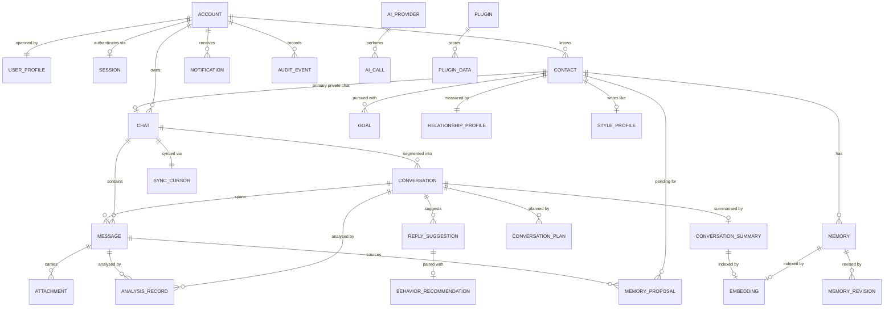

# DOMAIN_MODEL.md

# Telegram AI Conversation Assistant

Domain Model Specification

Version: 1.0

Status: Active

Last Updated: 2026-07-28

---

# 1. Purpose

This document defines the business domain: its entities, value objects, invariants, relationships and lifecycles.

It is the **authoritative source for the domain model**. `DATABASE.md` derives its schema from this document, and `API.md` derives its repository and service contracts from it. When this document and the schema disagree, this document is correct and the schema is a defect.

The domain layer contains **no third-party imports** (ADR-011). Everything here is expressible in plain Python: dataclasses, enums, and pure functions.

---

# 2. Ubiquitous Language

These terms have exactly one meaning across the codebase, the documentation and the user interface.

| Term | Definition |
|---|---|
| **Account** | A Telegram account the application is authorised to act on behalf of. The root ownership boundary for all data. |
| **User Profile** | The human operator of the application: their preferences, writing style, languages and availability. Distinct from Account, which is a credential binding. |
| **Session** | An authenticated connection state for an Account, including the local encrypted session store. |
| **Contact** | A Telegram user other than the operator, about whom the application may store memories and relationship data. |
| **Chat** | A Telegram conversation container: private, group, channel or saved messages. Mirrors Telegram's structure. |
| **Conversation** | A bounded *session of interaction* within a Chat — a contiguous run of messages separated from neighbours by an inactivity gap. The unit that summaries, plans and analyses attach to. |
| **Message** | A single message within a Chat, inbound or outbound. |
| **Memory** | A durable, user-visible fact about a Contact, approved for long-term retention. |
| **Memory Proposal** | An AI-extracted candidate fact awaiting user decision. Not yet a Memory (ADR-019). |
| **Goal** | A user-defined objective for the relationship with a Contact, guiding but never overriding suggestions. |
| **Relationship Profile** | Computed, deterministic metrics describing interaction patterns with a Contact. |
| **Style Profile** | Observed communication characteristics of a Contact or of the operator: typical length, formality, emoji use, language mix. |
| **Conversation Context** | The assembled, token-budgeted input to an AI task for one Conversation at one moment. Transient. |
| **Conversation Plan** | A proposed strategy for continuing a Conversation, given a Goal. |
| **Reply Suggestion** | A generated candidate reply with confidence, reasoning and alternatives. Never sent automatically (ADR-023). |
| **Behavior Recommendation** | Advice about *when* and *how* to reply. Advice only; never an action. |
| **Emotion Assessment** | A detected emotional state with confidence and supporting evidence. |
| **Analysis Record** | A cached AI-derived judgement about a Message or Conversation, versioned by prompt and model. |
| **Sync Cursor** | Per-Chat bookmark recording how far history synchronisation has progressed. |
| **Notification** | A user-facing alert raised by the application. |
| **Audit Event** | A durable record of a security- or privacy-relevant action. |
| **AI Provider** | A configured source of language-model or embedding capability. |
| **Plugin** | An optional extension registered through the plugin host. |
| **Configuration** | Deployment-scoped, file- and environment-sourced settings. Immutable at runtime (ADR-028). |
| **Setting** | User-scoped preference stored in the database and mutable at runtime (ADR-028). |

**Chat versus Conversation** is the distinction most easily lost. A Chat is permanent and mirrors Telegram. A Conversation is a derived, bounded episode within it. One Chat has many Conversations. Summaries belong to Conversations; message history belongs to Chats.

---

# 3. Entity Overview



---

# 4. Value Objects

Value objects are immutable, compared by value, and carry their own validation. They have no identity.

| Value Object | Definition | Invariants |
|---|---|---|
| `AccountId`, `ContactId`, `ChatId`, `MessageId`, `ConversationId`, `MemoryId`, `GoalId` | Typed 64-bit identifiers | Positive; not interchangeable across types |
| `TelegramUserId`, `TelegramChatId`, `TelegramMessageId` | External identifiers assigned by Telegram | Never used as local primary keys |
| `Confidence` | A model or system confidence value | `0.0 ≤ value ≤ 1.0`; exposes `band()` → `LOW`/`MEDIUM`/`HIGH` using configured thresholds |
| `Score` | A normalised metric (trust, engagement, depth) | `0.0 ≤ value ≤ 1.0`; carries `sample_size` and `computed_at`; a score with `sample_size` below the minimum is `Score.insufficient()` and never displayed as a number |
| `Importance` | Memory importance weight | `0.0 ≤ value ≤ 1.0` |
| `TokenBudget` | Allocation across context sections | Section allocations sum to no more than `total` |
| `TimeWindow` | A start/end instant pair | `start ≤ end`; both UTC |
| `LanguageCode` | BCP-47 language tag | Validated against a known tag set |
| `Timezone` | IANA timezone identifier | Must resolve; defaults to the Account timezone |
| `PromptVersion` | Prompt identifier plus semantic version | Immutable; recorded on every AI artifact |
| `ModelIdentifier` | Provider name plus model name | Immutable; recorded on every AI artifact |
| `Money` | Estimated cost | Non-negative; carries currency; always marked as an estimate |
| `Provenance` | Origin of a fact: `USER`, `AI_APPROVED`, `AI_AUTO`, `IMPORTED` | Determines precedence in conflict resolution |

**Time rule.** Every instant in the domain is UTC. Local-time conversion happens only in the presentation layer, using the Contact's or Account's timezone. No domain object stores a naive datetime.

---

# 5. Core Entities

## 5.1 Account

**Responsibility.** Represents an authorised Telegram account and forms the ownership root for all stored data. Present from the first release even though multi-account is a future feature, because retrofitting an ownership root is a breaking migration (`PROJECT_SPEC.md` §4.11).

**Attributes.** `id`, `telegram_user_id`, `phone_number_hash`, `display_name`, `is_active`, `timezone`, `created_at`, `updated_at`, `last_authenticated_at`.

**Invariants.**
- Exactly one Account is `is_active` at a time in v1.0.
- `phone_number_hash` stores a salted hash, never the number itself.
- Deleting an Account deletes every record owned by it, with no orphans.

**Lifecycle.** `created → authenticating → active → suspended → logged_out → deleted`

**Relationships.** Owns Chats, Contacts, Notifications, Audit Events; has one User Profile and at most one live Session.

---

## 5.2 User Profile

**Responsibility.** Describes the operator: how they write, what languages they use, when they are available, and what assistance they want. It is the counterpart to a Contact's Style Profile and supplies the "user preferences" section required by every prompt.

**Attributes.** `id`, `account_id`, `display_name`, `primary_language`, `additional_languages`, `timezone`, `tone_preference` (`casual` | `neutral` | `formal` | `mirror_contact`), `preferred_message_length`, `emoji_usage` (`none` | `sparing` | `frequent`), `available_hours`, `quiet_hours`, `auto_approve_memory_categories`, `confidence_thresholds`, `created_at`, `updated_at`.

**Invariants.**
- Exactly one User Profile per Account.
- `quiet_hours` must not cover the entire day.
- `confidence_thresholds` satisfy `low < medium < high`, each within `[0,1]`.

**Notes.** `tone_preference = mirror_contact` instructs the Reply Generator to adopt the Contact's Style Profile rather than a fixed register.

---

## 5.3 Session

**Responsibility.** Represents authenticated connection state for an Account, including the location of the encrypted Telegram session store and the current authorization stage. It exists in the domain because the authorization flow is a multi-step state machine the presentation layer must drive.

**Attributes.** `id`, `account_id`, `state`, `session_path`, `encryption_key_ref` (a name in the `SecretStore`, never a key value), `connected_at`, `last_activity_at`, `client_version`.

**States.**

```
disconnected → connecting → awaiting_phone → awaiting_code
             → awaiting_password (2FA) → ready
             → reconnecting → disconnected | ready
             → logged_out
```

**Invariants.**
- `encryption_key_ref` never holds key material.
- Only the `ready` state permits sending.
- Transition to `logged_out` destroys local session material.

---

## 5.4 Contact

**Responsibility.** A person the operator communicates with, and the anchor for memory, goals and relationship data.

**Attributes.** `id`, `account_id`, `telegram_user_id`, `username`, `display_name`, `first_name`, `last_name`, `phone_number_hash`, `language`, `country`, `timezone`, `is_blocked`, `is_deleted`, `notes`, `first_seen_at`, `last_seen_at`, `created_at`, `updated_at`, `deleted_at`.

**Invariants.**
- `(account_id, telegram_user_id)` is unique.
- A Contact cannot be its own Account's operator identity.
- Soft deletion (`deleted_at`) hides a Contact and suspends all AI processing for it, but preserves history until hard deletion is requested.
- Hard deletion removes the Contact and every Memory, Proposal, Goal, Relationship Profile, Style Profile and Suggestion referencing it (`PRIVACY.md` §7, contact purge).

**Lifecycle.** `discovered → active → dormant → archived → deleted`. *Dormant* is derived (no interaction within a configured window), not stored.

---

## 5.5 Chat

**Responsibility.** Mirrors a Telegram conversation container and owns message history, synchronisation state and per-chat AI policy.

**Attributes.** `id`, `account_id`, `telegram_chat_id`, `chat_type` (`private` | `group` | `supergroup` | `channel` | `saved`), `title`, `contact_id` (set for private chats only), `is_muted`, `is_archived`, `sync_enabled`, `ai_processing_mode` (`disabled` | `local_only` | `cloud_allowed`), `retention_days`, `last_message_at`, `created_at`, `updated_at`, `deleted_at`.

**Invariants.**
- `(account_id, telegram_chat_id)` is unique.
- `contact_id` is non-null if and only if `chat_type = private`.
- `ai_processing_mode` defaults to `local_only` (ADR-024); no content leaves the device for a Chat set to `disabled` or `local_only`.
- A Chat with `sync_enabled = false` ingests no history and receives no live updates.
- `retention_days = null` means "inherit the global policy".

**Notes.** MVP scope is private chats (`PROJECT_SPEC.md` §12). The entity models the others so that enabling group support later is additive rather than a schema change.

---

## 5.6 Message

**Responsibility.** A single message. The immutable factual record from which everything else is derived.

**Attributes.** `id`, `account_id`, `chat_id`, `conversation_id`, `telegram_message_id`, `sender_kind` (`operator` | `contact` | `system`), `sender_telegram_user_id`, `is_outgoing`, `message_type` (`text` | `photo` | `voice` | `video` | `document` | `sticker` | `location` | `poll` | `service` | `other`), `text`, `reply_to_message_id`, `forwarded_from`, `sent_at` (Telegram time, UTC), `edited_at`, `ingested_at` (local insert time, UTC), `is_deleted_remotely`, `deleted_at`.

**Invariants.**
- `(account_id, chat_id, telegram_message_id)` is unique — the idempotency guarantee that makes re-synchronisation safe.
- `sent_at` and `ingested_at` are distinct concepts and both required. Timing analysis uses `sent_at`; sync diagnostics use `ingested_at`. Conflating them is a defect.
- `is_outgoing` is derived from the sender at ingest and stored, because it is queried constantly.
- Messages are **immutable after ingest** except for `edited_at`, `text` on edit, `is_deleted_remotely` and `deleted_at`.
- `reply_to_message_id` references a local Message or is null; it is never a dangling Telegram identifier.

**Deletion policy.** A remote deletion sets `is_deleted_remotely` and blanks `text` if the user has enabled *mirror remote deletions* (default: on). The row is retained so replies referencing it remain coherent (`PROJECT_SPEC.md` §4.1, `sync.mirror_remote_deletions`).

---

## 5.7 Conversation

**Responsibility.** A bounded episode of interaction within a Chat. The unit of summarisation, planning and analysis. Its existence keeps prompt context proportional to a coherent exchange rather than to an entire chat history.

**Attributes.** `id`, `account_id`, `chat_id`, `started_at`, `ended_at`, `message_count`, `is_open`, `initiated_by` (`operator` | `contact`), `dominant_language`, `created_at`, `updated_at`.

**Invariants.**
- A Conversation belongs to exactly one Chat and never spans Chats.
- At most one Conversation per Chat has `is_open = true`.
- Conversations do not overlap in time within a Chat.
- `ended_at` is null while open.

**Segmentation rule (deterministic, no AI).** A new Conversation begins when the gap since the previous message exceeds `conversation_gap_minutes` (default 360), or when the open Conversation exceeds `conversation_max_messages` (default 200). Segmentation is pure and re-runnable: re-segmenting a Chat from its messages yields identical boundaries.

---

## 5.8 Attachment

**Responsibility.** Metadata for non-text message content. The application stores metadata always and file bytes only when the user has enabled media download.

**Attributes.** `id`, `message_id`, `attachment_type`, `filename`, `mime_type`, `size_bytes`, `storage_path`, `is_downloaded`, `remote_file_id`, `duration_seconds`, `width`, `height`, `caption`, `created_at`.

**Invariants.**
- `storage_path` is non-null only when `is_downloaded` is true.
- Downloads respect the configured per-file and total size caps.
- Deleting a Message deletes its Attachments and any downloaded bytes.

---

## 5.9 Memory

**Responsibility.** A durable, user-visible fact about a Contact. The system's most valuable and most safety-critical state (ADR-019).

**Attributes.** `id`, `account_id`, `contact_id`, `category`, `key`, `value`, `confidence`, `importance`, `provenance`, `source_message_id`, `source_conversation_id`, `valid_from`, `valid_until`, `is_pinned`, `last_retrieved_at`, `retrieval_count`, `created_at`, `updated_at`, `deleted_at`.

**Invariants.**
- `(account_id, contact_id, category, key)` is unique among non-deleted Memories. This constraint is what makes deduplication tractable.
- Every Memory has provenance. A Memory with `provenance ∈ {AI_APPROVED, AI_AUTO}` must reference the source Message that produced it.
- **`provenance = USER` outranks all AI provenance** in retrieval scoring and conflict resolution.
- A Memory is never silently overwritten. Changing a value creates a `MemoryRevision` and updates the current value in one transaction.
- `is_pinned` Memories are always eligible for retrieval regardless of score.
- Deletion is soft first (`deleted_at`); hard deletion additionally removes revisions and embeddings.

**Categories (initial closed set).** `identity`, `location`, `occupation`, `interest`, `preference`, `relationship`, `important_date`, `plan`, `shared_experience`, `open_question`, `constraint`, `other`.

**Lifecycle.** `proposed → approved → active → superseded | archived → deleted`

**Decay.** `effective_importance = importance × recency_factor(last_retrieved_at, updated_at)`. Decay affects ranking only; it never deletes. Deletion is always a user action or a retention-policy action (`PRIVACY.md` §6).

---

## 5.10 Memory Proposal

**Responsibility.** An AI-extracted candidate fact awaiting a decision. The mechanism that keeps hallucinated or injected content out of permanent memory (ADR-019).

**Attributes.** `id`, `account_id`, `contact_id`, `category`, `key`, `value`, `confidence`, `source_message_id`, `source_conversation_id`, `prompt_version`, `model_identifier`, `status` (`pending` | `approved` | `rejected` | `superseded` | `expired`), `conflicts_with_memory_id`, `rejection_reason`, `created_at`, `decided_at`.

**Invariants.**
- A Proposal with a non-null `conflicts_with_memory_id` **can never be auto-approved**; it always requires a user decision.
- Approval creates or revises exactly one Memory, in the same transaction that sets `status = approved`.
- Rejected Proposals are retained so the same fact is not re-proposed; the extractor consults rejection history.
- Proposals expire after a configured period (default 90 days) and are then `expired`, not silently deleted.

**Auto-approval rule.** A Proposal auto-approves only when *all* hold: its category is in `UserProfile.auto_approve_memory_categories`; `confidence ≥ threshold.high`; `conflicts_with_memory_id` is null; and the Chat's `ai_processing_mode` is not `disabled`. Otherwise it waits for the user.

---

## 5.11 Memory Revision

**Responsibility.** The audit trail of a Memory's value over time. Enables "what did we believe, when, and why", and makes supersession reversible.

**Attributes.** `id`, `memory_id`, `previous_value`, `new_value`, `reason` (`user_edit` | `superseded_by_proposal` | `merge` | `correction`), `changed_by` (`user` | `system`), `source_proposal_id`, `created_at`.

**Invariants.** Revisions are append-only and never modified or deleted while the parent Memory exists.

---

## 5.12 Goal

**Responsibility.** A user-defined objective for a relationship, guiding planning and reply generation without overriding user judgement.

**Attributes.** `id`, `account_id`, `contact_id`, `goal_type`, `title`, `description`, `priority`, `status` (`active` | `paused` | `achieved` | `abandoned`), `target_date`, `success_criteria`, `created_at`, `updated_at`, `deleted_at`.

**Invariants.**
- **At most one `active` Goal per Contact.** This resolves the cardinality ambiguity across the v1.0 documents: the schema permits many Goals per Contact (history, paused alternatives), the domain permits exactly one active at a time, and the planner consumes only the active one.
- `priority` orders non-active Goals for promotion; it does not create concurrency.
- A Goal is always authored by the user. AI never creates or modifies Goals; it may only suggest that the user consider a change.

**Goal types.** `friendship`, `professional_networking`, `language_practice`, `maintain`, `reconnect`, `general`, `custom`.

---

## 5.13 Relationship Profile

**Responsibility.** Deterministic, explainable metrics describing the interaction pattern with a Contact. Computed from observable message data (ADR-029 §3) — no LLM involvement.

**Attributes.** `id`, `account_id`, `contact_id`, `interaction_frequency`, `reciprocity_ratio`, `median_response_time_operator`, `median_response_time_contact`, `conversation_depth`, `engagement_trend` (`rising` | `stable` | `declining` | `insufficient_data`), `topic_breadth`, `initiation_balance`, `total_messages`, `total_conversations`, `first_interaction_at`, `last_interaction_at`, `sample_size`, `computed_at`.

**Invariants.**
- Exactly one Relationship Profile per Contact.
- Every metric is a pure function of Messages and Conversations, recomputable from scratch and identical on recomputation.
- A metric whose `sample_size` is below the configured minimum is reported as `insufficient_data`, never as a number.
- Metric definitions are published in §10 of this document and are stable across releases; changing one requires a version bump and a recomputation job.

**Deliberate exclusion.** There is no stored `trust_score` or `friendship_level`. The v1.0 documents specified both without definitions, which made them unfalsifiable and untestable. The measurable components are retained above; any qualitative label shown in the UI is derived at presentation time from these metrics and is always accompanied by the evidence that produced it (`PROJECT_SPEC.md` §3.5).

---

## 5.14 Style Profile

**Responsibility.** Observed communication characteristics, used so suggestions match how a Contact actually writes and how the operator actually writes.

**Attributes.** `id`, `account_id`, `owner_kind` (`contact` | `operator`), `contact_id`, `median_message_length`, `formality` (`informal` | `neutral` | `formal`), `emoji_rate`, `question_rate`, `languages`, `typical_active_hours`, `punctuation_style`, `sample_size`, `computed_at`.

**Invariants.**
- `contact_id` is non-null exactly when `owner_kind = contact`.
- Computed from observable data; the LLM may only label `formality`.
- Below the minimum sample size, the profile is not used to shape suggestions.

---

## 5.15 Conversation Summary

**Responsibility.** A compact representation of a Conversation, letting later context assembly skip raw history (`PROMPTS.md` §19).

**Attributes.** `id`, `account_id`, `conversation_id`, `chat_id`, `summary_text`, `key_topics`, `important_facts`, `open_questions`, `follow_up_opportunities`, `first_message_id`, `last_message_id`, `prompt_version`, `model_identifier`, `analysis_version`, `token_count`, `created_at`, `superseded_at`.

**Invariants.**
- At most one non-superseded Summary per Conversation.
- Regenerating a Summary supersedes rather than replaces the previous one.
- A Summary always records the prompt and model that produced it, enabling targeted invalidation (ADR-026 §5).
- A Summary never contains material absent from its source Conversation; violations are an evaluation failure (`AI_MODELS.md` §14).

---

## 5.16 Conversation Context

**Responsibility.** The assembled, budgeted input for one AI task at one moment. **Transient — never persisted.** It exists as a domain object so context assembly is unit-testable without a model.

**Attributes.** `conversation_id`, `contact_id`, `goal`, `relationship_profile`, `style_profiles`, `retrieved_memories`, `summary`, `recent_messages`, `current_message`, `open_questions`, `token_budget`, `assembled_at`, `truncation_report`.

**Invariants.**
- Total tokens never exceed `token_budget.total`.
- Section priority when trimming follows `PROMPTS.md` §19: current message → recent messages → summary → memories → relationship → goal → system.
- `truncation_report` records exactly what was dropped, so degraded output is explainable rather than mysterious.
- All Contact-derived content in a Context is marked as untrusted for prompt-assembly purposes (`SECURITY.md` §12).

---

## 5.17 Conversation Plan

**Responsibility.** A proposed strategy for continuing a Conversation given the active Goal.

**Attributes.** `id`, `account_id`, `conversation_id`, `objective`, `suggested_direction`, `topics_to_introduce`, `topics_to_avoid`, `reasoning`, `confidence`, `prompt_version`, `model_identifier`, `created_at`, `is_stale`.

**Invariants.**
- A Plan is advisory. Neither the Reply Generator nor the user is bound by it.
- A Plan becomes `is_stale` when a new message arrives in its Conversation.
- Plans are retained for explainability and evaluation, not reused once stale.

---

## 5.18 Reply Suggestion

**Responsibility.** A generated candidate reply with its reasoning, confidence and alternatives. Persisted because `PROJECT_SPEC.md` §3.6 requires the application to explain why a suggestion was made, and `TESTING.md` §9 requires regression comparison.

**Attributes.** `id`, `account_id`, `conversation_id`, `in_reply_to_message_id`, `primary_text`, `alternatives`, `reasoning`, `confidence`, `uncertainty_flags`, `recommended_action` (`send` | `review` | `clarify` | `write_manually` | `wait`), `context_snapshot_ref`, `plan_id`, `prompt_version`, `model_identifier`, `provider_name`, `status` (`offered` | `accepted` | `edited_and_sent` | `dismissed` | `expired`), `sent_message_id`, `created_at`, `decided_at`.

**Invariants.**
- **A Reply Suggestion never sends itself** (ADR-023). Only the `SendMessage` use case sends, and only from an `accepted` or `edited_and_sent` Suggestion or user-authored text.
- `confidence` below `threshold.low` forces `recommended_action ∈ {clarify, write_manually}`.
- `context_snapshot_ref` identifies the memories, summary and messages used, so a suggestion remains explainable after the underlying data changes.
- Outcome (`status`) is recorded for every Suggestion; this is the primary quality signal for evaluation.

---

## 5.19 Behavior Recommendation

**Responsibility.** Advice about reply timing and shape. Deterministic (ADR-029 §3).

**Attributes.** `id`, `account_id`, `conversation_id`, `suggested_delay_seconds`, `suggested_send_at`, `rationale`, `suggested_length`, `should_split`, `split_hint`, `confidence`, `rule_version`, `created_at`.

**Invariants.**
- Advisory only. It has **no dependency on the Telegram gateway** — a structural guarantee, not a policy (ADR-023 §4).
- Never recommends sending inside the operator's configured quiet hours unless the message is marked urgent.
- Outputs are bounded by configured minimum and maximum delays.
- `rule_version` records which rule set produced the advice.

---

## 5.20 Emotion Assessment

**Responsibility.** Detected emotional state for a Message or Conversation, with evidence.

**Attributes.** `id`, `subject_kind` (`message` | `conversation`), `subject_id`, `primary_emotion`, `emotion_scores`, `confidence`, `evidence`, `prompt_version`, `model_identifier`, `created_at`.

**Emotions.** `happy`, `excited`, `curious`, `neutral`, `sad`, `angry`, `anxious`, `stressed`, `surprised`, `confused`.

**Invariants.**
- `emotion_scores` covers the full closed set and sums to approximately 1.0.
- `evidence` cites the text that drove the assessment; an assessment without evidence is invalid.
- Emotion never triggers an automatic action; it informs suggestions only.

---

## 5.21 Analysis Record

**Responsibility.** A cached AI judgement about a Message or Conversation, preventing repeated processing and enabling targeted invalidation.

**Attributes.** `id`, `subject_kind`, `subject_id`, `analysis_type` (`emotion` | `intent` | `topic` | `question_detection` | `stage` | `composite`), `result`, `confidence`, `analysis_version`, `prompt_version`, `model_identifier`, `input_fingerprint`, `created_at`.

**Invariants.**
- `(subject_kind, subject_id, analysis_type, analysis_version)` is unique.
- `input_fingerprint` is a hash of the exact analysed content; a change invalidates the entry.
- A prompt or model version change invalidates only affected entries, never the whole cache (ADR-029 §5).

---

## 5.22 Sync Cursor

**Responsibility.** Per-Chat synchronisation bookmark making history backfill resumable and idempotent.

**Attributes.** `id`, `account_id`, `chat_id`, `oldest_synced_message_id`, `newest_synced_message_id`, `backfill_complete`, `backfill_target_date`, `last_sync_at`, `last_error`, `consecutive_failures`, `updated_at`.

**Invariants.**
- Exactly one Cursor per Chat.
- Backfill resumes from `oldest_synced_message_id` and never re-requests completed ranges.
- Interrupting a sync at any point leaves the Cursor consistent; the next run resumes without gaps or duplicates.
- `consecutive_failures` drives exponential backoff and, past a threshold, disables sync for that Chat and raises a Notification.

---

## 5.23 Notification

**Responsibility.** A user-facing alert raised by the application.

**Attributes.** `id`, `account_id`, `notification_type`, `severity` (`info` | `warning` | `error` | `action_required`), `title`, `body`, `related_entity_kind`, `related_entity_id`, `is_read`, `is_dismissed`, `action_url`, `created_at`, `read_at`.

**Types.** `memory_proposals_pending`, `suggestion_ready`, `sync_failed`, `auth_required`, `provider_unavailable`, `quota_warning`, `retention_pending`, `plugin_error`, `backup_failed`, `migration_required`.

**Invariants.**
- `action_required` notifications persist until acted upon; they cannot be auto-dismissed.
- Notifications never contain message content beyond a short, configurable preview, and none at all when previews are disabled.

---

## 5.24 AI Provider

**Responsibility.** A configured source of model capability, with its declared capabilities, limits and data-boundary classification.

**Attributes.** `id`, `provider_name`, `provider_kind` (`cloud_llm` | `local_llm` | `cloud_embedding` | `local_embedding`), `model_identifier`, `endpoint`, `api_key_ref`, `capabilities`, `context_window_tokens`, `max_output_tokens`, `cost_per_input_token`, `cost_per_output_token`, `is_enabled`, `is_default_for`, `data_boundary` (`local` | `external`), `priority`, `created_at`, `updated_at`.

**Invariants.**
- `api_key_ref` is a `SecretStore` name, never a key value (ADR-021).
- A provider with `data_boundary = external` may only process content from Chats whose `ai_processing_mode = cloud_allowed` (ADR-024).
- `capabilities` is discovered and verified by `ai check`, not trusted from configuration (ADR-020).
- Disabling every provider is valid; the application degrades to non-AI features (`PROJECT_SPEC.md` §4.2).

---

## 5.25 AI Call

**Responsibility.** An instrumentation record for one model invocation. Makes cost and latency measurable from the first milestone (ADR-029 §6).

**Attributes.** `id`, `account_id`, `provider_name`, `model_identifier`, `prompt_id`, `prompt_version`, `task_kind`, `input_tokens`, `output_tokens`, `estimated_cost`, `latency_ms`, `outcome` (`success` | `schema_violation` | `repaired` | `rate_limited` | `timeout` | `provider_error` | `cancelled`), `retry_count`, `related_entity_kind`, `related_entity_id`, `created_at`.

**Invariants.**
- **Never stores prompt or response content** — only metadata (`SECURITY.md` §9).
- Written for every call including failures; success-only instrumentation hides the expensive cases.
- Subject to log retention, not conversation retention.

---

## 5.26 Plugin

**Responsibility.** Registration record for an installed extension (ADR-025).

**Attributes.** `id`, `plugin_name`, `version`, `api_version_range`, `entry_point`, `is_enabled`, `declared_permissions`, `install_source`, `installed_at`, `last_error`, `error_count`, `updated_at`.

**Invariants.**
- A Plugin whose `api_version_range` excludes the current API version is refused and never loaded.
- `declared_permissions` is advisory in v1.0: displayed and logged, not enforced (ADR-025 §4).
- Repeated failures disable the Plugin and raise a Notification; a failing Plugin never halts the application.

---

## 5.27 Audit Event

**Responsibility.** A durable record of security- and privacy-relevant actions (ADR-027 §3).

**Attributes.** `id`, `account_id`, `event_type`, `actor` (`user` | `system` | `plugin`), `actor_detail`, `summary`, `related_entity_kind`, `related_entity_id`, `created_at`.

**Types.** `login`, `logout`, `session_created`, `session_destroyed`, `provider_enabled`, `provider_disabled`, `ai_mode_changed`, `data_exported`, `data_deleted`, `contact_purged`, `retention_applied`, `backup_created`, `backup_restored`, `plugin_installed`, `plugin_enabled`, `plugin_disabled`, `encryption_enabled`, `diagnostic_logging_enabled`.

**Invariants.**
- **Append-only.** No update or delete path exists, including for administrative use.
- Never contains message content or secret values.
- Retained independently of conversation retention; deleting conversation data does not erase the record that a deletion occurred.

---

## 5.28 Setting

**Responsibility.** A user-scoped, runtime-mutable preference (ADR-028).

**Attributes.** `key`, `account_id`, `value_json`, `updated_at`.

**Invariants.**
- Keys are drawn from a declared, validated schema; unknown keys are rejected.
- A key present in Configuration must not exist as a Setting (ADR-028 §1), verified at startup.
- Changing a Setting emits a `SettingChanged` domain event.

---

## 5.29 Retention Policy

**Responsibility.** User-configured rules for how long each class of data is kept (`PROJECT_SPEC.md` §4.8).

**Attributes.** `id`, `account_id`, `scope` (`messages` | `attachments` | `analyses` | `summaries` | `memories` | `suggestions` | `logs` | `audit`), `chat_id`, `retention_days`, `action` (`delete` | `archive` | `anonymise`), `is_enabled`, `last_applied_at`.

**Invariants.**
- A `chat_id`-scoped policy overrides the account-wide policy for that Chat.
- `retention_days = null` means retain indefinitely.
- **Audit events are never deleted by a retention policy**; the `audit` scope may only lengthen retention.
- Application is idempotent and logs an Audit Event.

---

# 6. Domain Services

Domain services hold logic that belongs to no single entity. They are **pure**: no I/O, no clock reads (time is injected), fully unit-testable.

| Service | Responsibility | Key operations |
|---|---|---|
| `ConversationSegmenter` | Divides a Chat's messages into Conversations | `segment(messages, rules) → list[Conversation]` |
| `RelationshipMetricsCalculator` | Computes Relationship Profile metrics from messages | `compute(messages, conversations, now) → RelationshipProfile` |
| `StyleProfiler` | Derives Style Profiles from observable message features | `profile(messages) → StyleProfile` |
| `MemoryRanker` | Scores memories for retrieval relevance | `rank(memories, query_vector, context, now) → ranked list` |
| `MemoryConflictDetector` | Determines whether a Proposal contradicts existing Memory | `detect(proposal, memories) → Conflict \| None` |
| `MemoryMerger` | Decides whether two memories express the same fact | `merge(a, b) → MergeDecision` |
| `ContextAssembler` | Builds a token-budgeted Conversation Context | `assemble(inputs, budget) → ConversationContext` |
| `ConfidenceCalibrator` | Combines model self-report with verifiable signals | `calibrate(model_confidence, signals) → Confidence` |
| `BehaviorRuleEngine` | Deterministic timing and shape advice | `recommend(context, profile, now) → BehaviorRecommendation` |
| `SuggestionTriggerPolicy` | Decides whether to spend a model call on a message | `should_suggest(message, chat, profile, budget) → Decision` |
| `RetentionEvaluator` | Determines which records a policy affects | `evaluate(policy, now) → list[EntityRef]` |
| `TokenBudgetPlanner` | Allocates a context window across sections | `plan(window, priorities) → TokenBudget` |

**Confidence calibration** deserves emphasis. Self-reported model confidence is poorly calibrated, so `ConfidenceCalibrator` combines it with verifiable signals: whether a required memory was missing, whether an open question is unresolved, whether the message is ambiguous or very short, whether retrieval returned weak matches, whether the context was truncated. The final `Confidence` is what drives `recommended_action`, and its inputs are recorded so a low score can be explained.

---

# 7. Domain Events

Events are immutable facts about something that has happened. Naming is past tense. Delivery semantics are defined in `EVENTS` (`ARCHITECTURE.md` §8).

| Event | Payload | Raised by |
|---|---|---|
| `MessageIngested` | message_id, chat_id, is_outgoing | Ingest use case |
| `ConversationStarted` / `ConversationEnded` | conversation_id, chat_id | Segmenter |
| `ConversationAnalyzed` | conversation_id, analysis_ids | Analysis use case |
| `SummaryCreated` | summary_id, conversation_id | Summarisation |
| `MemoryProposed` | proposal_id, contact_id, has_conflict | Extraction |
| `MemoryApproved` / `MemoryRejected` | proposal_id, memory_id | Approval use case |
| `MemoryUpdated` / `MemoryDeleted` | memory_id, contact_id | Memory use cases |
| `GoalChanged` | goal_id, contact_id, previous_status | Goal use case |
| `RelationshipRecomputed` | contact_id | Metrics job |
| `PlanCreated` | plan_id, conversation_id | Planner |
| `SuggestionGenerated` | suggestion_id, confidence, recommended_action | Reply use case |
| `SuggestionDecided` | suggestion_id, status | User action |
| `MessageSent` | message_id, chat_id, from_suggestion_id | Send use case |
| `SyncStarted` / `SyncProgressed` / `SyncCompleted` / `SyncFailed` | chat_id, counts, error | Sync use case |
| `AuthorizationStateChanged` | previous, current | Session |
| `ProviderUnavailable` | provider_name, reason | AI adapter |
| `SettingChanged` | key, previous, current | Settings |
| `RetentionApplied` | policy_id, affected_counts | Retention job |
| `PluginLoaded` / `PluginFailed` | plugin_name, error | Plugin host |
| `NotificationRaised` | notification_id, severity | Any component |

---

# 8. Aggregates and Consistency Boundaries

| Aggregate | Root | Members | Transactional rule |
|---|---|---|---|
| **Account** | Account | User Profile, Session, Retention Policies | Account creation and its profile are one transaction |
| **Chat** | Chat | Messages, Conversations, Sync Cursor, Attachments | Message ingest updates the Chat, Conversation and Cursor atomically |
| **Contact Knowledge** | Contact | Memories, Revisions, Proposals, Goals, Relationship Profile, Style Profile | Proposal approval creates the Memory, its Revision and the status change atomically |
| **Suggestion** | Reply Suggestion | Plan reference, Behavior Recommendation, context snapshot | Generation persists all parts or none |
| **Plugin** | Plugin | Plugin Data | Independent |

Cross-aggregate consistency is **eventual**, achieved through domain events. Relationship recomputation after ingest, for example, is triggered by `MessageIngested` and is not part of the ingest transaction.

---

# 9. Invariant Summary

The invariants that must hold at all times, restated for testability. Each has a corresponding architectural test.

1. Every domain object with a timestamp stores UTC.
2. `(account_id, chat_id, telegram_message_id)` is unique — re-sync is idempotent.
3. At most one open Conversation per Chat; Conversations never overlap.
4. At most one active Goal per Contact.
5. Exactly one Relationship Profile per Contact.
6. Memory uniqueness on `(account_id, contact_id, category, key)` among non-deleted rows.
7. Every AI-derived Memory has provenance and a source message.
8. `provenance = USER` outranks AI provenance in every conflict.
9. A conflicting Memory Proposal never auto-approves.
10. Memory values are never overwritten without a Revision.
11. No Reply Suggestion, Plan or Behavior Recommendation can send a message.
12. `BehaviorRecommendation` and `ReplyGenerator` have no dependency on `TelegramGateway`.
13. Conversation Context never exceeds its token budget, and records what it dropped.
14. No content from a Chat with `ai_processing_mode ∈ {disabled, local_only}` reaches an external provider.
15. Audit Events are append-only and exempt from retention deletion.
16. Secret values never appear in the database, in logs, or in unencrypted backups.
17. Every AI artifact records its prompt version and model identifier.
18. Metrics with insufficient sample size report `insufficient_data`, never a number.

---

# 10. Glossary of Computed Metrics

Every metric is defined as a formula over observable data, is recomputable, and is stable across releases. Changing a definition requires a version bump and recomputation.

| Metric | Definition | Range | Minimum sample |
|---|---|---|---|
| `interaction_frequency` | Messages exchanged per active week over the trailing 90 days | ≥ 0 | 14 days of history |
| `reciprocity_ratio` | Contact messages ÷ operator messages over the window | ≥ 0, 1.0 = balanced | 20 messages |
| `median_response_time_*` | Median delay between a message and the other party's next message, excluding gaps beyond 24 h | seconds | 10 response pairs |
| `conversation_depth` | Median messages per Conversation over the window | ≥ 1 | 5 conversations |
| `topic_breadth` | Distinct topics observed ÷ conversations, over the window | 0–1 | 5 conversations |
| `initiation_balance` | Conversations initiated by contact ÷ total conversations | 0–1 | 5 conversations |
| `engagement_trend` | Sign of the slope of `interaction_frequency` across three consecutive 30-day windows | enum | 90 days |
| `emoji_rate` | Messages containing at least one emoji ÷ total messages | 0–1 | 30 messages |
| `question_rate` | Messages containing a question ÷ total messages | 0–1 | 30 messages |

---

# 11. Extension Points

Designed-in seams for planned future capability, requiring no schema redesign:

- **Multi-account.** `account_id` is present on every owned entity from the first migration.
- **Group conversations.** `Chat.chat_type` already models groups; enabling them requires a participant join table and per-sender attribution, both additive.
- **Additional platforms.** Nothing in this model names Telegram except the `telegram_*` external identifier fields, which generalise to `external_*` behind the gateway port.
- **Voice and image understanding.** `Attachment` and `message_type` already carry the metadata; adding transcription means a new Analysis Record type.
- **Knowledge-graph memory.** `Memory` category/key/value generalises to subject-predicate-object without changing consumers.
- **Multi-device sync.** Every entity carries `created_at`/`updated_at`; adding a change log and conflict resolution is additive.

---

# 12. Modelling Rules

1. Entities hold identity and lifecycle; value objects hold meaning.
2. Validation lives in the domain object, never only in the database or the UI.
3. No domain object imports a third-party library.
4. No domain object performs I/O or reads the clock; time is passed in.
5. Prefer explicit enums over free strings for any closed set.
6. Prefer immutability; mutate through explicit methods that preserve invariants.
7. A concept with no defined formula and no falsifiable meaning does not become a stored field.
