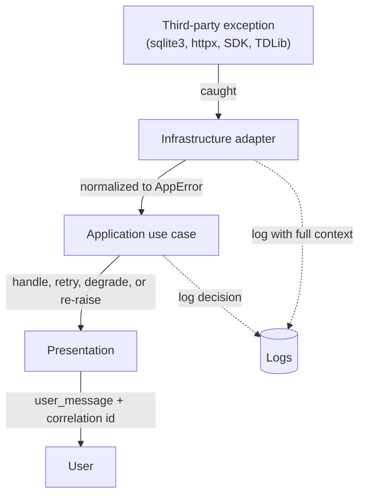

# ERROR_HANDLING.md

# Telegram AI Conversation Assistant

Error Handling Strategy

Version: 1.0

Status: Active

Last Updated: 2026-07-28

---

# 1. Purpose

This document defines the application-wide error taxonomy, how errors cross layer boundaries, retry and timeout policy, and how failures are surfaced to the user.

`API.md` §15 references this document for the failure modes each port declares.

---

# 2. Principles

1. **Errors are typed, never strings.** Behaviour depends on the type, not on message text.
2. **Normalize at the boundary.** No third-party exception escapes an adapter. A caller never catches `sqlite3.IntegrityError`, `httpx.TimeoutException` or a provider SDK error.
3. **Fail loudly on bugs, gracefully on conditions.** A violated invariant is a defect and must be visible. A network timeout is an expected condition and must be handled.
4. **Never silently swallow.** Every caught exception is logged, handled, or re-raised. A bare `except: pass` is a defect.
5. **Every error carries context** — correlation id, component, and the identifiers needed to investigate, without sensitive content.
6. **Retryability is a property of the error type**, declared once, not decided ad hoc at each call site.
7. **The user sees an actionable message**, never a stack trace, never internal detail.
8. **Degrade rather than crash.** A failing subsystem disables its features; it does not take down the application.

---

# 3. Exception Hierarchy

Every class name carries the `Error` suffix, per PEP 8 and enforced by `ruff`
rule `N818`.

```
AppError                                  (base; carries code, context, retryable, user_message)
├── DomainError                           — a business rule was violated
│   ├── InvariantViolationError
│   ├── InvalidStateTransitionError
│   ├── DomainValidationError
│   └── ConflictError
├── PersistenceError
│   ├── DatabaseUnavailableError          [retryable]
│   ├── ConstraintViolationError
│   ├── RecordNotFoundError
│   ├── TransactionFailedError            [retryable]
│   ├── MigrationFailedError
│   └── IntegrityCheckFailedError
├── TelegramError
│   ├── AuthorizationRequiredError
│   ├── AuthorizationFailedError
│   ├── TwoFactorRequiredError
│   ├── RateLimitedError                  [retryable, honours retry_after]
│   ├── ChatNotFoundError
│   ├── MessageNotFoundError
│   ├── PermissionDeniedError
│   ├── NetworkUnavailableError           [retryable]
│   ├── ConnectionLostError               [retryable]
│   └── GatewayUnavailableError           [retryable]
├── AIProviderError
│   ├── ProviderUnavailableError          [retryable]
│   ├── ProviderRateLimitedError          [retryable, honours retry_after]
│   ├── ProviderAuthenticationFailedError
│   ├── ContextTooLongError
│   ├── SchemaViolationError
│   ├── ContentFilteredError              [never retried]
│   ├── ProviderTimeoutError              [retryable]
│   ├── NoProviderAvailableError
│   └── DataBoundaryViolationError        [never retried — a bug]
├── EmbeddingError
│   ├── EmbeddingModelUnavailableError    [retryable]
│   ├── DimensionMismatchError
│   └── ReindexFailedError
├── ConfigurationError                    — fatal at startup
│   ├── MissingRequiredSettingError
│   ├── InvalidConfigurationValueError
│   ├── ConfigurationConflictError
│   ├── UnknownConfigurationKeyError
│   └── PromptRegistryInvalidError
├── SecurityError
│   ├── SecretUnavailableError
│   ├── SecretStoreUnavailableError
│   ├── PermissionCheckFailedError
│   └── EncryptionFailedError
├── PluginError
│   ├── PluginLoadFailedError
│   ├── IncompatibleApiVersionError
│   ├── PluginCrashedError
│   └── PluginDisabledError
└── OperationError
    ├── OperationCancelledError
    ├── OperationTimeoutError             [retryable]
    ├── BudgetExceededError
    └── ResourceExhaustedError
```

## Implementation status

Only the branches with a live consumer exist in code. As of Milestone 0 that is
`AppError`, `DomainError` (with `InvariantViolationError` and
`InvalidStateTransitionError`) and the full `ConfigurationError` family. The
remaining families arrive with the milestone that raises them; defining them
earlier would be a placeholder, not a contract.

## Base structure

```python
@dataclass(frozen=True)
class AppError(Exception):
    code: str                    # stable, e.g. "AI_PROVIDER_RATE_LIMITED"
    message: str                 # developer-facing; may be detailed
    user_message: str            # user-facing; simple and actionable
    context: Mapping[str, Any]   # ids and metadata; never content or secrets
    retryable: bool
    retry_after_seconds: float | None
    cause: BaseException | None
```

`code` is stable across releases and is what tests, logs and support conversations refer to. `message` may change freely; `code` may not.

---

# 4. Error Classification

Three classes, requiring different responses.

| Class | Meaning | Response | Examples |
|---|---|---|---|
| **Defect** | The code is wrong | Log at ERROR with full context, surface a generic message with a correlation id, never retry | `InvariantViolationError`, `DataBoundaryViolationError`, `DimensionMismatchError`, most `ConstraintViolationError` |
| **Condition** | The world is temporarily uncooperative | Retry per policy, then degrade | `NetworkUnavailableError`, `ProviderRateLimitedError`, `DatabaseUnavailableError` |
| **User-correctable** | The user must act | Surface clearly with the corrective action | `AuthorizationRequiredError`, `MissingRequiredSettingError`, `BudgetExceededError` |

The distinction matters because retrying a defect wastes resources and hides the bug, while treating a condition as a defect produces alarming noise for something that resolves itself.

`DataBoundaryViolationError` is deliberately classified as a defect and is never retried: if the code attempted to send `local_only` data to an external provider, the correct response is to fail hard and fix the code (`SECURITY.md` §11).

---

# 5. Layer Responsibilities



**Domain layer.** Raises `DomainError` when an invariant would be violated. Catches nothing — it performs no I/O, so there is nothing to catch.

**Infrastructure adapters.** The only layer that catches third-party exceptions. Each adapter maps them to the taxonomy, attaches context, and logs at the boundary where the technical detail is still available.

**Application layer.** Decides: retry, fall back, degrade, compensate, or propagate. This is where policy lives, because only the use case knows what a failure means for the operation in progress.

**Presentation layer.** Translates to user-facing messages, offers the corrective action, and never displays internals.

---

# 6. Retry Policy

Retry is declared by error type and applied by a shared `RetryExecutor` — not reimplemented per call site.

| Error | Attempts | Backoff | Notes |
|---|---|---|---|
| `NetworkUnavailableError` | 3 | Exponential from 1 s, jitter | |
| `ConnectionLostError` | 5 | Exponential from 2 s, jitter | Gateway reconnection |
| `RateLimitedError` (Telegram) | 3 | `retry_after` from the server | Refuses if wait exceeds the ceiling |
| `ProviderRateLimitedError` | 3 | `retry_after`, else exponential | Then fall back to the next provider |
| `ProviderUnavailableError` | 2 | Exponential from 2 s | Then fall back |
| `ProviderTimeoutError` | 2 | Exponential from 1 s | Then fall back |
| `DatabaseUnavailableError` | 3 | Exponential from 100 ms | Usually a lock; short waits |
| `TransactionFailedError` | 2 | Immediate, then 200 ms | |
| `SchemaViolationError` | 1 | Immediate | The single repair attempt (ADR-020) |
| `EmbeddingModelUnavailableError` | 2 | Exponential from 2 s | Then queue as un-embedded |
| Everything else | 0 | — | |

Rules:

1. **Jitter is always applied** to exponential backoff, so concurrent failures do not resynchronise.
2. **Total wall-clock per user-facing operation is capped** (default 60 s). Retries never exceed the cap regardless of attempt count.
3. **Retries are instrumented individually**; `ai_calls` records each attempt.
4. **Idempotency is required before retry.** Message ingest is idempotent by unique constraint; sending is not retried automatically, because a duplicate message is worse than a failed one — the user is asked.
5. `ContentFilteredError` is **never** retried; retrying around a provider's safety system is not something this application does.

---

# 7. Timeout Policy

| Operation | Timeout | On expiry |
|---|---|---|
| Database query | 5 s | `DatabaseUnavailableError` |
| Database transaction | 30 s | `TransactionFailedError`, rollback |
| Telegram API call | 30 s | `GatewayUnavailable` |
| History page fetch | 60 s | Retry from the cursor |
| LLM generation | 60 s (cloud), 180 s (local) | `ProviderTimeoutError` |
| Embedding (batch) | 60 s | `EmbeddingModelUnavailableError` |
| Vector search | 5 s | `OperationTimeoutError` — indicates a defect at this scale |
| Backup | 300 s | `OperationTimeoutError`, partial backup discarded |
| Migration | Unbounded | Reports progress; cancellation restores the backup |
| UI-initiated operation | 60 s total | Cancellable by the user throughout |

Every timeout is configurable. Every long-running operation is cancellable and reports progress; a user who cannot cancel a hung operation will kill the process, which is worse.

---

# 8. Degradation Strategy

The application prefers reduced function over failure. What survives each subsystem outage:

| Failed subsystem | Lost | Retained |
|---|---|---|
| All AI providers | Analysis, summaries, proposals, suggestions | Everything else — browsing, search, memory editing, goals, metrics, timing advice |
| Cloud provider only | Cloud-quality suggestions | Local model suggestions, or the above |
| Embedding model | Semantic retrieval | Keyword + recency + importance ranking (`VECTOR_SEARCH.md` §9) |
| Telegram connection | New messages, sending | All stored data remains fully usable offline |
| A plugin | That plugin's features | Everything else; the plugin is disabled with a notification |
| Full-text search index | Text search | Browsing, filtering, semantic retrieval |
| Scheduler | Background jobs | Everything on-demand; jobs run at next start |

**Degradation is always visible.** A disabled feature shows why and what would restore it. Silent degradation is worse than an error, because the user cannot tell whether the answer is bad or the feature is off.

The subsystem whose failure is *not* survivable is the secret store: if it is unavailable, the application refuses to start rather than proceeding without session encryption (`SECURITY.md` §7).

---

# 9. Transaction and Compensation

1. A use case is one transaction. Failure rolls back completely (`API.md` §6).
2. **Domain events publish only after commit**, so no handler acts on a fact that was rolled back.
3. **Non-transactional side effects require compensation.** Sending a message succeeds at Telegram before it is recorded locally; if the local write then fails, the message is reconciled on the next sync rather than lost or duplicated — the unique constraint on `telegram_message_id` makes reconciliation idempotent.
4. **Batched long operations** (backfill, re-index, archive) commit per batch and record progress, so interruption leaves a consistent, resumable state rather than a half-applied one.
5. **Migrations** back up first and restore automatically on failure (`DATABASE.md` §7.6).

---

# 10. User-Facing Messages

| Error | User message | Offered action |
|---|---|---|
| `AuthorizationRequiredError` | "Your Telegram session has expired." | Sign in |
| `TwoFactorRequired` | "Two-factor authentication is enabled for this account." | Enter password |
| `RateLimitedError` | "Telegram is limiting requests. Retrying in {n} seconds." | Wait / cancel |
| `NoProviderAvailableError` | "No AI provider is configured, so suggestions are unavailable. Everything else still works." | Open provider settings |
| `ProviderAuthenticationFailedError` | "The API key for {provider} was rejected." | Update key |
| `BudgetExceededError` | "You've reached your {period} AI spending limit." | Adjust limit / switch to local model |
| `ContextTooLongError` | "This conversation is too long to process at the current settings." | Reduce context size |
| `ContentFilteredError` | "{provider} declined to generate a response for this content." | Try a different provider / write manually |
| `DatabaseUnavailableError` | "The database is temporarily unavailable. Retrying." | Wait / cancel |
| `MigrationFailedError` | "The update could not be applied. Your data has been restored from backup." | View log / contact support |
| `SecretStoreUnavailableError` | "The system credential store is unavailable, so credentials cannot be protected." | Retry / documentation link |
| Any defect | "Something went wrong. Reference: {correlation_id}" | Copy diagnostics |

Rules: no stack traces; no file paths outside the app directory; no message content; no secret values; always a next step; always a correlation id for anything unexpected.

---

# 11. Logging Errors

| Class | Level | Content |
|---|---|---|
| Defect | ERROR / CRITICAL | Full context, stack trace, correlation id |
| Condition, retrying | WARNING | Error code, attempt number, next delay |
| Condition, exhausted | ERROR | Error code, attempt history, degradation applied |
| User-correctable | INFO | Error code and the action offered |
| Plugin failure | WARNING (ERROR after disabling) | Plugin name, code, count |

Every log record carries: correlation id, component, error code, account id. Never: message content, secret values, prompt or response bodies (`SECURITY.md` §9).

---

# 12. Error Handling in Background Jobs

1. A job failure never terminates the scheduler.
2. Failures are retried per §6, then the job is marked failed and a notification is raised.
3. Repeated failures (default 5 consecutive) disable the job with an `action_required` notification.
4. Jobs are idempotent, so a retry after a partial run is safe.
5. Progress is persisted, so resumption does not restart from the beginning.

---

# 13. Error Handling in Plugins

Per ADR-025 §5:

1. Every hook invocation is wrapped.
2. An exception is caught, logged with the plugin name, and counted.
3. It **never** propagates to core execution or to other plugins.
4. Repeated failures disable the plugin for the session with a notification.
5. `PluginCrashedError` is surfaced to the user with the plugin identified, so blame is attributable.

---

# 14. Testing Requirements

| Test | Assertion |
|---|---|
| Normalization | Every adapter converts its third-party exceptions to the taxonomy; no SDK exception escapes |
| Retryability | Each error type's `retryable` flag matches §6 |
| Backoff | Delays follow the declared schedule; jitter applied; wall-clock cap respected |
| Timeouts | Each operation raises the declared type on expiry |
| Rollback | A use case failure leaves no partial state |
| Events after commit | No event is published for a rolled-back transaction |
| Degradation | With each subsystem disabled, the retained features in §8 still work |
| Startup denial | Missing secret store prevents startup |
| Plugin isolation | A raising hook does not propagate and disables the plugin |
| Compensation | A send that succeeds remotely but fails locally reconciles on next sync without duplication |
| Message safety | No user-facing message contains secrets, paths or content |

Every bug fix adds a regression test reproducing the failure (`DEVELOPMENT_WORKFLOW.md` §15).

---

# 15. Anti-Patterns

Prohibited, and checked in review:

```python
except Exception:                    # bare catch-all outside a designated boundary
    pass                             # silent swallow

except Exception as e:
    logger.error(str(e))             # log-and-continue with no handling decision

raise Exception("something failed")  # untyped

if "rate limit" in str(e):           # string matching on error text
    ...

except sqlite3.IntegrityError:       # third-party exception outside its adapter
    ...

for _ in range(10):                  # ad-hoc retry loop with no backoff or cap
    try: ...
```

The catch-all is permitted in exactly three places: the plugin hook wrapper, the event handler wrapper, and the top-level application handler. Each logs fully and each exists to prevent one failure from becoming total failure.

---

# 16. Philosophy

Errors are part of the interface, not an afterthought. A port that documents its return type but not its failure modes is half-specified.

Two rules carry most of the weight:

**Distinguish defects from conditions.** Retrying a defect hides a bug; alarming the user about a condition trains them to ignore alarms.

**Degrade visibly.** A user who can see that suggestions are unavailable because no provider is configured can fix it. A user who sees empty suggestions and no explanation concludes the application is broken — and is not wrong.
