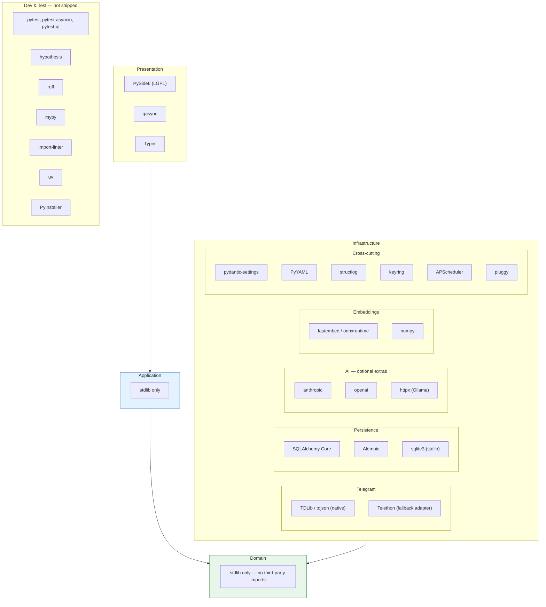
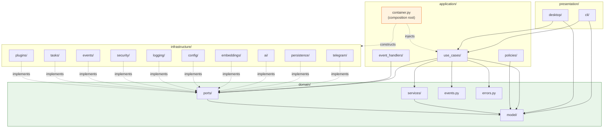
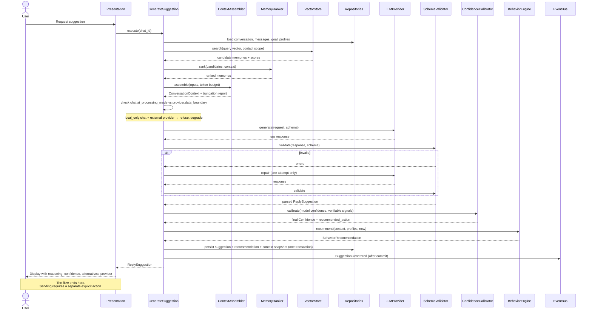
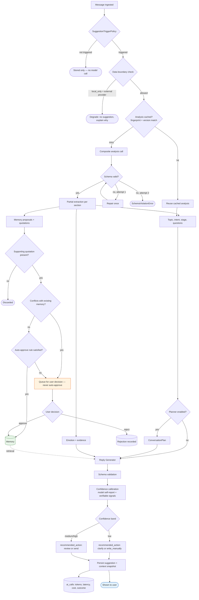
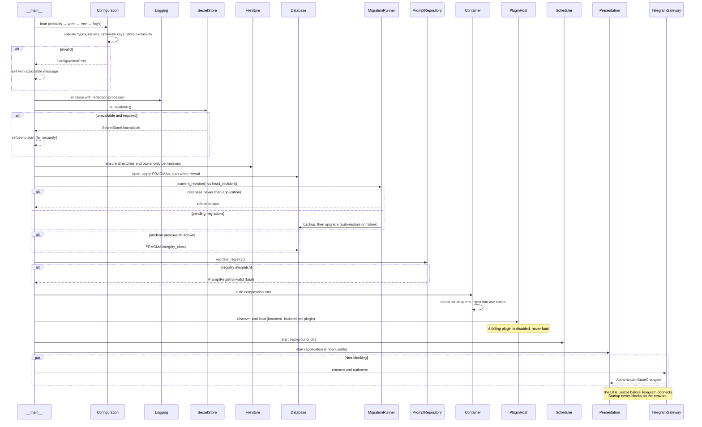
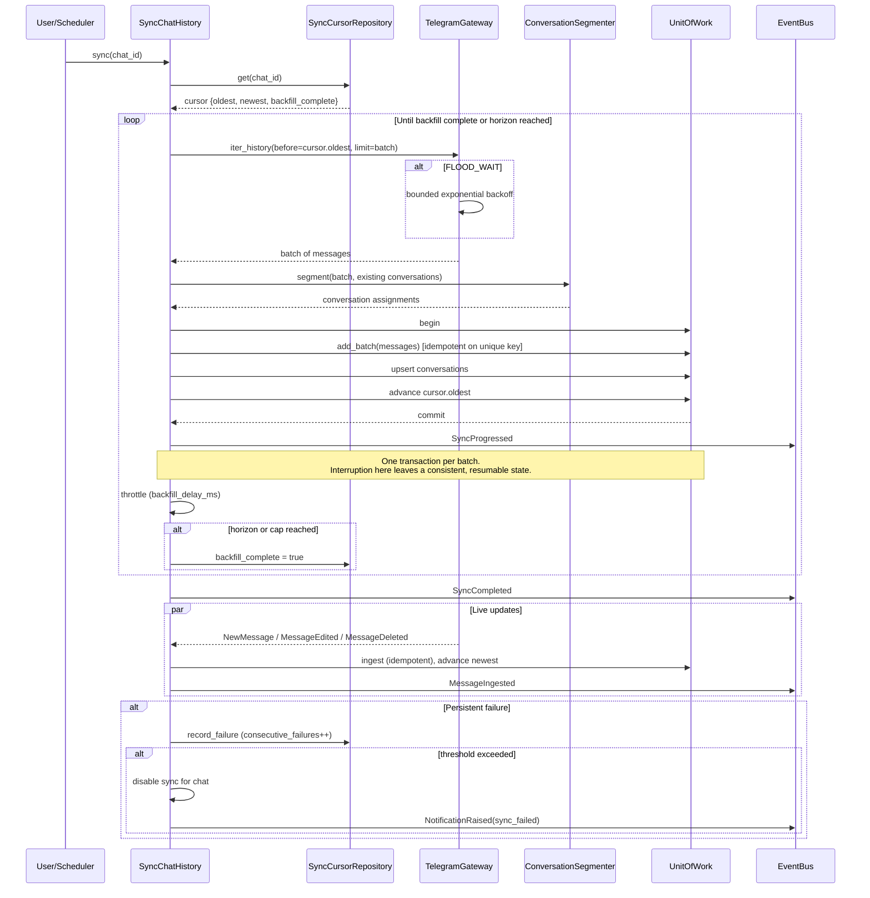
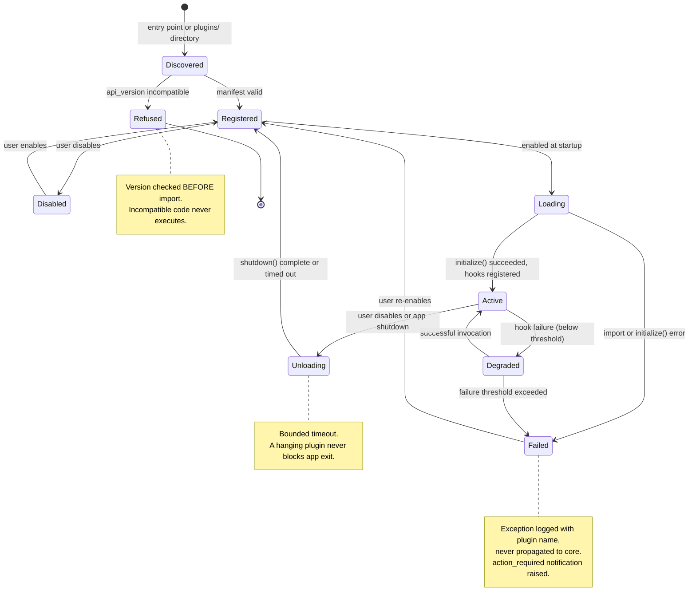
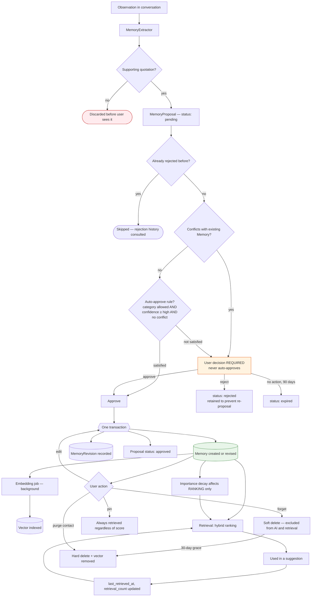
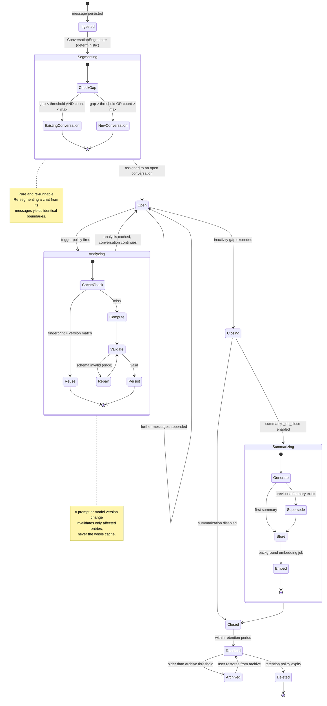

# MASTER_ARCHITECTURE.md

# Telegram AI Conversation Assistant

Master Architecture Diagrams

Version: 1.0

Status: Active

Last Updated: 2026-07-28

---

# Purpose

A single visual reference for the system's structure and behaviour. Each diagram is normative — where a diagram and prose disagree, that is a defect to be fixed, not a matter of interpretation.

| # | Diagram | Answers |
|---|---|---|
| 1 | Project dependency graph | What third-party code do we depend on, and where? |
| 2 | Module dependency graph | Which internal modules may import which? |
| 3 | Request flow | What happens when the user asks for a suggestion? |
| 4 | AI pipeline | How does a message become a validated suggestion? |
| 5 | Startup sequence | What happens between launch and a usable application? |
| 6 | Synchronisation sequence | How is history backfilled resumably? |
| 7 | Plugin lifecycle | How is a plugin discovered, loaded, isolated and unloaded? |
| 8 | Memory lifecycle | How does an observation become a durable, reversible fact? |
| 9 | Conversation processing lifecycle | How is a chat segmented, analysed and summarised? |

---

# 1. Project Dependency Graph

External dependencies by layer. Note that the domain layer has **no** external dependencies — that is the property the whole architecture is built to preserve.

**Dependency policy.** AI provider SDKs are optional extras (`pip install tgassist[anthropic]`), so a user who enables no cloud provider installs no cloud SDK. The only native dependency is the Telegram library, whose acquisition and verification is resolved in Milestone 0 (ADR-012).

---

# 2. Module Dependency Graph

The contracts enforced by `import-linter` in CI. A violation fails the build.

## Enforced contracts

| Contract | Rule |
|---|---|
| Layered architecture | `presentation` → `application` → `domain`; no reverse edges |
| Domain independence | `domain` imports nothing from `application`, `infrastructure`, `presentation`, or any third-party package |
| Infrastructure isolation | `infrastructure` imports only from `domain` |
| Composition root | Only `application/container.py` imports from `infrastructure` |
| No send capability | `ReplyGenerator`, `ConversationPlanner`, `BehaviorRuleEngine` do not reference `TelegramGateway` (ADR-023) |
| Audit immutability | `AuditRepository` exposes no update or delete method |
| No cycles | No circular imports anywhere |

---

# 3. Request Flow — Generating a Suggestion

**The critical property:** there is no edge from this flow to Telegram. Sending is a separate use case requiring an approved suggestion (ADR-023).

---

# 4. AI Pipeline

---

# 5. Startup Sequence

---

# 6. Synchronisation Sequence

---

# 7. Plugin Lifecycle

---

# 8. Memory Lifecycle

**Two invariants are visible here:** decay affects ranking but never deletes, and no path leads from AI output to `Memory` without passing through approval or an explicit, conflict-free auto-approval rule.

---

# 9. Conversation Processing Lifecycle

---

# Diagram Maintenance

These diagrams are normative. When implementation diverges:

1. If the diagram is right, the code is a defect.
2. If the code is right, update the diagram **in the same commit**.
3. A structural change (new layer, new dependency direction, new flow) requires an ADR before the diagram changes.

Diagrams are reviewed at the end of every milestone (`DEVELOPMENT_WORKFLOW.md` §12).
