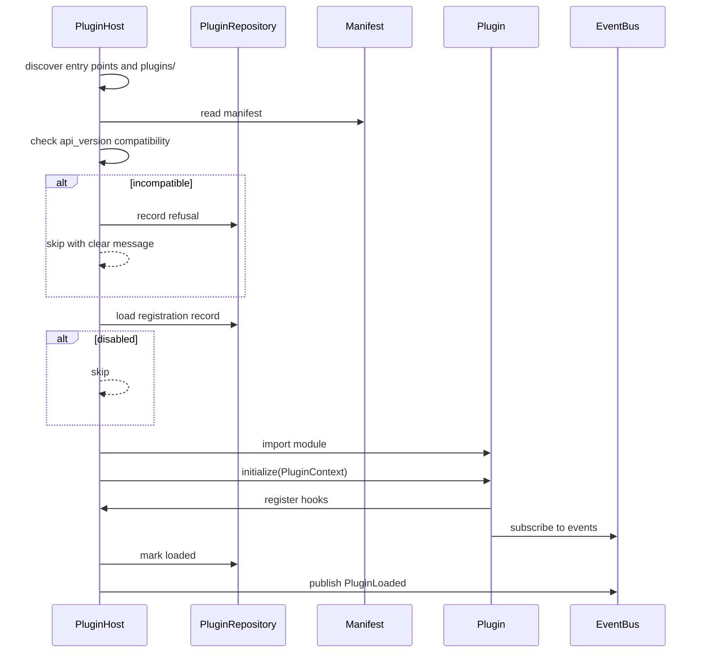
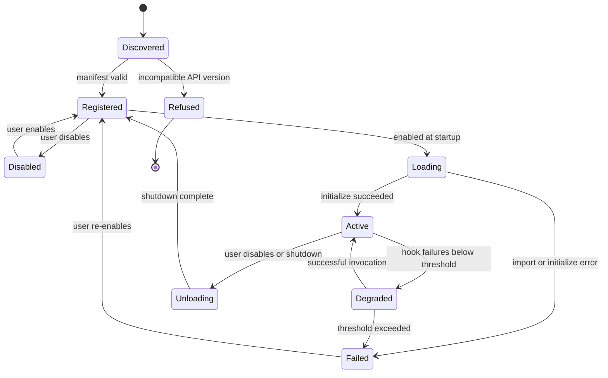

# PLUGIN_SYSTEM.md

# Telegram AI Conversation Assistant

Plugin Architecture

Version: 1.0

Status: Active

Last Updated: 2026-07-28

Governing decisions: ADR-009 (plugin-oriented design), ADR-025 (architecture and trust model)

---

# 1. Purpose

This document specifies the plugin system: what plugins can do, how they are discovered and loaded, what guarantees they receive, and — stated plainly — what security boundary they do **not** have.

The plugin framework is implemented at **Milestone 12**, after the core is stable. This document defines the design so that the interfaces built earlier are compatible with it, and so the deliberate deferral is on record rather than an omission.

---

# 2. Design Position

## 2.1 The API is derived, not designed

An extension API designed before anything uses it is a guess, and guesses about extension points are wrong in ways that only surface when the second plugin arrives — by which point the API is public and breaking it is expensive.

Therefore, before the framework is generalised, **two capabilities are built as if they were plugins**:

1. An **additional AI provider** — exercising service registration, configuration, secrets and error normalization.
2. A **UI panel** — exercising presentation registration, event subscription and data access.

The hook specification is then extracted from what those two actually needed. Anything neither needed is not in v1.0 of the API.

## 2.2 Plugins are trusted code

This is the most important statement in this document, and it is deliberately not softened.

**A plugin runs in the application's process with the application's privileges.** It can read the database file, read the Telegram session, make arbitrary network connections, and read process memory. Python offers no in-process sandbox that meaningfully constrains code determined to escape it.

**Installing a plugin is equivalent to installing an application.** The application says this at install time, in the documentation, and here.

We could implement a permission system that *looks* like enforcement. We do not, because a security control that does not control is worse than none: it converts an accurate perception of risk into a false sense of safety. What v1.0 provides instead is **transparency** — declared permissions are displayed and logged so the user can make an informed decision — plus **fault isolation**, which is a reliability control and is real.

Genuine isolation (subprocess with IPC, or WASM) is possible and is noted as post-1.0 work in §12. Until it exists, the control is user judgement, and the application's job is to inform that judgement rather than to substitute for it.

---

# 3. Capabilities

What a plugin may register:

| Capability | Hook | Example |
|---|---|---|
| **AI provider** | `register_llm_provider` | A provider not shipped with the application |
| **Embedding provider** | `register_embedding_provider` | An alternative embedding model |
| **UI panel** | `register_ui_panel` | A conversation analytics dashboard |
| **CLI command** | `register_command` | `tgassist translate` |
| **Background job** | `register_job` | Periodic export to an external note system |
| **Event handler** | `subscribe` via the event bus | React to `MemoryApproved` |
| **Memory source** | `register_memory_source` | Import facts from an external system |
| **Export format** | `register_exporter` | Export to a proprietary format |
| **Notification channel** | `register_notification_channel` | Route notifications elsewhere |

What a plugin may **not** do:

- Access the database directly (only via `PluginContext`)
- Import from `tgassist.infrastructure` or `tgassist.application.container`
- Modify core behaviour by monkey-patching (detectable in review; not prevented)
- Send Telegram messages — **the send path is closed to plugins entirely** (ADR-023)
- Read or write secrets except its own namespaced storage
- Register hooks not declared in its manifest

The send-path exclusion is absolute. A plugin that could send would defeat the automation boundary that the rest of the architecture is built to guarantee.

---

# 4. Discovery and Loading

## 4.1 Sources

| Source | Mechanism | Use |
|---|---|---|
| **Entry points** | `importlib.metadata`, group `tgassist.plugins` | pip-installed plugins |
| **Local directory** | `plugins/` scanned for packages with a manifest | Development and personal plugins |

There is no discovery from arbitrary paths and no remote installation. A plugin arrives because the user installed a package or placed a directory.

## 4.2 Manifest

Every plugin declares `plugin.toml`:

```toml
[plugin]
name = "conversation-analytics"
version = "1.2.0"
api_version = ">=1.0,<2.0"
entry_point = "conversation_analytics:Plugin"
description = "Charts and statistics for conversation history"
author = "..."
homepage = "..."

[plugin.permissions]
requires = ["memory:read", "messages:read", "ui:panel", "storage:own"]

[plugin.config]
chart_style = { type = "string", default = "line" }
```

## 4.3 Permission vocabulary

Displayed to the user at install time. **Advisory in v1.0** (§2.2).

| Permission | Meaning |
|---|---|
| `messages:read` | Read message history |
| `memory:read` / `memory:write` | Read or propose memories |
| `contacts:read` | Read contact records |
| `analysis:read` | Read AI analyses and summaries |
| `ui:panel` | Add a UI panel |
| `cli:command` | Add a CLI command |
| `jobs:schedule` | Register background jobs |
| `network` | Make outbound connections |
| `storage:own` | Use its own namespaced storage |
| `ai:provider` | Register an AI provider |

`memory:write` grants the ability to create **proposals**, not memories. The approval workflow (ADR-019) applies to plugins exactly as it applies to the built-in extractor.

There is no `telegram:send` permission, because that capability does not exist for plugins.

## 4.4 Load sequence



Rules:

1. **API version is checked before import.** An incompatible plugin is never executed.
2. Import and `initialize()` are wrapped; a failure records the error, disables the plugin and continues loading others.
3. Registration happens only during `initialize()`. Later registration attempts are rejected.
4. Load order is deterministic (alphabetical by name) so behaviour is reproducible.
5. Plugin loading never blocks application startup beyond a bounded timeout (default 5 s per plugin).

---

# 5. Lifecycle



```python
class Plugin(Protocol):
    def metadata(self) -> PluginMetadata: ...
    async def initialize(self, context: PluginContext) -> None: ...
    async def shutdown(self) -> None: ...
```

`shutdown()` is called on disable and on application exit, with a bounded timeout (default 5 s). A plugin that does not return in time is abandoned and logged; shutdown of the application is never blocked by a plugin.

---

# 6. `PluginContext`

The only surface a plugin may use (`API.md` §13).

```python
class PluginContext(Protocol):
    def logger(self) -> Logger: ...                       # pre-bound with plugin name
    def event_bus(self) -> EventBus: ...
    def config(self) -> Mapping[str, Any]: ...            # this plugin's config only
    def storage(self) -> PluginStorage: ...               # namespaced key/value
    def clock(self) -> Clock: ...

    # Read-only data access, permission-gated and account-scoped
    def data(self) -> PluginDataAccess: ...

    # Registration (valid only during initialize)
    def register_llm_provider(self, provider: LLMProvider) -> None: ...
    def register_embedding_provider(self, provider: EmbeddingProvider) -> None: ...
    def register_ui_panel(self, panel: UIPanelSpec) -> None: ...
    def register_command(self, command: CommandSpec) -> None: ...
    def register_job(self, job: Job, interval_seconds: int) -> None: ...
    def register_memory_source(self, source: MemorySource) -> None: ...
    def register_exporter(self, exporter: Exporter) -> None: ...
```

`PluginDataAccess` exposes read-only, paginated, account-scoped queries returning **domain objects** — the same objects the core uses. Plugins get no query language, no raw SQL and no repository handles, so a schema change breaks the core's mappers rather than every installed plugin.

`PluginStorage` is a namespaced key/value store backed by `plugin_data`. A plugin cannot read another plugin's namespace through the API.

---

# 7. Fault Isolation

This is a real guarantee, unlike the permission model.

1. **Every hook invocation is wrapped.** Exceptions are caught, logged with the plugin name, and counted.
2. **Exceptions never propagate** to core execution or to other plugins.
3. **Hook calls are time-bounded** (default 5 s). A timeout counts as a failure.
4. **Consecutive failures** past `plugins.failure_threshold` (default 3) disable the plugin for the session and raise an `action_required` notification naming it.
5. **Event handlers** follow the same rules (`API.md` §5.3): a repeatedly failing handler is unsubscribed automatically.
6. **A failing plugin never blocks startup or shutdown.**
7. **Blame is attributable.** Every plugin-originated log record and notification names the plugin, so the user knows what to disable.

What isolation does **not** provide: protection against a plugin that corrupts data deliberately, exhausts memory, or blocks the event loop with a synchronous CPU-bound call. These are consequences of in-process execution and are why §2.2 says what it says.

---

# 8. Versioning

The plugin API carries its own semantic version, independent of the application version, because third parties depend on it.

| Change | Version impact |
|---|---|
| New hook, new optional parameter, new permission | Minor |
| Behavioural clarification, bug fix | Patch |
| Hook removed or renamed; required parameter added; semantics changed | **Major** |

Rules:

1. Plugins declare a compatible range; incompatible plugins are refused with a message naming the required range.
2. Breaking changes require a major bump, an ADR, and a migration note in `CHANGELOG.md`.
3. Deprecated hooks warn for one minor version before removal.
4. The current API version is reported by `PluginHost.api_version()` and by `tgassist plugins info`.

---

# 9. Configuration

Plugin configuration lives under `plugins.<name>.*` in application configuration (`CONFIGURATION.md` §6.14), validated against the manifest's declared schema. A plugin receives only its own section.

Plugin **secrets** use the standard `SecretStore` with names prefixed `PLUGIN_<NAME>_`, so a plugin's credentials are visible to the user in `secrets list` alongside everything else — no hidden credential surface.

---

# 10. CLI

| Command | Purpose |
|---|---|
| `tgassist plugins list` | Installed plugins, versions, status |
| `tgassist plugins info <name>` | Manifest, declared permissions, error history |
| `tgassist plugins enable <name>` | Enable (audit event) |
| `tgassist plugins disable <name>` | Disable (audit event) |
| `tgassist plugins doctor` | Verify compatibility and configuration of all plugins |

---

# 11. Testing Requirements

Every plugin should verify loading, registration, event handling, shutdown and configuration.

The **host** is tested for:

| Test | Assertion |
|---|---|
| Version refusal | An incompatible plugin is never imported |
| Init failure isolation | A plugin failing `initialize()` does not prevent others from loading |
| Hook isolation | A raising hook does not propagate |
| Timeout | A hanging hook is abandoned and counted as a failure |
| Threshold | Repeated failures disable the plugin and notify |
| Shutdown bound | A hanging `shutdown()` does not block application exit |
| Namespace isolation | A plugin cannot read another's storage through the API |
| Data scoping | `PluginDataAccess` never returns another account's data |
| **Send path closed** | No plugin surface can send a Telegram message |
| Determinism | Load order is reproducible |

The send-path test is an architectural test, not merely a unit test: it asserts that `PluginContext` exposes no path to `TelegramGateway`.

---

# 12. Future Work

| Improvement | Value | Cost |
|---|---|---|
| **Subprocess isolation with IPC** | A genuine security boundary; permissions become enforceable | Significant complexity; IPC latency; serialization of domain objects |
| Permission enforcement | Makes the manifest meaningful | Requires the above |
| Plugin marketplace | Discovery | Requires signing, review and trust infrastructure |
| Signed plugins | Provenance | Requires key management |
| Resource quotas | Prevents runaway plugins | Requires the subprocess model |
| Hot reload | Developer experience | Moderate |

Subprocess isolation is the prerequisite for most of the rest. It is post-1.0 work and would warrant its own ADR superseding parts of ADR-025.

---

# 13. Principles

1. **Derive the API from real consumers**; do not design it speculatively.
2. **State the trust model honestly.** Plugins are trusted code and the application says so.
3. **Fault isolation is real; permission enforcement is not** — do not conflate them in the UI or the documentation.
4. **The send path is closed to plugins**, without exception.
5. **Memory writes from plugins are proposals**, subject to the same review as any AI-derived memory.
6. **Plugins see domain objects**, never rows, so schema changes do not become breaking plugin changes.
7. **Attribute blame.** The user must always be able to tell which plugin caused a problem.
8. **Never let a plugin block startup, shutdown, or the core.**
