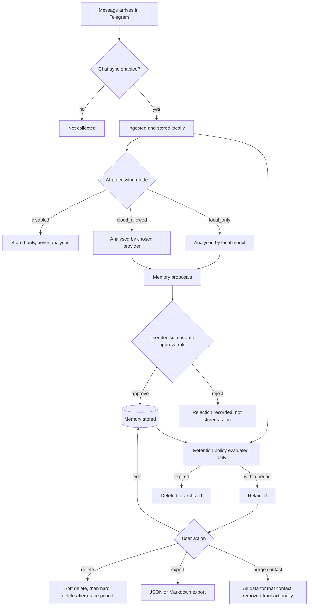

# PRIVACY.md

# Telegram AI Conversation Assistant

Privacy Principles & Data Lifecycle

Version: 1.0

Status: Active

Last Updated: 2026-07-28

Governing decision: ADR-024 (local-first design and AI data boundaries)

---

# 1. Purpose

This document states what data the application handles, where it goes, how long it stays, and who has rights over it.

It is written for two audiences: engineers deciding how a feature should behave, and users deciding whether to trust the application. Both need the same answers.

`SECURITY.md` specifies the technical controls. This document specifies the commitments those controls exist to enforce.

---

# 2. The Central Problem

Most privacy documents concern the relationship between an application and its user. This application has a third party in every interaction: **the person on the other side of the conversation.**

That person:

- did not install this application
- did not consent to being analysed
- does not know their messages are stored, summarised, or profiled
- may not know an AI provider has received their words
- has no interface through which to object

Their data is nonetheless being processed — and processed more intensively than Telegram itself does, because the application builds durable profiles, infers emotional states, and tracks relationship trajectories.

This is not a reason to abandon the project. People have always kept notes about the people in their lives, and helping someone be a more thoughtful correspondent is a legitimate goal. But it does mean the design must weigh the interests of someone who is not in the room. Where the user's convenience and the contact's interests conflict, this project resolves the conflict toward the contact — because the user chose to be here and the contact did not.

Every principle below follows from that.

---

# 3. Privacy Principles

1. **Local-first by default.** All data stays on the user's device unless the user takes an explicit action to change that.
2. **Minimise at ingest.** Do not synchronise what will not be used. Bounded scope beats unbounded collection plus later deletion.
3. **Minimise at transmission.** Send the smallest context that accomplishes the task, never full history.
4. **Granular consent.** Cloud processing is decided per chat, not once for the whole application, because sensitivity varies per relationship.
5. **Transparency.** The user can always see what is stored, where it came from, and which provider processed it.
6. **User control over derived data.** Every memory is viewable, editable and deletable. Nothing inferred is beyond reach.
7. **No telemetry.** No analytics, usage tracking or crash reporting leaves the device without separate, explicit, off-by-default consent.
8. **Contact-scoped rights.** The user can export or erase everything relating to one person in a single action, so they can honour a request from that person.
9. **Honest disclosure.** Where a protection is absent or partial, say so plainly rather than implying more.

---

# 4. Data Categories

| Category | Examples | Source | Sensitivity | Leaves device? |
|---|---|---|---|---|
| **Account identity** | Telegram user id, display name, hashed phone | Telegram | Medium | Never |
| **Session credentials** | Auth key, encryption key | Telegram | **Critical** | Never |
| **Contact identity** | Name, username, language, hashed phone | Telegram | Medium | Only within context sent to a provider, if enabled |
| **Message content** | Text, timestamps, attachments | Telegram | **High** | Only recent messages, only if the chat is `cloud_allowed` |
| **Derived memories** | Facts inferred about a contact | AI + user | **High** | Only retrieved memories, only if `cloud_allowed` |
| **Summaries** | Conversation compressions | AI | High | As above |
| **Relationship metrics** | Frequency, reciprocity, response times | Computed locally | Medium | Headline metrics only, if `cloud_allowed` |
| **Style profiles** | Length, formality, emoji rate | Computed locally | Low | As above |
| **Goals** | User-authored objectives | User | Medium | Title and description, if `cloud_allowed` |
| **Suggestions** | Generated replies and reasoning | AI | High | Generated externally if `cloud_allowed` |
| **AI call metadata** | Provider, model, tokens, latency, cost | Application | Low | Never |
| **Application logs** | Errors, events, timings | Application | Low | Never |
| **Audit events** | Security-relevant actions | Application | Low | Never |
| **Configuration** | Paths, endpoints, feature flags | User | Low | Never |
| **Secrets** | API keys, encryption keys | User | **Critical** | Never |

---

# 5. What Leaves the Device, and When

## Nothing leaves by default

On a fresh installation with no AI provider configured, **no data leaves the device**. The application connects to Telegram — which already has the messages — and to nothing else.

## When a cloud AI provider is enabled

Cloud processing requires two independent conditions:

1. The user enables a provider with `data_boundary = external`.
2. The specific chat is set to `ai_processing_mode = cloud_allowed`. **The default for every chat is `local_only`.**

Both must hold. Enabling a cloud provider does not retroactively open existing chats.

When both hold, a request may contain:

- the current message
- a bounded window of recent messages (default 20)
- the conversation summary
- retrieved memories for that contact (typically 5–15)
- headline relationship metrics
- the contact's style profile
- the active goal
- the user's tone preferences

It never contains: full chat history · other contacts' data · secrets · session data · phone numbers · attachment contents (unless an image feature is explicitly enabled) · anything from a chat that is not `cloud_allowed`.

## Disclosure

Before the first transmission to any given provider, the user is shown which provider will receive data and which categories are included, and must confirm. The active provider is visible in the UI whenever a suggestion is generated. Provider changes are audit events.

## Local embeddings

Semantic search uses a **local** embedding model by default (ADR-018). Memory text is not transmitted for embedding unless the user opts into a cloud embedding provider, which is governed by the same per-chat boundary.

---

# 6. Data Lifecycle

## Collection

Bounded by design. The user selects which chats synchronise and how far back. A chat with `sync_enabled = false` is never read. The default is opt-in per chat, not "everything".

## Storage

Local SQLite database, owner-only permissions, plus attachments on the filesystem. Sessions and secrets are stored separately and always encrypted (`SECURITY.md` §6).

## Derivation

Analyses, summaries, memories and profiles are derived data. All are traceable to their source and all are deletable. Memories additionally require a user decision before becoming permanent (ADR-019).

## Retention

Configurable per data class and per chat:

| Class | Default | Configurable |
|---|---|---|
| Messages | Indefinite | Yes, per chat |
| Attachments | Indefinite | Yes |
| Analyses | 180 days | Yes |
| Summaries | Indefinite | Yes |
| Memories | Indefinite | Yes |
| Suggestions | 90 days | Yes |
| AI call metadata | 90 days | Yes |
| Logs | 14 days | Yes |
| **Audit events** | **Indefinite** | **Lengthen only** |

Retention runs daily, is idempotent, and writes an audit event. Audit events are never deleted by policy — the record that data was deleted must outlive the data.

## Deletion

Three levels (`DATABASE.md` §6): **soft delete** (hidden, excluded from AI, reversible), **hard delete** (removed with dependents), **purge** (everything relating to a contact or chat, transactional and complete).

Soft-deleted data is hard-deleted after a 30-day grace period.

---

# 7. User and Contact Rights

## What the user can do

| Right | Mechanism |
|---|---|
| See everything stored | Full JSON export; memory and message browsers in the UI |
| See where a memory came from | Every memory shows its source message and provenance |
| See which providers processed data | Provider list, audit log, per-suggestion provider record |
| Correct anything | All memories, goals and notes are editable |
| Delete anything | Per-memory, per-message, per-chat, per-contact, or all |
| Export | JSON (complete), scoped JSON (one contact), Markdown (readable), SQLite backup (full fidelity) |
| Stop processing | Per-chat `ai_processing_mode = disabled`, or disable all providers |
| Take data elsewhere | JSON export is documented and stable within a major version |

## What the user can do *for a contact*

This is the part that distinguishes this application from one with only two parties. If someone asks the user what is stored about them, or asks for it to be deleted, the user must be able to act.

| Contact request | Mechanism |
|---|---|
| "What do you have about me?" | **Scoped export** — one command or one click produces every message, memory, summary, goal and metric relating to that contact |
| "Delete everything about me" | **Contact purge** — transactional removal across every table, including embeddings and attachments, with an audit record that it happened |
| "Stop using AI on our chats" | Set that chat's `ai_processing_mode` to `disabled` |
| "Don't send our messages to a cloud service" | Set that chat to `local_only` (the default) |
| "Correct this" | Edit or delete the specific memory |

These are first-class, single-action features — not something reconstructed by hand from a database. That is a deliberate design requirement, because a right that is technically possible but practically laborious is not a right.

**Limitation, stated plainly:** a purge removes data from this application. It cannot remove the messages from Telegram, from the contact's own device, or from an AI provider's logs if a cloud provider processed them earlier. Providers have their own retention policies over which this project has no control. This is disclosed at the point where a user enables a cloud provider.

---

# 8. AI Provider Relationships

When a cloud provider is enabled, that provider receives conversation content and is subject to its own terms and retention policies — not this project's.

The application therefore:

1. **Names the provider** before the first transmission and in settings thereafter.
2. **Links to the provider's terms** so the user can read them.
3. **Discloses that the project has no control** over provider-side retention, logging or training use.
4. **Supports local models** as a fully functional alternative for users who want no third party at all.
5. **Defaults to local**, so this only arises when the user chooses it.
6. **Never crosses the boundary on fallback** — a `local_only` chat degrades rather than escalating to a cloud provider when the local model fails.

Users concerned about provider-side handling should use local models. The application is designed so that this is a real option, not a degraded curiosity: everything except analysis, summarisation, proposals and suggestions works with no provider at all (`AI_MODELS.md` §18).

---

# 9. What the Application Does Not Do

Stated explicitly, because absence is a feature:

- **No telemetry.** No usage analytics, no crash reporting, no update pings.
- **No accounts.** No registration, no cloud service operated by this project, no server component.
- **No advertising, no profiling for anyone's benefit but the user's.**
- **No training on user data.** This project trains no models.
- **No automatic messages.** Nothing is ever sent without explicit user approval (ADR-023).
- **No synthetic typing indicators.** The application never simulates human activity to a contact.
- **No hidden data flows.** Every outbound connection is to Telegram or to a provider the user configured.
- **No backdoors.** Encrypted backups with lost passphrases are unrecoverable, because a recovery mechanism would be a backdoor.

---

# 10. Known Limitations

Honesty about gaps is a privacy practice, not an admission of failure.

| Limitation | Status | Mitigation |
|---|---|---|
| **Database is unencrypted at rest in Phase 1** | Accepted for MVP (ADR-022) | Owner-only ACLs; disclosed in onboarding; Phase 2 adds optional full encryption |
| **Contacts cannot consent or object directly** | Inherent to the problem | The user holds the tools to honour requests; defaults are conservative |
| **Provider-side retention is outside our control** | Inherent | Disclosed; local models offered as a full alternative |
| **Plugins are not sandboxed** | Accepted (ADR-025) | Stated plainly; permissions displayed but not presented as enforcement |
| **Vectors encode content** | Inherent | Treated as sensitive: same protections, same deletion path |
| **A purge cannot reach Telegram or the contact's device** | Inherent | Disclosed |
| **Prompt injection cannot be fully prevented** | Inherent to LLMs | Layered defences; injection reaches nothing valuable (`SECURITY.md` §12) |

---

# 11. Privacy by Design in Practice

How these principles constrain feature work. Every new feature answers:

1. What data does it collect that was not collected before?
2. Does any of it leave the device? Under what consent?
3. What is the retention period, and who set it?
4. Can the user see it, correct it and delete it?
5. Does it affect a third party who cannot consent?
6. What is the least-data version of this feature?
7. Does it work with no AI provider configured?

A feature that cannot answer these does not ship. This checklist is part of the definition of done (`DEVELOPMENT_WORKFLOW.md` §22).

---

# 12. User Communication

Privacy information appears where decisions are made, not only in this document:

- **Onboarding** explains local-first defaults, what enabling a cloud provider means, and the Phase 1 encryption limitation.
- **Enabling a provider** shows what will be sent and to whom, and requires confirmation.
- **The chat settings panel** shows each chat's processing mode with plain-language descriptions.
- **Suggestion display** shows which provider generated it.
- **Diagnostic mode** shows a persistent indicator while active.
- **Data management** offers export, purge and retention in one place, including per-contact actions.

---

# 13. Review

This document is reviewed whenever: a new data category is introduced, a new provider type is added, retention defaults change, an export or deletion path changes, or a new third-party data flow is proposed.

Changes are recorded in `CHANGELOG.md` under Security or Documentation, and material changes to defaults require an ADR.

---

# 14. Summary

The application is built so that the privacy-respecting configuration is also the default configuration and the easy one. Data stays local unless the user deliberately decides otherwise, per chat. Everything derived is visible and deletable. Nothing is sent without approval. Nothing is inferred beyond reach.

And where the interests of the user and the person they are talking to diverge, the design favours the person who never got a vote.
