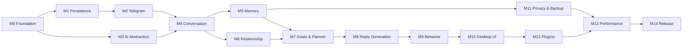

# ROADMAP.md

# Telegram AI Conversation Assistant

Development Roadmap

Version: 2.0

Status: Active

Last Updated: 2026-07-28

---

# 0. Changes in Version 2.0

| Change | Reason |
|---|---|
| **Storage moved before Telegram** (M1 ↔ M2) | Telegram sync had nowhere to persist data |
| **AI abstraction moved to M3** | M3 and M4 in v1.0 required an LLM but AI Services was M7 — an unsatisfiable ordering |
| **CLI adapter added to M0** | Milestones 1–9 previously produced nothing a human could evaluate (ADR-030) |
| **Privacy/export/backup promoted to its own milestone (M11)** | `SECURITY.md` required export and deletion; no milestone delivered them |
| **Packaging and onboarding added (M14)** | A desktop application with no installer and no first-run flow is not shippable |
| Acceptance criteria made falsifiable | v1.0 criteria such as "conversations are parsed accurately" could not be evaluated |
| Complexity estimates added | Enables scope decisions before, not during, a milestone |

---

# 1. Vision

Build a modular, privacy-first AI conversation assistant for Telegram that helps the user communicate more effectively — understanding context, maintaining long-term memory, and producing high-quality reply suggestions the user always reviews.

Extensible, maintainable, configurable, supporting multiple AI providers and future plugins.

---

# 2. Development Philosophy

Every milestone must:

- Produce something demonstrable through the CLI or UI
- Be independently testable
- Include documentation updates in the same commits
- Include tests
- Leave previous functionality working

Do not begin a milestone until the previous one is complete and stable.

**Complexity scale** (solo, part-time): **S** ≈ 1–2 days · **M** ≈ 3–5 days · **L** ≈ 1–2 weeks · **XL** ≈ 3+ weeks.

---

# 3. Milestone Overview

| # | Milestone | Complexity | Depends on |
|---|---|---|---|
| 0 | Foundation & Tooling | M | — |
| 1 | Persistence Core | L | M0 |
| 2 | Telegram Connectivity & Sync | XL | M1 |
| 3 | AI Abstraction Layer | M | M0 |
| 4 | Conversation Processing | L | M2, M3 |
| 5 | Memory Engine | XL | M4 |
| 6 | Relationship & Emotion | M | M4 |
| 7 | Goals & Planner | M | M5, M6 |
| 8 | Reply Generation & Uncertainty | L | M7 |
| 9 | Human Behavior Engine | S | M8 |
| 10 | Desktop User Interface | XL | M8 |
| 11 | Privacy, Export & Backup | M | M5 |
| 12 | Plugin Framework | L | M10 |
| 13 | Performance & Observability | M | M11, M12 |
| 14 | Packaging, QA & Release | L | M13 |

**Minimum viable vertical slice** — the earliest point at which the product's core claim is demonstrable — is reached at the end of **M8**: sync one chat, retrieve memory, generate an explained suggestion, review it in the CLI.

---

# 4. Milestone Detail

## M0 — Foundation & Tooling

**Status: substantially complete — 2026-07-28.** Remaining items are listed under
"Carried forward" below and are the first task of the next session.

**Complexity:** M · **Depends on:** none

**Objective.** A buildable, lintable, type-checked, testable skeleton with architectural rules enforced mechanically, plus resolution of the native-binary risk.

**Deliverables**
- `uv` project, Python 3.12 floor, dependency extras per provider
- Full directory skeleton per `ARCHITECTURE.md` §10
- ruff, mypy (strict on domain/application), pre-commit, gitleaks, pip-audit
- **import-linter contracts** encoding the corrected dependency rule
- CI on Windows and Linux
- Typed configuration with validation
- structlog with the central redaction processor
- `Clock`, `IdGenerator`, `EventBus`, `SecretStore` ports with real and fake implementations
- Composition root
- CLI adapter: `version`, `config show`, `config validate`, `doctor`
- Test scaffolding with shared fakes and marker taxonomy
- **TDLib binary acquisition, verification and bundling strategy resolved** (ADR-012 §3)
- Documentation corrections applied

**Acceptance criteria**

| Criterion | Status |
|---|---|
| `ruff format --check`, `ruff check`, `mypy`, `lint-imports`, `pytest` all pass | ✅ 123 passed, 92% coverage |
| A deliberately added `domain → infrastructure` import **fails the build** | ✅ verified: 2 contracts broken, 1 architectural test failed |
| Redaction proves no secret reaches a log record | ✅ including records from third-party stdlib loggers |
| `tgassist doctor` reports directory and permission status | ✅ secret-store status pending its implementation |
| CI runs on Windows and Linux | ✅ workflow committed; first remote run pending push |
| `pip-audit` clean | ✅ configured in CI security job |
| The chosen Telegram library loads on a clean Windows machine | ⬜ **carried forward** |

### Milestone 0.1 — Core Domain Ports (complete, 2026-07-28)

| Deliverable | Status |
|---|---|
| `Clock`, `IdGenerator`, `EventBus`, `SecretStore` ports in the domain layer | ✅ |
| Production implementations for all four | ✅ |
| Behaviourally correct fakes for all four | ✅ |
| Shared contract suite parametrized over production and fake | ✅ 288 tests, 93% coverage |
| Registered in the composition root by constructor injection | ✅ |
| `doctor` checks the credential backend | ✅ |
| ADRs raised for architecture changes rather than changing silently | ✅ ADR-031, ADR-032, ADR-033 |

**Carried forward**

1. **TDLib binary acquisition and verification** (ADR-012 §3). The largest
   unretired technical risk in the project; confronting it now rather than at
   packaging time is the whole point of placing it in Milestone 0.
2. **`pre-commit install`** on the developer machine (the configuration is
   committed and validates; installing the git hook is a local action).
3. **Startup enforcement of `security.require_secret_store`.**
   `Container.verify_secret_store()` exists and `doctor` calls it; wiring it into
   application startup waits for a long-running process to start.

---

## M1 — Persistence Core

**Complexity:** L · **Depends on:** M0

**Objective.** Durable, migrated storage with repositories, derived from the written domain model.

**Deliverables**
- Domain entities and value objects per `DOMAIN_MODEL.md`
- Repository and `UnitOfWork` ports plus in-memory fakes
- Alembic migrations `0001`–`0010`
- SQLite engine with WAL, foreign keys, busy timeout, single-writer thread
- All repository implementations with explicit mappers
- FTS5 index and triggers; `MessageSearchPort`
- `MigrationRunner` with pre-migration backup and automatic restore on failure
- Seed and fixture tooling
- CLI: `db migrate`, `db status`, `db check`, `db seed`

**Acceptance criteria**
- Every migration passes up → down → up in CI against a seeded database
- Every unique and partial-unique constraint provably rejects duplicates
- `audit_log` rejects UPDATE and DELETE
- Mapper round-trip property tests pass (domain → row → domain equality)
- 500,000 synthetic messages insert and page within the `DATABASE.md` §20 access-pattern targets
- Repository account-scoping tests show no cross-account leakage

---

## M2 — Telegram Connectivity & Sync

**Complexity:** XL · **Depends on:** M1

**Objective.** Authenticate, backfill a bounded scope resumably, receive live updates, send only on explicit user action.

**Deliverables**
- `TelegramGateway` port and the chosen adapter
- Authorization state machine driven through `AuthorizationHandler`
- Encrypted session storage with key in the credential store
- Resumable per-chat backfill with cursors and batched transactions
- Live update handling: new, edited, deleted messages
- FLOOD_WAIT backoff and reconnection with exponential retry
- Sync scope configuration (chat selection, history depth, caps)
- Media metadata; optional download with caps
- Conversation segmentation on ingest
- CLI: `login`, `logout`, `chats`, `sync`, `watch`, `send`

**Acceptance criteria**
- Login succeeds including 2FA, and the session survives restart
- Backfill interrupted at an arbitrary point resumes with **no gaps and no duplicates** (verified by count and checksum)
- Re-running a completed sync inserts zero rows
- Rate limiting is handled without data loss
- No credentials or message content appear in logs
- Sending requires explicit invocation; no code path sends implicitly
- The gateway exposes no typing-indicator method (architectural test)

---

## M3 — AI Abstraction Layer

**Complexity:** M · **Depends on:** M0

**Objective.** Provider-agnostic model access with reliable structured output. **No product features.**

**Deliverables**
- `LLMProvider` port with capability negotiation
- Adapters for Anthropic, OpenAI and Ollama as optional extras, plus `FakeLLMProvider`
- `StructuredOutputStrategy` and `StructuredOutputValidator` with one repair attempt
- Normalized error taxonomy for provider failures
- Prompt registry, loader and renderer with startup validation
- JSON Schemas for all planned prompts
- Token budget planner and estimation fallback
- Cost and latency instrumentation into `ai_calls`
- Provider fallback with **data-boundary enforcement**
- Concrete model selection recorded in `config/default.yaml`
- CLI: `ai check`, `ai providers`, `ai cost`

**Acceptance criteria**
- The same prompt and schema produce valid output on every configured provider
- Capability negotiation is verified against real providers, not read from config
- An invalid response is repaired once, then raises a typed error
- **An `external` provider is never called for a `local_only` chat** (test)
- Fallback never crosses the data boundary (test)
- Every call, including failures, writes an `ai_calls` row
- All AI tests run offline against the fake

---

## M4 — Conversation Processing

**Complexity:** L · **Depends on:** M2, M3

**Objective.** Understand conversations within a bounded token budget.

**Deliverables**
- `ConversationSegmenter` as a pure domain service
- `ContextAssembler` with priority-ordered trimming and truncation reporting
- Topic, intent, stage and question detection
- `CompositeAnalysisService` batching analysis, emotion and extraction
- Rolling conversation summaries with supersession
- Analysis caching keyed by fingerprint and version
- `SuggestionTriggerPolicy`
- CLI: `analyze`, `summarize`, `context show`

**Acceptance criteria**
- Segmentation is deterministic: re-segmenting a chat yields identical boundaries
- Context never exceeds its budget on a 50,000-message chat, and records what it dropped
- Unchanged content is never re-analysed (cache hit verified)
- A prompt version change invalidates only affected cache entries
- Summaries contain no fact absent from their source (evaluation check)
- All of the above verified against the fake provider in CI

---

## M5 — Memory Engine

**Complexity:** XL · **Depends on:** M4

**Objective.** Long-term memory that is accurate, reviewable and reversible.

**Deliverables**
- Memory extraction producing **proposals only**
- Grounding requirement: a supporting quotation per proposal
- Conflict detection and supersession with revisions
- Deduplication and merge
- Auto-approval rule (category allow-list + high confidence + no conflict)
- Rejection history consulted by the extractor
- `EmbeddingProvider` (fastembed) and `NumpyVectorStore`
- `MemoryRanker` hybrid scoring as a pure domain service
- Embedding lifecycle jobs and re-index
- CLI: `memory list|show|add|edit|forget|proposals|approve|reject`

**Acceptance criteria**
- The `TESTING.md` §8 scenario passes end to end
- **A conflicting proposal never auto-approves** (test)
- A memory value never changes without a corresponding revision (test)
- A `USER` memory outranks an equal-similarity `AI_AUTO` memory (test)
- Retrieval precision measured against a labelled synthetic set and recorded
- With the embedding provider disabled, retrieval still returns ranked results
- A deleted memory is absent from retrieval and its vector is gone

---

## M6 — Relationship & Emotion

**Complexity:** M · **Depends on:** M4

**Objective.** Explainable relationship signals, computed not guessed.

**Deliverables**
- `RelationshipMetricsCalculator` — all metrics per `DOMAIN_MODEL.md` §10
- `StyleProfiler` for contact and operator
- Emotion classification with mandatory evidence
- Engagement trend over rolling windows
- Recomputation jobs
- CLI: `relationship show`, `style show`

**Acceptance criteria**
- Every metric is computed **without an LLM** and is unit-tested from fixed message sets
- Recomputation is idempotent: identical inputs produce identical outputs
- Below the minimum sample size, `insufficient_data` is returned, never a number
- An emotion assessment without evidence is rejected
- No `trust_score` or `friendship_level` field exists anywhere (architectural test)

---

## M7 — Goals & Planner

**Complexity:** M · **Depends on:** M5, M6

**Deliverables**
- Goal CRUD with the one-active-goal invariant
- Goal activation transaction (deactivates the previous)
- `ConversationPlanner` behind the `ai.planner_enabled` flag
- Plan staleness on new messages
- CLI: `goal set|show|list|pause|achieve`

**Acceptance criteria**
- Activating a goal deactivates any other active goal atomically (constraint verified)
- AI cannot create or modify a goal (architectural test)
- A plan becomes stale when a message arrives
- Planner output validates against its schema on every provider
- Planner-on and planner-off paths both produce suggestions in M8

---

## M8 — Reply Generation & Uncertainty

**Complexity:** L · **Depends on:** M7

**Objective.** The product's core claim, demonstrable end to end.

**Deliverables**
- `ReplyGenerator` with alternatives and reasoning
- `ConfidenceCalibrator` combining model self-report with verifiable signals
- Recommended-action mapping from calibrated confidence
- Suggestion persistence with context snapshot for explainability
- Outcome tracking (accepted, edited, dismissed)
- Injection-resistance test cases in the corpus
- CLI: `suggest`, `suggest explain`, `suggest history`

**Acceptance criteria**
- **Confidence below the low threshold forces `clarify` or `write_manually`** (test)
- Every suggestion can show exactly which memories, summary and messages it used
- `ReplyGenerator` has no reference to `TelegramGateway` (architectural test)
- Sending requires an explicit `SendMessage` invocation with an approved suggestion
- Injection cases in the corpus do not produce schema-valid harmful output
- Calibration data collection is in place (predicted confidence vs. acceptance)

---

## M9 — Human Behavior Engine

**Complexity:** S · **Depends on:** M8

**Deliverables**
- `BehaviorRuleEngine` — deterministic timing, length and split advice
- Quiet-hours and availability handling with correct timezone conversion
- Bounded outputs with rule versioning
- CLI: `timing show`

**Acceptance criteria**
- All outputs are deterministic and within configured bounds
- Never recommends sending during quiet hours unless urgent
- **No dependency on `TelegramGateway`** (architectural test)
- No synthetic typing capability exists anywhere in the codebase (architectural test)
- Timezone conversion is correct across a DST transition (test)

---

## M10 — Desktop User Interface

**Complexity:** XL · **Depends on:** M8

**Deliverables**
- PySide6 application with `qasync` bridging
- Onboarding wizard per `PROJECT_SPEC.md` §4.4
- Chat list and virtualized conversation viewer
- Suggestion panel with reasoning, confidence and alternatives
- **Memory review queue** for pending proposals
- Memory browser and editor
- Goal editor, settings, notifications
- Per-chat AI processing mode control with plain-language descriptions
- Provider indicator on every suggestion

**Acceptance criteria**
- A 100,000-message chat scrolls smoothly; no operation exceeds 100 ms on the UI thread
- **Full keyboard navigation** with visible focus (verified by a keyboard-only pass)
- **Screen-reader pass completed**; all controls have accessible names
- Contrast meets WCAG 2.1 AA in both themes
- 200% OS text scaling loses no function
- Sending always requires explicit user action
- The active AI provider is visible whenever a suggestion is shown

---

## M11 — Privacy, Export & Backup

**Complexity:** M · **Depends on:** M5

**Deliverables**
- Complete and scoped JSON export; Markdown export
- Import with idempotent merge and conflict reporting
- **Contact purge** — transactional removal across all tables
- Retention policies and the daily retention job
- Backup creation, verification, retention and restore
- Backup encryption
- Audit log viewer
- CLI: `export`, `import`, `purge`, `backup`, `restore`, `retention`, `audit`

**Acceptance criteria**
- After a contact purge, **no row in any table references that contact** (exhaustive test)
- Export excludes secrets, sessions and logs (test)
- A backup written outside the data directory is always encrypted (test)
- Every backup is verified after creation; an unverified backup reports failure
- Restore requires re-authentication and does not restore session data
- Import is idempotent: importing twice changes nothing the second time
- Retention never deletes audit events (test)

---

## M12 — Plugin Framework

**Complexity:** L · **Depends on:** M10

**Objective.** Extension points **derived from** two real extensions, not designed speculatively.

**Deliverables**
- Two capabilities built as plugins first (an AI provider and a UI panel)
- Hook specification extracted from what they needed
- `PluginHost` with entry-point and directory discovery
- API version compatibility checking
- Failure isolation, timeouts and disable thresholds
- Manifest with advisory permissions, displayed at install
- `PluginContext` with read-only, permission-gated data access
- CLI: `plugins list|info|enable|disable|doctor`

**Acceptance criteria**
- An incompatible plugin is refused **before import**
- A raising hook does not propagate; repeated failures disable the plugin
- A hanging `shutdown()` does not block application exit
- **No plugin surface can send a Telegram message** (architectural test)
- Plugin memory writes create proposals, not memories
- A plugin cannot read another plugin's storage through the API

---

## M13 — Performance & Observability

**Complexity:** M · **Depends on:** M11, M12

**Deliverables**
- `PERFORMANCE_BUDGETS.md` with binding targets
- Benchmark suite against a 500k-message seeded database
- Query profiling and index review
- Cache tuning with measured hit rates
- Archive job implementation
- Metrics surface: sync throughput, AI cost, retrieval latency, cache hit rate
- CLI: `stats`, `benchmark`

**Acceptance criteria**
- Every `PROJECT_SPEC.md` §5 target is met and recorded, or the deviation is documented and accepted
- Benchmarks run in CI and fail on regression beyond tolerance
- Every added index is justified by a profiled query
- Archiving is resumable and reversible

---

## M14 — Packaging, QA & Release

**Complexity:** L · **Depends on:** M13

**Deliverables**
- PyInstaller bundle including the native Telegram library
- Windows installer; macOS and Linux packages as feasible
- First-run experience verified on a clean machine
- Full regression, security and privacy test passes
- Documentation review for accuracy against the implementation
- Release notes and versioning
- Crash-recovery verification

**Acceptance criteria**
- A clean-machine install completes onboarding and syncs successfully with no developer tooling present
- All security tests pass (`SECURITY.md` §24)
- All privacy tests pass (`PRIVACY.md`)
- No critical or high-priority defects open
- Every document is accurate as of the release commit
- Upgrade from the previous version migrates without data loss

---

# 5. Release Strategy

| Stage | Gate |
|---|---|
| **Alpha** (after M8) | Core claim demonstrable through the CLI; internal use only |
| **Beta** (after M11) | Feature-complete with UI, privacy tooling and backup; limited testing |
| **Release Candidate** (after M13) | Performance targets met; documentation reviewed; security reviewed |
| **1.0** (after M14) | Packaged, installable, migration-tested |

---

# 6. Success Metrics

The MVP succeeds when it can connect to Telegram within a bounded scope, maintain traceable long-term memory, generate context-aware suggestions and explain them, support independent goals per contact, preserve user and third-party privacy, remain useful without AI or network, and be extended without core changes.

---

# 7. Scope Risk

The largest risk to this roadmap is not technical — it is **scope relative to a solo maintainer** (`§Risk R13` of the initial review). Fourteen milestones with several XL items is a long path.

Mitigations, to be applied deliberately rather than discovered under pressure:

1. **Reach the M8 vertical slice before broadening.** It proves the product's central claim.
2. **M6, M7, M9 and M12 are optional for 1.0.** Each adds value; none is load-bearing for the core claim.
3. **The Planner (M7) is behind a feature flag** specifically so it can be evaluated and, if it does not earn its cost, removed.
4. **The plugin framework (M12) can slip past 1.0** entirely without affecting any other milestone.
5. Prefer deterministic implementations wherever they suffice — they are faster to build, cheaper to run and easier to test.

---

# 8. Project Management Rules

- Update this roadmap whenever a milestone changes; record completion dates.
- Do not skip a milestone without documenting the reason.
- Split a milestone if its complexity proves higher than estimated.
- Keep this document synchronized with `PROJECT_SPEC.md`, `ARCHITECTURE.md` and `DECISIONS.md`.
- Every milestone ends with documentation updated in the same commits as the code.

This roadmap is the authoritative implementation plan for the project.
