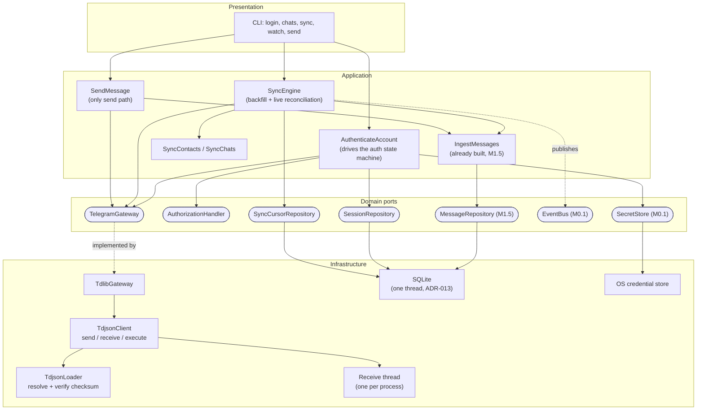
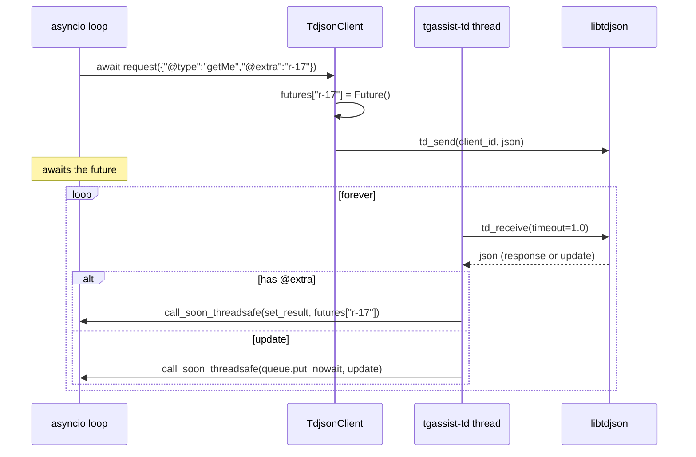
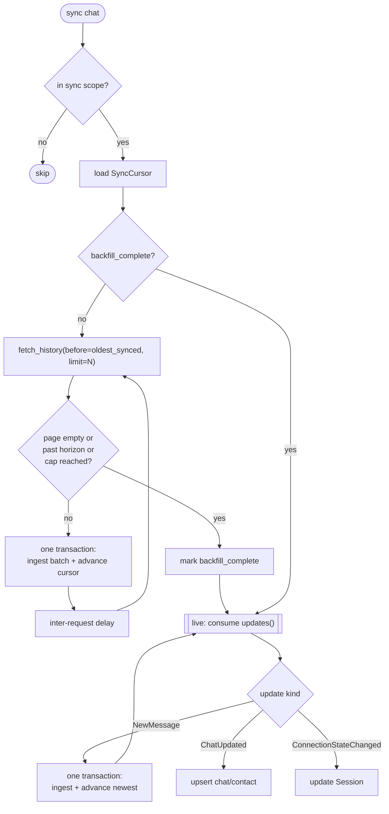
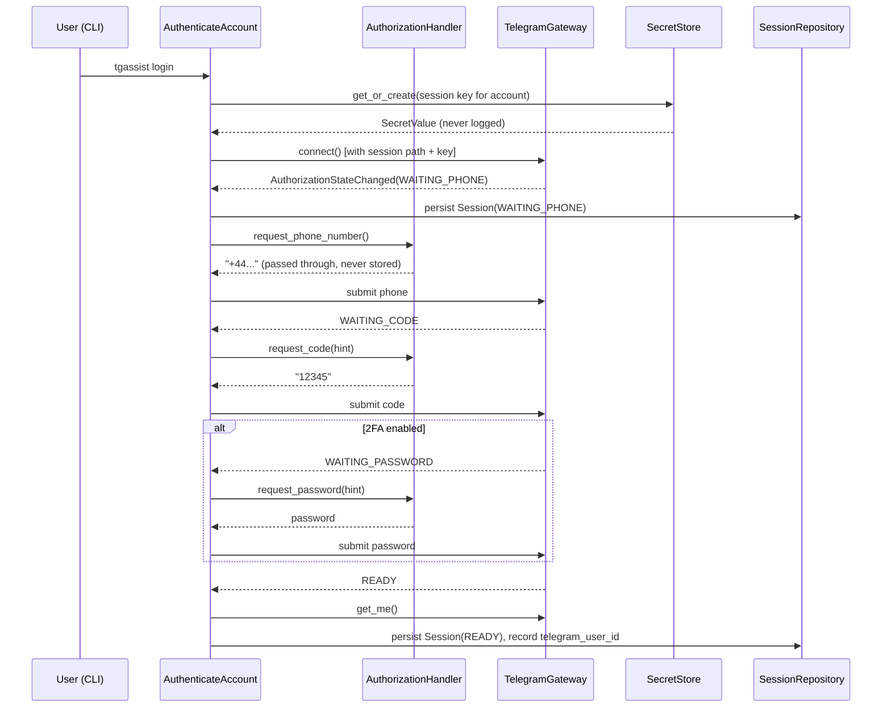
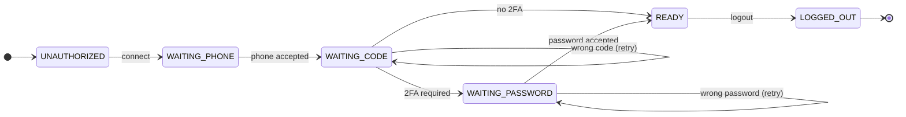

# TELEGRAM_ARCHITECTURE.md

# Telegram Connectivity — Design

Version: 1.0 · Status: **Proposed, awaiting approval** · Date: 2026-07-28

Design only. No production code exists for anything described here.

---

# 1. Purpose and Scope

This document specifies how the application connects to Telegram, authenticates,
synchronises history, receives live updates, and sends messages — and how all of
that fits the architecture already built through Milestone 1.5.

**In scope:** the gateway port and its TDLib adapter, the authorization state
machine, session storage, the update loop, the synchronisation engine, error
handling, threading, testing.

**Deliberately out of scope**, each with a reason:

| Excluded | Reason |
|---|---|
| Media file download | Separable vertical; needs `attachments` and a `FileStore` port that does not exist. Metadata-only is a later slice (§14). |
| Conversation segmentation | Derived data over messages. Independent of connectivity; belongs with `Conversation` (ADR-044). |
| A Telethon adapter | ADR-012 §4 proposes it opportunistically. §12.4 argues against building it. |
| Multi-account *operation* | `PROJECT_SPEC.md` §4.11 puts it post-1.0. The design must not preclude it; §7.3 shows it does not. |
| Group and channel sync | MVP is private chats (`PROJECT_SPEC.md` §12). The model supports the rest (ADR-044). |

---

# 2. Inconsistencies Found in Existing Documentation

Listed explicitly rather than worked around, as instructed. Each needs a
decision before or during implementation.

## 2.1 ADR-012 §3 is overdue and unresolved — **blocking**

> "Resolve native binary acquisition, verification and bundling during
> **Milestone 0**, not at packaging time."

Milestone 0 completed without it. It has been carried in `ROADMAP.md` as an open
item through M0.1, M0.2, M1.0–M1.5. It is now the single blocking prerequisite
for any Telegram work, and the ADR's own risk note explains why it cannot be
waved through:

> "an unverified `tdjson` binary has full access to the user's Telegram session."

**Proposed resolution: ADR-047.**

## 2.2 The Session state machine conflates two independent axes

`DOMAIN_MODEL.md` §5.3 gives one enum:

```
disconnected → connecting → awaiting_phone → awaiting_code
             → awaiting_password (2FA) → ready
             → reconnecting → disconnected | ready → logged_out
```

TDLib reports **two** states, and they vary independently:
`authorizationState` (do we have credentials?) and `connectionState` (is the
socket up?). A single enum cannot express *authorized but currently
reconnecting*, which is the ordinary state after any network blip — and under
this model a reconnect would have to overwrite `ready`, losing the fact that we
are authorized.

The invariant "only the `ready` state permits sending" then becomes ambiguous:
ready in which sense?

**Proposed resolution: ADR-049.**

## 2.3 `ROADMAP.md` M2 requires tables `DATABASE.md` schedules for M3

| M2 deliverable (`ROADMAP.md`) | Table needed | Migration plan says |
|---|---|---|
| "Resumable per-chat backfill with cursors" | `sync_cursors` | `0008`, Milestone 3 |
| "Conversation segmentation on ingest" | `conversations` | `0008`, Milestone 3 |
| "Media metadata" | `attachments` | `0008`, Milestone 3 |

Three of M2's stated deliverables depend on tables the migration plan assigns to
M3. `sync_cursors` is genuinely required by M2 — resumable backfill is
meaningless without it. The other two are not: §1 excludes them.

**Proposed resolution:** move `sync_cursors` into the M2 migration; leave
`conversations` and `attachments` in M3 and remove them from M2's deliverables.
Documentation change only, no ADR.

## 2.4 `API.md` §10 `TelegramGateway` does not match the concurrency model

Three problems, all fixable in the port before implementation:

1. **`updates()` returns a single `AsyncIterator`.** One iterator per gateway is
   correct, but the port does not say the gateway is *per account*, and with
   multi-account the reader would otherwise be ambiguous. §7.3 fixes this by
   binding a gateway instance to one account.
2. **`iter_history()` returns `AsyncIterator[TelegramMessage]`** — message by
   message. TDLib returns history in batches, and the sync engine writes in
   batches (§8.4). A per-message iterator forces the adapter to flatten what the
   engine then has to re-group. Proposed change to `fetch_history(...) ->
   HistoryPage` in §5.1.
3. **`download_file` and the media methods** have no consumer in this design and
   no `FileStore` port behind them. Proposed: remove from the M2 port surface,
   reinstate with the media slice.

## 2.5 `SECURITY.md` §7 vs. the credential-store startup rule

> "If the credential store becomes unavailable, the application **refuses to
> start** rather than falling back to an unencrypted session."

`security.require_secret_store` exists in configuration and defaults to `true`,
but **nothing enforces it at startup** — carried in `ROADMAP.md` since M0. Until
M2 there was no session to protect, so the gap was theoretical. It stops being
theoretical the moment a session key exists.

**Resolved in slice 2 (Milestone 2.4).** `Container.start()` verifies the
credential store before opening the database, and every CLI command that touches
user data goes through it. Diagnostic commands deliberately do not, so `doctor`
can still explain the refusal.

Enforcement is in two places rather than one, because the flag and the operation
answer different questions. `security.require_secret_store` governs **startup**,
and the `development` and `testing` profiles set it `false` so a developer
without a credential backend is not locked out. `PrepareSession` refuses
**whatever the flag says**: there is nowhere else a session key may go, and an
unencrypted fallback does not exist (`SECURITY.md` §8).

## 2.6 `DOMAIN_MODEL.md` §5.4: an unenforceable Contact invariant becomes enforceable

> "A Contact cannot be its own Account's operator identity."

Recorded in `ROADMAP.md` as unenforced because nothing knew the operator's own
Telegram identifier. This design assigned enforcement to the contact-sync slice
(§14, slice 5).

**Resolved in slice 5 (ADR-052), and the reasoning above was half wrong.** The
identifier does not come from `getMe` — it has been on `Account.telegram_user_id`
since Milestone 1.2, a required column set at account creation and verified at
every login. Nothing had to be obtained. The invariant was unenforced because
nobody had written the check, not because the value was missing.

It is now enforced by a domain service, `require_not_operator`, called by every
write path that can create a contact. It is not enforced in the schema: SQLite's
`CHECK` cannot reference another table, and a trigger would be a second home for
a rule the application already states.

Implementation also found the case that makes the rule unavoidable rather than
merely correct. Telegram's **Saved Messages** is a private chat whose counterpart
is the operator, and every real account has one — so a synchronisation that did
not recognise it would try to create the forbidden contact on its first run
against every account. It is stored as `ChatType.SAVED`, which the domain model
already had.

## 2.7 `ARCHITECTURE.md` layer order places Telegram below Storage

The layer stack in `CLAUDE.md` and `ARCHITECTURE.md` reads

```
… → Human Behavior Simulator → Telegram Client Layer → Storage
```

which suggests the Telegram layer sits above and depends on Storage. It does
not, and must not: `API.md` §10 constraint 1 says the gateway "never writes to
the database". Both are adapters at the same level, composed by the application
layer. The prose is right; the diagram ordering invites the wrong reading.

**Proposed resolution:** correct the diagram in `ARCHITECTURE.md` to show
Telegram and Storage as sibling adapters. Documentation change only.

---

# 3. Design Principles for This Layer

Carried forward from what the codebase already does, and stated because each one
decides something below.

1. **The gateway never touches the database.** Ingest is the application layer's
   job (`API.md` §10). This is what lets the sync engine be tested against a
   fake gateway and a real database, independently.
2. **Structural guarantees over policy.** The gateway has no typing-indicator
   method (ADR-023 §2), and an architectural test will assert its absence, as
   `ROADMAP.md` M2 already requires.
3. **One writer.** ADR-034's single connection and serialised transactions are
   unchanged. The sync engine must therefore write in small batches (§8.4) or it
   will starve every other reader.
4. **Nothing speculative.** No port gets built without a second implementation
   that is genuinely needed. For `TelegramGateway`, the fake used by the sync
   tests *is* that second implementation (§13.2) — the port is not speculative.
5. **Content is the most sensitive thing in the system.** Message text is
   redacted from logs by whole-key match (added in M1.5); session material is
   never logged, exported or backed up (`SECURITY.md` §7).

---

# 4. Component Architecture

## 4.1 Component diagram



The important shape: **`TdlibGateway` has no edge to SQLite.** Every arrow into
storage passes through the application layer. That is what makes the sync engine
testable with a fake gateway and a real database.

## 4.2 Module layout

```
src/tgassist/
  domain/
    model/session.py              Session aggregate (two state axes)
    model/sync_cursor.py          SyncCursor aggregate
    model/telegram.py             Gateway DTOs: TelegramUser, TelegramChatInfo,
                                  TelegramMessage, TelegramUpdate variants
    ports/telegram_gateway.py     TelegramGateway, AuthorizationHandler
    ports/session_repository.py
    ports/sync_cursor_repository.py
  application/
    use_cases/authenticate.py     AuthenticateAccount, LogOutAccount
    use_cases/sync.py             BackfillChat, SyncChats, SyncContacts
    sync/engine.py                SyncEngine — the orchestration loop
  infrastructure/
    telegram/loader.py            TdjsonLoader: resolve, verify, load
    telegram/client.py            TdjsonClient: request/response + receive thread
    telegram/gateway.py           TdlibGateway: the port implementation
    telegram/mapping.py           TDLib JSON -> domain DTOs
    telegram/errors.py            TDLib error -> domain error taxonomy
    tasks/supervisor.py           BackgroundTaskSupervisor: start, cancel, drain
    persistence/sessions.py       mapper + repository
    persistence/sync_cursors.py   mapper + repository
```

`infrastructure/telegram/` and `infrastructure/tasks/` already exist as empty
packages; this fills them.

---

# 5. Required Ports

Two, and no more. Everything else this layer needs already exists.

## 5.1 `TelegramGateway` — revised

Changes from `API.md` §10 are marked. The rest is unchanged.

```python
class TelegramGateway(Protocol):
    """The sole boundary to Telegram. One instance per Account."""

    @property
    def account_id(self) -> AccountId: ...        # CHANGED: bound to one account

    # Lifecycle
    async def connect(self) -> None: ...
    async def disconnect(self) -> None: ...
    async def is_connected(self) -> bool: ...

    # Authorization
    async def authorization_state(self) -> AuthorizationState: ...
    async def start_authorization(self, handler: AuthorizationHandler) -> None: ...
    async def logout(self) -> None: ...

    # Reading
    async def get_me(self) -> TelegramUser: ...
    async def list_chats(self, *, limit: int) -> list[TelegramChatInfo]: ...
    async def get_chat(self, chat_id: TelegramChatId) -> TelegramChatInfo | None: ...
    async def get_contact(self, user_id: TelegramUserId) -> TelegramUser | None: ...

    # CHANGED: a page, not a per-message iterator (§2.4)
    async def fetch_history(
        self,
        chat_id: TelegramChatId,
        *,
        before_message_id: TelegramMessageId | None,
        limit: int,
    ) -> HistoryPage: ...

    # Updates
    def updates(self) -> AsyncIterator[TelegramUpdate]: ...

    # Writing — the only send path in the system
    async def send_message(
        self, chat_id: TelegramChatId, text: str, *, reply_to: TelegramMessageId | None
    ) -> TelegramMessage: ...
    async def mark_read(
        self, chat_id: TelegramChatId, up_to_message_id: TelegramMessageId
    ) -> None: ...
```

`HistoryPage` carries `messages: tuple[TelegramMessage, ...]` and
`oldest_message_id: TelegramMessageId | None` — the cursor for the next call,
and `None` when the chat's beginning has been reached. Returning the boundary
explicitly means the sync engine never has to infer "are we done" from an empty
page, which is the classic source of an infinite backfill loop.

**As implemented (slice 4).** `list_chats` is three TDLib calls, not one, and
the order matters: `loadChats` asks the server to populate the client's list and
answers `404` when it is already complete — an ordinary end condition, absorbed
rather than raised; `getChats` returns *identifiers* in Telegram's own order,
which is not re-sorted here because recomputing recency would need data this does
not fetch; `getChat` resolves each one from TDLib's local database. A chat that
disappears between the second and third call is skipped, because one vanished
chat must not cost the user the other two hundred.

**Removed for M2**, each to return with its consumer: `edit_message`,
`delete_message` (no use case sends edits or deletions yet — ADR-046 makes
messages append-only locally, so there is nothing to reconcile them with),
`download_file` (media slice).

**Still absent, permanently:** any typing-indicator method (ADR-023 §2).

## 5.2 `AuthorizationHandler` — unchanged

`API.md`'s definition stands. It is the one place the presentation layer
supplies credentials, and codes and passwords pass through without being stored,
logged or retained.

**As implemented (slice 3):** `on_error` takes `Exception` rather than
`AuthorizationError`. The parameter is what the handler is *shown*, and
narrowing it would force the gateway to construct a specific type before it
knows the failure is recoverable.

`ConsoleAuthorizationHandler` keeps two slots — an attempt counter and its limit
— so there is nowhere a credential could survive. That is asserted by test
rather than left as a claim.

## 5.2a How much of the gateway exists

`TelegramGateway` is declared **one slice at a time** (ADR-051). Slice 3
declared lifecycle, authorization, both state axes and `get_me`; slice 4 added
`list_chats`, `get_chat` and `fetch_history`; slice 5 added `get_contact` and
`list_contacts`. `updates()` arrives with the update consumer (slice 7) and
`send_message` with slice 8.

`list_contacts` is a separate call from `list_chats` rather than a convenience
over it: the address book and the chat list are different populations, and
neither contains the other. `get_contact` exists because a chat carries its
counterpart's name but not their handle.

The gateway also owns the **single consumer** of `TdjsonClient.receive()`. The
queue holds one item per update, so a second consumer would not duplicate the
stream — it would split it, and each consumer would silently miss whatever the
other took first. An architectural test asserts this, exactly as ADR-048's
single-caller rule is asserted, *before* slice 4 introduces a second candidate.

## 5.3 Ports deliberately *not* created

| Considered | Why not |
|---|---|
| `MessageSource` | Rejected in M1.5 for the same reason: one implementation, no second consumer. `IncomingMessage` is the seam. |
| `Scheduler` | `API.md` lists it, but M2 needs only `asyncio.sleep` and task cancellation. A `BackgroundTaskSupervisor` in infrastructure (§11.3) covers it without a port. |
| `FileStore` | No media in this slice. |
| `RateLimiter` | Flood-wait handling lives inside the adapter (`API.md` §10 constraint 2). Extracting it would create an interface with one implementation and one caller. |

---

# 6. Domain Additions

## 6.1 `Session` — two state axes (ADR-049)

```python
class AuthorizationState(StrEnum):
    UNAUTHORIZED, WAITING_PHONE, WAITING_CODE, WAITING_PASSWORD, READY, LOGGED_OUT

class ConnectionState(StrEnum):
    OFFLINE, CONNECTING, UPDATING, READY, WAITING_FOR_NETWORK

@dataclass(frozen=True, slots=True)
class Session:
    account_id: AccountId          # identity IS the account (as UserProfile, ADR-038)
    authorization_state: AuthorizationState
    connection_state: ConnectionState
    session_path: Path
    encryption_key_ref: str        # a NAME in the SecretStore, never key material
    client_version: str | None
    connected_at: datetime | None
    last_activity_at: datetime | None
    created_at: datetime
    updated_at: datetime

    @property
    def can_send(self) -> bool:
        return (
            self.authorization_state is AuthorizationState.READY
            and self.connection_state is ConnectionState.READY
        )
```

`can_send` replaces "only the `ready` state permits sending" and makes the
ambiguity in §2.2 unrepresentable: sending needs *both* axes ready.

One session per account, so `account_id` is the primary key — the same reasoning
ADR-038 applied to `UserProfile`, and for the same reason.

## 6.2 `SyncCursor`

`DOMAIN_MODEL.md` §5.22 as written, minus two fields with no consumer:

```python
@dataclass(frozen=True, slots=True)
class SyncCursor:
    account_id: AccountId
    chat_id: ChatId                              # identity: one cursor per chat
    oldest_synced_message_id: TelegramMessageId | None
    newest_synced_message_id: TelegramMessageId | None
    backfill_complete: bool
    backfill_horizon: datetime | None            # how far back we intend to go
    last_sync_at: datetime | None
    consecutive_failures: int
    updated_at: datetime
```

`last_error` is dropped: an error string on a row is a log entry in the wrong
place, and the failure count is what drives behaviour. `backfill_target_date` is
renamed `backfill_horizon` for consistency with the configuration key.

The cursor is written **in the same transaction as the messages it accounts
for**. That single fact is what makes interruption safe (§8.4).

## 6.3 Gateway DTOs

`TelegramUser`, `TelegramChatInfo`, `TelegramMessage` and the `TelegramUpdate`
variants live in `domain/model/telegram.py`. They are **not** the aggregates:
they describe what Telegram said, exactly as `IncomingMessage` describes what a
source offered (M1.5). Keeping them apart is what stops TDLib's shape leaking
into the entities.

**As implemented (slices 3 and 4):** `TelegramUser`, `TelegramChatInfo`,
`TelegramMessage`, `CodeHint`, `PasswordHint` and `HistoryPage` exist. Each
validates what Telegram cannot sensibly have said -- a non-positive identifier,
a naive timestamp, a group with a single counterpart -- so a malformed frame
fails at the boundary rather than three layers inside it.

`TelegramUpdate` variants for M2: `NewMessage`, `ChatUpdated`,
`AuthorizationStateChanged`, `ConnectionStateChanged`. `MessageEdited` and
`MessageDeleted` are parsed and **discarded with a counter** until ADR-046's
successor decides how an edit is represented — dropping them silently would be
worse than recording that they arrived.

---

# 7. Threading, Async and Lifetime

## 7.1 Threading model

Three threads, each with one owner.

| Thread | Owner | Responsibility |
|---|---|---|
| Main / asyncio loop | the application | Everything except the two below |
| `tgassist-db` | `DatabaseExecutor` (built, M0.2) | All SQLite work |
| `tgassist-td` | `TdjsonClient` (new) | The blocking `td_receive` loop |

`td_receive` is a blocking C call and must be driven by exactly one thread.
`td_send` is thread-safe, so requests go directly from the event loop; only
receipt needs the dedicated thread. This mirrors the existing database executor,
which is why it needs no new concurrency concept — see ADR-048.

**One receive thread serves every client.** TDLib multiplexes clients by
`@client_id` on a single receive loop, so multi-account costs threads only in
the sense of more clients, not more threads.



**Backpressure.** The update queue is bounded. When it fills, the receive thread
blocks before calling `td_receive` again, so TDLib buffers internally rather
than the process accumulating an unbounded Python queue. A full queue is a
signal that ingestion is behind, and is reported as a metric (§10.3) rather than
absorbed silently.

## 7.2 Cancellation and graceful shutdown

Ordered, because getting the order wrong loses data or hangs:

1. Stop accepting new work — the sync engine's task is cancelled first.
2. Let the in-flight ingestion transaction finish. `asyncio.CancelledError` must
   not abandon a half-written batch; the batch boundary is the cancellation
   point, and a cursor is only advanced by a committed batch anyway (§8.4).
3. `gateway.disconnect()` → TDLib `close`, then await its
   `authorizationStateClosed`.
4. Join the receive thread with a timeout; log and continue if it does not stop.
5. `DatabaseExecutor.close()` last, since steps 2–3 may still write.

A `BackgroundTaskSupervisor` (§11.3) owns steps 1–2 so that no component has to
remember the order.

## 7.3 Gateway lifetime and multi-account

One `TelegramGateway` instance per Account, created and owned by the container,
keyed by `AccountId`. In 1.0 exactly one is ever created, because
`PROJECT_SPEC.md` §4.11 puts multi-account operation post-1.0. Nothing in the
design forbids a second: session directories are per account
(`<sessions_dir>/<account_id>/`), TDLib clients are independent, and every
repository is already account-scoped (ADR-039).

The gateway is **not** a container property like `clock` — it holds a network
connection and a native client, so it is acquired and released explicitly:

```python
async with container.telegram_for(account_id) as gateway:
    ...
```

---

# 8. Synchronisation Model

## 8.1 What TDLib does, and what we must do

The reason ADR-001 chose TDLib over raw MTProto:

| Concern | Owner |
|---|---|
| Update-gap detection and recovery after disconnect | **TDLib** |
| Reordering and deduplication of MTProto updates | **TDLib** |
| Local caching of chats and users | **TDLib** |
| Reconnection with backoff | **TDLib** (we observe `connectionState`) |
| Which chats we have chosen to store | **us** |
| How far back we have stored | **us** — `SyncCursor` |
| Idempotency of *our* writes | **us** — the partial unique index (ADR-045) |

Our cursors exist for **our own resumability**, not for MTProto gap handling.
Conflating the two would duplicate work TDLib already does correctly. This is
the single most important thing to state before implementation, because a design
that re-derives update gaps from message ids will be both wrong and enormous.

## 8.2 Sync flow



## 8.3 Backfill

Backwards from newest, which is the only direction Telegram's history API
supports efficiently and the only one where an interruption leaves a contiguous
stored range.

Terminates on the **first** of: an empty page (chat beginning),
`sent_at < backfill_horizon` (default 365 days, `PROJECT_SPEC.md` §4.1), or the
per-chat cap (default 50 000). All three are configuration, all three are
recorded on the cursor so a later horizon change is a resumption rather than a
restart.

## 8.4 Transaction granularity — the constraint ADR-034 imposes

The whole application has one database connection and one transaction at a time.
A backfill batch is therefore a **latency budget for everything else**, and the
design has to pick a size.

- One transaction per fetched page (default 100 messages, aligned with TDLib's
  practical page size).
- The cursor advance is **in that same transaction**. A committed batch is
  accounted for; an uncommitted one never happened. That is the whole
  resumability mechanism, and it needs no extra machinery.
- Between batches the engine yields, so live updates and UI reads interleave.

50 000 messages ≈ 500 transactions. At the measured M1.5 write path this is well
within a single-connection budget; if it is not, ADR-034 already names the
escape (a read replica connection), and §15 lists it as a measured risk rather
than a guess.

## 8.5 Live updates and the backfill race

A `NewMessage` arriving while a backfill is in progress is ingested immediately.
It cannot conflict: it advances `newest_synced_message_id`, the backfill advances
`oldest_synced_message_id`, and the unique index makes a genuine overlap a no-op
rather than a duplicate (ADR-045). This is precisely the case M1.5's idempotency
tests already cover.

**One ingestion serialiser.** Live updates and backfill batches both write, and
ADR-034 permits one transaction at a time. Rather than let them collide on the
unit-of-work lock, both flow through a single ingestion task consuming one
queue. Serialisation becomes explicit and orderable rather than an emergent
property of lock contention.

## 8.6 Contact and chat synchronisation

Chats first, then their contacts, because a private chat cannot be stored
without the contact it names (ADR-043's composite key). Order is a correctness
requirement, not a preference.

- `list_chats` → for each, upsert `Contact` then `Chat`, in one transaction.
- The operator's own identity is **excluded** from contacts, finally enforcing
  the invariant in §2.6.

**As implemented (slice 5).** Three things differ from the sketch above.

*The operator's identity comes from the Account, not from `get_me()`* — it is
already there, and re-deriving it per run would let it change halfway through
one (ADR-052).

*A private chat's Telegram identifier is not assumed to equal its counterpart's
user identifier.* It happens to today, and relying on a coincidence Telegram has
never promised would break silently if it stopped holding. `TelegramChatInfo`
carries `counterpart_id` explicitly, so the join is read rather than computed.

*Every chat is recorded, not only those in scope.* Scope
(`telegram.sync_chat_types`, default private) decides the initial `sync_enabled`,
not whether a row exists — so the operator can see a group and switch
synchronisation on, rather than wondering where it went. Nothing revisits that
setting afterwards (ADR-053).

Contacts are also synchronised from the **address book**, which the sketch above
did not mention: it holds people this account saved but never messaged, and no
amount of reading the chat list would find them.

---

# 9. Authentication and Session Lifecycle

## 9.1 Authorization flow



## 9.2 Session state machine



Connection state varies **independently** on the other axis
(`OFFLINE ⇄ CONNECTING ⇄ UPDATING ⇄ READY`, plus `WAITING_FOR_NETWORK`), driven
entirely by TDLib's `connectionState` updates. Neither axis overwrites the other
— which is the defect §2.2 identifies.

## 9.3 Session storage

- Directory `<sessions_dir>/<account_id>/`, owner-only permissions, verified by
  `tgassist doctor` (`SECURITY.md` §7).
- TDLib's `database_encryption_key` is generated on first login, stored in the
  OS credential store under a name recorded in `Session.encryption_key_ref`.
  **The row holds the name; the store holds the key** — the existing
  `SecretStore` port and the `_ref` suffix redaction rule already support this.
- `security.require_secret_store` is enforced at startup, closing §2.5. Preparing
  a session refuses whatever the flag says, because there is nowhere else the key
  could go.
- The per-account directory is **not** created when the session record is
  written. TDLib creates its own store when it opens it, under a root that
  already carries owner-only permissions.
- Logout destroys the directory and the key, and writes an audit event.
- Session material is excluded from backup and never restored (`SECURITY.md` §7
  point 5).

---

# 10. Errors, Retries, Logging and Metrics

## 10.1 Error taxonomy

TDLib errors map onto the existing `AppError` tree — no new root:

| TDLib | Domain error | Handling |
|---|---|---|
| `FLOOD_WAIT_<n>` | absorbed, or `RateLimitedError` beyond ceiling | Sleep `n`; surface only if `n > sync.flood_wait_ceiling` |
| `PHONE_CODE_INVALID`, `PASSWORD_HASH_INVALID` | `AuthorizationError` | Back to the handler for retry; never logged with the value |
| `AUTH_KEY_UNREGISTERED`, `SESSION_REVOKED` | `SessionRevokedError` | Session → `LOGGED_OUT`; destroy local material; notify |
| `CHANNEL_PRIVATE`, `CHAT_ID_INVALID` | `ChatUnavailableError` | Disable sync for that chat; notify; do not retry |
| Network / timeout | transient | TDLib reconnects; we observe `connectionState` |
| Anything else | `TelegramError` with the TDLib code | Fail the operation; count consecutive failures |

## 10.2 Retry strategy

| Failure | Policy |
|---|---|
| Flood wait | Sleep exactly the requested duration. Never shorter — that is what caused it. |
| Transient network | No application retry. TDLib owns reconnection; the engine pauses on non-`READY` connection state and resumes. |
| Per-chat sync failure | Exponential backoff on `consecutive_failures`; past the threshold, disable that chat's sync and raise a Notification (`DOMAIN_MODEL.md` §5.22). |
| Ingestion constraint violation | Not retried. It means a genuine bug, because idempotency is already structural. |

Retry counts live on the cursor, so they survive restart — an in-memory counter
would reset every launch and turn a permanent failure into an infinite one.

## 10.3 Logging, telemetry, metrics

**No outbound telemetry, ever** (`PROJECT_SPEC.md` §9). Everything here is local.

Logged, with content redacted by the existing processor: connection state
transitions, authorization state transitions (never the credential), per-chat
sync start/finish with counts and durations, flood waits with their duration,
every error with its TDLib code.

**Never logged:** phone numbers, codes, 2FA passwords, session key material,
message text outside diagnostic mode (`SECURITY.md` §9).

Counters worth exposing through `tgassist sync status`: messages ingested and
skipped, batches committed, flood-wait seconds accumulated, update-queue high
water mark, consecutive failures per chat, discarded `MessageEdited` /
`MessageDeleted` updates (§6.3).

---

# 11. Event Publication and Background Work

## 11.1 The tension with ADR-031

ADR-031 makes `EventBus.publish` **synchronous** — it returns only after every
handler has run. Publishing one event per message during a 50 000-message
backfill would run every handler 50 000 times inside the sync loop, and the
backfill would proceed at the speed of the slowest subscriber.

**Decision (ADR-050): publish one event per committed batch, not per message.**

```python
@dataclass(frozen=True, slots=True)
class MessagesIngested(DomainEvent):
    account_id: int
    chat_id: int
    count: int
    newest_sent_at: datetime
```

A live update is the degenerate case, `count=1`, so subscribers have one shape
to handle rather than two. ADR-031 is unchanged; it simply stops being applied
at the wrong granularity.

## 11.2 Events this layer publishes

`AuthorizationStateChanged`, `SessionEstablished`, `SessionRevoked`,
`ChatDiscovered`, `MessagesIngested`, `BackfillCompleted`, `SyncFailed`.

Each has a real subscriber in a later milestone (relationship metrics, memory
extraction, notifications). None is published before it has one.

## 11.3 `BackgroundTaskSupervisor`

Infrastructure, not a port: one implementation, and the thing it manages is
asyncio itself. It owns named long-lived tasks (the update consumer, the sync
engine, the ingestion serialiser), restarts one that dies unexpectedly with
backoff, and implements the shutdown ordering in §7.2 so no caller has to
remember it.

---

# 12. Testing Strategy

## 12.1 The layers, and what each proves

| Level | Subject | Telegram |
|---|---|---|
| Unit | `Session`, `SyncCursor`, mapping functions | none |
| Contract | `TelegramGateway` obligations | fake **and**, when present, TDLib |
| Sync engine | backfill, resumption, idempotency, ordering | fake gateway, **real SQLite** |
| Replay | mapping and update handling | recorded TDLib JSON fixtures |
| Live smoke | end-to-end login and one chat | real Telegram, opt-in only |

## 12.2 The fake is the second implementation

`FakeTelegramGateway` is scriptable: a chat list, per-chat history, a queue of
updates to emit, and injectable failures (flood wait, revoked session,
unavailable chat). It is what makes the sync engine testable at all, and it is
the demonstrated architectural reason the port exists — §3 principle 4.

It runs the same contract suite as the TDLib adapter, exactly as every
repository fake does since M1.0.

## 12.3 Deterministic replay

TDLib speaks JSON. A recorder captures the exact frames of a real session into a
fixture, with a scrubber removing phone numbers, codes and message text before
anything is written. Replaying a fixture drives the adapter's mapping and update
handling with no network and no binary — which is what lets contributors without
`tdjson` run most of the suite.

Recording is a developer action, never automatic, and fixtures are reviewed
before commit because they originate from a real account.

## 12.4 On a second real adapter

ADR-012 §4 proposes a Telethon adapter "opportunistically… to validate the
port". I recommend **not** building it. It is a second protocol implementation
maintained for a validation the fake already provides, and every hour spent on
it is an hour not spent on the primary path. If TDLib packaging fails on a
target platform, that is the moment to reconsider — as a replacement, not an
addition.

This contradicts an existing ADR, so it is proposed as an amendment in ADR-047
rather than done quietly.

---

# 13. Security and Privacy

| Concern | Treatment |
|---|---|
| Unverified native binary | Checksum-pinned manifest verified before `CDLL` (ADR-047). The ADR-012 risk note is the whole reason. |
| Session theft | Encrypted store, key in OS credential store, owner-only directory, never backed up (`SECURITY.md` §7) |
| Credential leakage | Codes and passwords pass through `AuthorizationHandler` and are never stored, logged or retained |
| Message content in logs | Redacted by the whole-key rule added in M1.5 |
| Over-collection | Sync scope defaults to **no chats** (`PROJECT_SPEC.md` §4.1); nothing is fetched before the user chooses |
| Third-party exposure | Nothing in this layer contacts anything but Telegram. AI boundaries are per-chat and unrelated (ADR-024). |
| Contact's data | A contact's messages arrive because the user is in a conversation with them; purge and export already reach them through the cascade chain verified in M1.5 |

---

# 14. Recommended Implementation Order

Seven slices, each independently reviewable, each ending in something
demonstrable. Sized like the M1.x slices that worked.

| # | Slice | Delivers | Depends on |
|---|---|---|---|
| **0** | **TDLib binary resolution** | `TdjsonLoader` (discover, checksum, architecture, dependencies, load, entry points, version), pinned manifest, `tdlib doctor`/`version`/`verify`, committed build script | **Done, 2026-07-28** |
| 1 | `TdjsonClient` | Receive thread, request/response correlation, backpressure, deterministic shutdown, health. Proved by `getOption` against the real library. | **Done, 2026-07-28** |
| 2 | Session + storage | `Session` aggregate, migration `0007`, repository, key in credential store, `require_secret_store` enforced (§2.5) | **Done, 2026-07-28** |
| 3 | Authentication | `AuthorizationHandler`, `AuthenticateAccount`, `tgassist login` / `logout`; session survives restart | **Done, 2026-07-28** |
| 4 | Gateway reads + fake | `TelegramGateway` port, TDLib adapter reads, `FakeTelegramGateway`, shared contract suite, `tgassist telegram chats` | **Done, 2026-07-29** |
| 5 | Chat and contact sync | `SyncChats` / `SyncContacts`, scope configuration, operator-identity invariant (§2.6) | **Done, 2026-07-30** |
| 6 | Backfill | `SyncCursor` + migration, `SyncEngine` backfill, batched transactions, resumption tests | 5 |
| 7 | Live updates | Update consumer, ingestion serialiser, `MessagesIngested`, `tgassist watch` | 6 |
| 8 | Send | `SendMessage`, explicit-approval path, architectural test asserting no typing method | 7 |

Slices 0–3 are the risky ones and are front-loaded deliberately. If slice 0
fails, nothing after it is worth starting — which is the argument for resolving
it before any other Telegram work, exactly as ADR-012 §3 intended.

---

# 15. Risks

| # | Risk | Likelihood | Impact | Mitigation |
|---|---|---|---|---|
| 1 | ~~**`tdjson` unavailable or unverifiable on a target platform**~~ | — | — | **Retired on windows-amd64**: built from source at a pinned commit, verified and recorded. Open for Linux and macOS, where nothing has been built or verified. |
| 2 | Native crash takes down the process | Low | Data loss | No writes in the gateway; committed batches only; TDLib is widely used |
| 3 | Single-connection contention during backfill | **Medium** | UI stalls | Small batches (§8.4); measure before optimising; ADR-034 names the escape |
| 4 | Flood waits make first sync very slow | High | Poor first impression | Honour waits exactly; show progress; cap scope by default |
| 5 | Thin Python wrappers for TDLib are unmaintained | Medium | Maintenance burden | Bind `ctypes` directly to the C interface — it is five functions |
| 6 | Session invalidated remotely mid-sync | Medium | Confusing failure | Explicit `SessionRevokedError`, destroy material, notify |
| 7 | Recorded fixtures leak real data | Low | **Privacy incident** | Scrub at record time, review before commit (§12.3) |
| 8 | Update queue overflows under a burst | Low | Backpressure stalls | Bounded queue, TDLib buffers, high-water metric (§7.1) |
| 9 | Live smoke tests are flaky in CI | High if attempted | Erodes trust in the suite | Opt-in only, never in the default run |

---

# 16. Required New ADRs

| ADR | Title | Resolves |
|---|---|---|
| **047** | TDLib Binary Acquisition, Verification and Distribution | §2.1 — the blocking prerequisite; also amends ADR-012 §4 |
| **048** | The TDLib Update Loop Runs on a Dedicated Thread, Bridged to asyncio | §7.1 — extends ADR-013's threading model |
| **049** | Session Models Authorization and Connection as Separate Axes | §2.2 — corrects `DOMAIN_MODEL.md` §5.3 |
| **050** | Synchronisation Cursors, Batch Boundaries and Batched Event Publication | §8, §11.1 — reconciles bulk ingest with ADR-031 and ADR-034 |

Two more were written during implementation, because implementation found
decisions this plan had not seen:

| ADR | Title | Written in |
|---|---|---|
| **051** | Authorization Is Driven by a Dispatch Loop over a Single Update Stream | Slice 3 — §5.1's port surface and §7.1's single consumer |
| **052** | The Operator's Telegram Identity Is the Account's, and It Is Enforced in a Domain Service | Slice 5 — §2.6 |
| **053** | Synchronisation Is Additive, Per-Item Transactional, and Never Overrules the Operator | Slice 5 — §8.4, §8.6 |

Documentation corrections needing no ADR: §2.3 (migration plan), §2.4 (port
surface), §2.5 (already decided, unimplemented), §2.7 (diagram).

**§2.6 was listed here as needing no ADR, and that was wrong.** Assigning
enforcement to a slice is scheduling; deciding *where a cross-aggregate
invariant lives*, when neither entity can hold it and the schema cannot express
it, is architecture. ADR-052 records it.

---

# 17. Approval Checklist

Before implementation begins:

- [x] **ADR-047 approved** — Accepted and implemented as slice 0
- [ ] ADR-048, ADR-049, ADR-050 approved
- [ ] §2.3 accepted: `sync_cursors` moves to M2; `conversations` and `attachments` stay in M3
- [ ] §2.4 accepted: `TelegramGateway` revised before it is written
- [ ] Licence decision made — `pyproject.toml` still says `UNLICENSED`, and TDLib is Boost, Telethon MIT
- [ ] Confirmation that media download stays out of the first M2 slices
