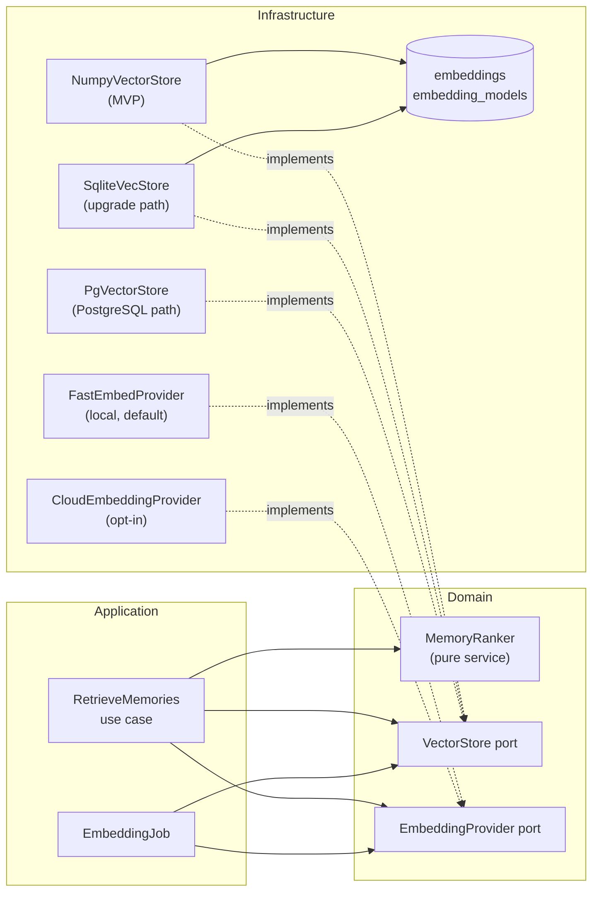
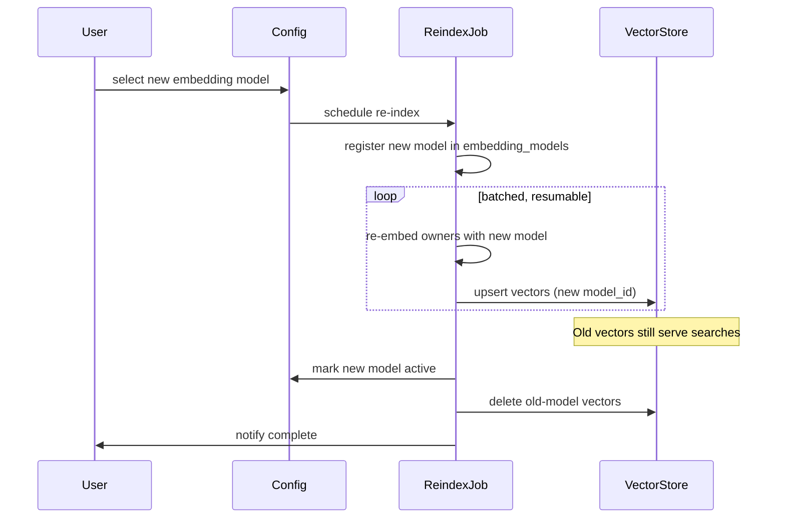

# VECTOR_SEARCH.md

# Telegram AI Conversation Assistant

Embedding & Semantic Retrieval Architecture

Version: 1.0

Status: Active

Last Updated: 2026-07-28

Governing decisions: ADR-017 (vector store), ADR-018 (embedding model)

---

# 1. Purpose

This document specifies how text becomes vectors, where vectors live, how similarity search works, and how retrieval combines semantic similarity with the non-semantic signals that make retrieved memories actually useful.

It exists as a separate document because embedding and retrieval have their own lifecycle, their own failure modes and their own upgrade path, and because getting retrieval wrong degrades every AI feature simultaneously.

---

# 2. Scope and Scale

Realistic scale for a single user, which drives every decision here:

| Quantity | Typical | Upper estimate |
|---|---|---|
| Contacts | 50–200 | 2,000 |
| Memories per contact | 20–100 | 500 |
| **Total memories** | **2,000–20,000** | **100,000** |
| Summaries | 500–5,000 | 50,000 |
| **Total vectors** | **~5,000–25,000** | **~150,000** |
| Vector dimension | 384–1024 | 1024 |

At 25,000 vectors × 768 dimensions × 4 bytes, the entire corpus is **~75 MB** — it fits comfortably in memory. A brute-force exact search over that matrix is a single NumPy matrix-vector product taking single-digit milliseconds.

**This is the central observation of this document.** Adopting an approximate nearest-neighbour index or a vector database at this scale would add a dependency, add a failure mode, and return *worse* results (approximate instead of exact) than the trivial implementation. Exact search is the correct engineering choice here, not a compromise.

---

# 3. Architecture



Two ports, deliberately separate:

- **`EmbeddingProvider`** computes vectors from text.
- **`VectorStore`** stores vectors and searches them.

`API.md` v1.0 placed `similarity_search()` on the embedding provider. That conflated two independently replaceable concerns: one can switch embedding models without changing storage, and switch storage without changing models. The split is corrected in `API.md` v2.0 §11.3–§11.4.

---

# 4. Embedding Pipeline

## 4.1 What gets embedded

| Owner kind | Text embedded | When |
|---|---|---|
| `memory` | `"{category}: {key} — {value}"` | On approval and on every value revision |
| `summary` | `summary_text` | On creation |
| `conversation` | Summary text, or concatenated messages if unsummarised | On conversation close (optional) |
| `message` | Message text | Only when message-level semantic search is enabled |

Messages are **not** embedded by default. Full-text search (FTS5) serves message lookup better and far more cheaply; embedding every message would multiply the corpus by two orders of magnitude for marginal benefit.

## 4.2 Generation

1. Embedding runs as a **background job**, never on the request path. A newly approved memory is searchable within seconds, not synchronously.
2. Generation is **batched** (default 32 texts per call) — dominant cost saving for both local and cloud providers.
3. Text is normalised before embedding: whitespace collapsed, control characters stripped, truncated to the model's input limit.
4. Vectors are **L2-normalised on write** when the model does not already produce unit vectors, so cosine similarity reduces to a dot product.
5. `content_fingerprint` (SHA-256 of the normalised text) is stored alongside; a mismatch on read marks the vector stale.
6. Failures are retried with backoff and, on persistent failure, leave the owner un-embedded — which degrades retrieval rather than breaking it (§9).

## 4.3 Storage format

`embeddings.vector` holds `dimension` little-endian float32 values as a `BLOB`.

Float32 rather than float64 halves storage and memory for no measurable quality loss at this scale. Storing vectors in the main database file rather than externally means one backup, one encryption boundary, one consistency domain, and no possibility of the vector store and the source data disagreeing.

Every row references `embedding_models`, which records provider, model name, dimension and normalization. Vectors produced by different models are **never** compared — a comparison across models is meaningless, and the schema makes it impossible rather than merely discouraged.

---

# 5. Retrieval Algorithm

Retrieval is **hybrid**. Pure semantic similarity retrieves memories that are topically related but stale, trivial, or already known — which is why similarity is one term of five.

## 5.1 Procedure

```
1. Build the query text from the current conversation focus
   (current message + open questions + active topic).
2. Embed the query with the active model.
3. VectorStore.search(account, query, owner_kind="memory",
                      filter=contact_id, top_k=candidate_k, min_score)
   → candidates with similarity scores.
4. Load the candidate Memory objects.
5. Union with always-included memories:
     - pinned memories
     - unresolved open questions
     - important dates within the upcoming window
6. MemoryRanker.rank(candidates, context, now) → final score per memory.
7. Take the top N that fit the memory section's token budget.
8. Record retrieved memory IDs on the suggestion (explainability)
   and update last_retrieved_at / retrieval_count.
```

`candidate_k` defaults to 50, final `N` to whatever fits the budget (typically 5–15).

## 5.2 Scoring

```
score = 0.45 · similarity
      + 0.20 · recency(updated_at)
      + 0.20 · importance
      + 0.05 · usage(retrieval_count)
      + 0.10 · provenance_bonus
```

| Term | Definition |
|---|---|
| `similarity` | Cosine similarity, already in [0,1] after normalisation |
| `recency` | `exp(-age_days / half_life_days)`, default half-life 180 days |
| `importance` | Stored memory importance, [0,1] |
| `usage` | `min(1, retrieval_count / 10)` — repeatedly useful memories rank higher |
| `provenance_bonus` | `1.0` for `USER`, `0.6` for `AI_APPROVED`, `0.3` for `AI_AUTO` |

Pinned memories bypass scoring entirely and are always included.

**Weights are configuration, not constants** (`ai.retrieval.weights.*`), so they can be tuned against the evaluation corpus rather than guessed.

## 5.3 Why `MemoryRanker` is a pure domain service

Ranking is a business rule about what matters in a relationship, not an infrastructure concern. Keeping it in the domain means it is unit-tested by injecting similarity scores directly — no embedding model, no database, no network — and that the weighting policy is reviewable in one small file rather than buried in a query.

---

# 6. Implementations

## 6.1 `NumpyVectorStore` — MVP default

- On first use per `(account_id, model_id, owner_kind)`, loads all vectors into a contiguous `float32` matrix plus a parallel ID array.
- `search()` computes `matrix @ query`, applies the owner filter, partitions for top-k with `np.argpartition`, and returns hits above `min_score`.
- Writes update the database and invalidate the cached matrix; the next search rebuilds it (typically < 100 ms at target scale).
- Memory footprint is bounded by retention policy; a cache-size limit triggers per-contact rather than per-account loading if exceeded.

Expected performance at 25,000 × 768: **matrix load ~80 ms (cold), search ~3 ms (warm)**. To be verified in Milestone 5.

## 6.2 `SqliteVecStore` — upgrade path

Adopted when measured search latency exceeds the budget or the corpus outgrows memory. Same port, same schema shape, ANN index maintained by the extension. Switching is a configuration change plus a one-time index build.

## 6.3 `PgVectorStore` — PostgreSQL path

For the post-1.0 multi-device scenario (ADR-016). Same port; `pgvector` with an HNSW index.

## 6.4 `FakeVectorStore` — testing

In-memory, exact, deterministic. Used by every use-case test so retrieval logic is tested without embeddings.

---

# 7. Model Change and Re-indexing

Changing the embedding model is a **planned migration**, never an implicit switch.



Rules:

1. The old model remains active and serving searches until the rebuild finishes. **Retrieval never breaks mid-migration.**
2. The job is batched, resumable and cancellable; interruption leaves both models' vectors valid.
3. Dimension changes are fully supported — old and new vectors live in separate rows with separate model references.
4. Cancellation rolls back to the old model, deleting partial new vectors.
5. The user sees progress and an estimated duration before starting.

---

# 8. Embeddings and Backup

Embeddings are **derived data**: fully reconstructible from source text.

Therefore:

1. Excluded from backups by default, materially reducing backup size.
2. Rebuilt automatically after a restore, as a background job.
3. `backup.include_embeddings = true` is available for users who prefer restore speed over backup size.
4. Deleting a memory cascades to its embedding; there is no orphan path.

---

# 9. Failure and Degradation

| Failure | Behaviour |
|---|---|
| Embedding provider unavailable | Owners queue as un-embedded; retrieval falls back to keyword + recency + importance ranking |
| Model download fails | Semantic retrieval disabled with a clear notification; all other features unaffected |
| Vector missing for a memory | The memory is still retrievable via the non-semantic terms; it simply scores lower |
| Corpus exceeds the memory limit | Store switches to per-contact matrix loading; if still exceeded, a notification recommends `sqlite-vec` |
| Dimension mismatch | Rejected at write with a typed error — a bug, never silently tolerated |
| Stale fingerprint | Vector is marked stale and re-embedded on the next job run |

The consistent principle: **degraded retrieval, never broken retrieval.** Memory search always returns something reasonable, because the non-semantic terms of the scoring function work without any model at all.

---

# 10. Privacy Considerations

1. **Local embedding is the default** (ADR-018). No memory text leaves the device unless the user opts into a cloud embedding provider.
2. Cloud embedding respects the same per-chat data boundary as cloud LLMs: a chat set to `local_only` is never embedded remotely (ADR-024).
3. Vectors are **not anonymous**. They are a lossy but meaningful encoding of their source text and are treated as sensitive data: same file, same permissions, same encryption phase, same deletion path.
4. Deleting a memory deletes its vector in the same transaction. There is no path by which deleted content persists in the index.
5. `ai_calls` records embedding calls as metadata only — never the embedded text.

---

# 11. Testing Requirements

| Test | Assertion |
|---|---|
| Round-trip | Vector written and read is bit-identical |
| Normalisation | Stored vectors are unit-length within tolerance |
| Dimension guard | Mismatched dimension raises a typed error |
| Model isolation | A search never returns vectors from a different model |
| Account isolation | A search never returns another account's vectors |
| Contact scoping | Memory retrieval never crosses contacts |
| Exactness | `NumpyVectorStore` results match a naive reference implementation |
| Ranking purity | `MemoryRanker` is deterministic given injected scores |
| Always-included | Pinned memories appear regardless of similarity |
| Provenance precedence | A `USER` memory outranks an equal-similarity `AI_AUTO` memory |
| Cache invalidation | A write makes the next search reflect it |
| Re-index resumability | Interrupting and resuming yields the same final state |
| Degradation | With the provider unavailable, retrieval still returns ranked results |
| Performance | 25,000 vectors: cold load and warm search within budget |

---

# 12. Design Principles

1. Exact beats approximate at this scale — and it is simpler.
2. Semantic similarity is one signal among several, never the whole ranking.
3. Vectors live with the data they describe: one file, one backup, one encryption boundary.
4. Vectors from different models are never compared, and the schema enforces it.
5. Embeddings are derived data — always reconstructible, never authoritative.
6. Retrieval degrades; it does not fail.
7. Ranking policy belongs in the domain, where it can be read, reviewed and tested.
8. Adopt an index when measurement demands it, not before.
